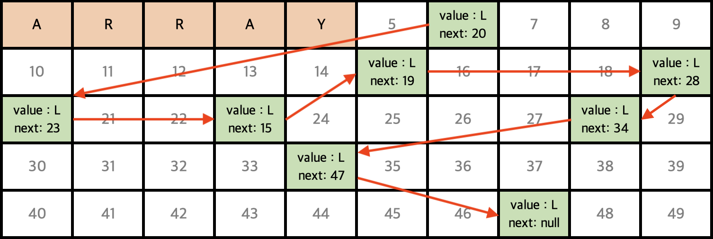

# 자료 구조

### 📌 &nbsp; **바로 가기**  

| 선형 구조                 | 비선형 구조         |
|:----------------------:|:----------------:|
| [Stack](#stack-스택)     | [Tree](#tree)    |
| [Queue](#queue-큐)      | [Binary Search Tree](#binary-search-tree) |
| [Deque](#deque-덱--디큐) | [Heap Tree](#heap-tree)  |
| [Linked List](#linked-list-연결-리스트)  | [Graph](#graph) |
|| [HashTable](#hash-table) |

<br>

### 📌 [**자료구조와 알고리즘 눈으로 보기**](https://www.cs.usfca.edu/~galles/visualization/Algorithms.html)

<br>

자료 구조란 여러 데이터의 묶음을 저장하고, 사용하는 방법을 정의한 것으로

자료 구조의 종류로는 ```Stack```, ```Queue```, ```Graph```, ```Tree```, ```Binary Search Tree```, ```Search Algorithm```, ```Deque```, ```Linked List```, ```Hash Table```, ```Heap Tree``` 등 여러 종류가 존재한다.


▲ _Type of Data Structure_

<br>

## Stack (스택)

Stack은 data를 순서대로 쌓는 자료 구조이다.

> ex) 인터넷 브라우저 (뒤로가기 앞으로가기)

<br>


▲ _Stack_

<br>

### Stack의 특징

1. Last In First Out (LIFO)
   
2. 데이터는 하나씩 넣고 뺄 수 있다.  

3. 하나의 입출력 방향을 가지고 있다.  

<br>

### Stack 메서드

```java
import java.util.Stack;

Stack<T> stack = new Stack<>();
```
▲ _Stack 선언_

<br>

**Stack 메서드**

|기능	|리턴<br>타입	|메서드	|설명|
|:-:|:-:|:-----|:-|
|객체<br>추가|Element|```push(e)``` | Stack에 데이터 추가|
|객체<br>삭제|Element|```pop()``` | 가장 위쪽의 데이터 제거|
||void|```clear()``` | Stack의 데이터 모두 제거|
|객체<br>검색|Element|```peek()``` | Stack 가장 상단의 데이터 출력|
||int|```size()``` | Stack의 크기 출력|
||int|```search(Object o)``` | Object의 index 리턴 <br> index는 스택의 최상단이 1부터 시작 <br> Object를 찾을 수 없는 경우 ```-1``` 리턴|
||boolean|```empty()``` | Stack이 비어있는지 확인|
||boolean|```contains(e)``` | Stack에 Object가 있는지 확인|
||String|```show()```| Stack에 포함된 모든 데이터를 String 타입으로 반환하여 리턴|

<br><br>

## Queue (큐)

Queue는 data가 입력된 순서대로 처리하는 자료 구조이다.

> ex) 프린터의 순차적 출력

<br>


▲ _Queue_

<br>

### Queue의 특징

1. First in First Out (FIFO)

2. 데이터는 하나씩 넣고 뺄 수 있다.

3. 두 개의 입출력 방향을 가지고 있다.  
   입력이 이루어지는 쪽을 ```rear```, 출력이 이루어지는 쪽을 ```front```라고 한다.  
   값을 입력할수록 rear 값이 증가하고, 값을 출력할수록 front 값이 증가한다.

<br>

### Queue 메서드

```java
import java.util.Queue;
import java.util.LinkedList;

Queue<T> queue = new LinkedList<>();
```
▲ _Queue 선언_

<br>

**Queue 메서드**

|기능	|리턴<br>타입	|메서드	|설명|
|:-:|:-:|:-----|:------------------|
|객체<br>추가| boolean | ```add(e)``` | Queue에 데이터 추가 <br> 큐가 꽉 찬 경우 ```IllegalStateException``` 발생 |
|| boolean | ```offer(e)``` | Queue에 데이터 추가 / 실패 시 ```false``` 리턴 |
|객체<br>삭제| Element | ```poll()``` | Queue 가장 앞쪽의 데이터 제거<br>큐가 비어있으면 ```null``` 리턴 |
|| Element | ```remove()``` | 인자가 없는 경우 Queue 가장 앞쪽의 데이터 제거 <br> 큐가 비어있는 경우 ```NoSuchElementException``` 발생  |
||boolean| ```remove(o)``` | 인자가 있는 경우 해당 데이터를 제거 / 실패 시 ```false``` 리턴 |
|| void | ```clear()``` | Queue의 데이터 모두 제거 |
|객체<br>검색| Element | ```peek()```  | Queue 가장 앞쪽의 데이터 출력 <br> 인자가 없는 경우 ```null``` 리턴|
|| Element | ```element()```  | Queue 가장 앞쪽의 데이터 출력 <br> 큐가 비어있는 경우 ```NoSuchElementException``` 발생 |

<br>

### 📋 [**_추가 : Circle Queue_**](https://haruhiism.tistory.com/144)

<br>

## Deque (덱 / 디큐)

Double-Ended Queue의 줄임말로 큐의 양쪽으로 데이터 입출력이 가능한 형태의 자료 구조이다.

하나의 자료 구조에 스택과 큐를 합쳐놓은 형태와 비슷하다고 볼 수 있다.

기본적으로는 양쪽으로 입출력이 가능하지만 입력이나 출력을 한쪽에서만 가능하도록 제한할 수 있고,  
이 중에 입력을 한 쪽으로만 제한한 덱을 스크롤(Scroll)이라고 하며  
출력을 한 쪽으로만 제한한 덱을 셸프(Shelf)라고 한다.

<br>


▲ _Deque_

<br>

### Deque 메서드

```java
Deque<String> deque1 = new ArrayDeque<>();
Deque<String> deque2 = new LinkedBlockingDeque<>();
Deque<String> deque3 = new ConcurrentLinkedDeque<>();
Deque<String> deque4 = new LinkedList<>();
```
▲ _Deque 선언_

<br>

**Deque 메서드**

Deque에서는 기본적으로 ```add()```, ```pop()```과 같은 Stack과 Queue의 메서드를 사용 할 수 있으며,  
추가로 사용 가능한 메서드는 아래와 같다.

|기능	|리턴<br>타입	|메서드	|설명|
|:-:|:-:|:-----|:------------------|
|객체<br>추가| boolean | ```addFirst(e)``` | Deque의 앞쪽에 데이터 추가 <br> 큐가 꽉 찬 경우 ```IllegalStateException``` 발생 |
||  boolean | ```addLast(e)``` | Deque의 뒤쪽에 데이터 추가 <br> 큐가 꽉 찬 경우 ```IllegalStateException``` 발생 |
|| boolean | ```offerFirst(e)``` | Deque의 앞쪽에 데이터 추가 / 실패 시 ```false``` 리턴 |
|| boolean | ```offerLast(e)``` | Deque의 뒤쪽에 데이터 추가 / 실패 시 ```false``` 리턴 |
|객체<br>삭제| Element | ```pollFirst()``` | Deque 가장 앞쪽의 데이터 제거<br>큐가 비어있으면 ```null``` 리턴 |
|| Element | ```pollLast()``` | Deque 가장 뒤쪽의 데이터 제거<br>큐가 비어있으면 ```null``` 리턴 |
|| Element | ```removeFirst()``` | Deque 가장 앞쪽의 데이터 제거<br>큐가 비어있는 경우 ```NoSuchElementException``` 발생 |
|| Element | ```removeLast()``` | Deque 가장 뒤쪽의 데이터 제거<br>큐가 비어있는 경우 ```NoSuchElementException``` 발생 |
||boolean| ```removeFirstOccurrence(o)``` | 앞쪽부터 찾아서 첫 번째 데이터를 제거 <br> 실패 시 ```false``` 리턴 |
||boolean| ```removeLastOccurrence(o)``` | 뒤쪽부터 찾아서 첫 번째 데이터를 제거 <br> 실패 시 ```false``` 리턴 |
|객체<br>검색| Element | ```peekFirst()``` | Deque 첫 번째 데이터 확인 <br> 인자가 없는 경우 ```null``` 리턴|
|| Element | ```peekLast()``` | Deque 마지막 데이터 확인 <br> 인자가 없는 경우 ```null``` 리턴|
|| Element | ```getFirst()``` | Deque 첫 번째 데이터 확인 <br> 큐가 비어있는 경우 ```NoSuchElementException``` 발생 |
|| Element | ```getLast()``` | Deque 마지막 데이터 확인 <br> 큐가 비어있는 경우 ```NoSuchElementException``` 발생 |

<br>

```java
// for-each문을 이용한 순회
for (String el : deque1) {
  System.out.println(el);
}

// Iterator를 이용한 순회
Iterator<String> iterator = deque1.iterator();
while (iterator.hasNext()) {
  String el = iterator.next();
  System.out.println(el);
}

// 역순 순회 
Iterator<String> reverseIterator = deque1.descendingIterator();
while (reverseIterator.hasNext()) {
  String el = reverseIterator.next();
  System.out.println(el);
}
```
▲ _Deque의 순회_

<br><br>

## Linked List (연결 리스트)

Linked List는 선형으로 그룹화된 데이터의 집합으로 데이터와  
다음 데이터의 주소를 포함하고 있는 하나의 노드가 선형으로 연결된 자료 구조이다.

> 삽입, 삭제가 중요한 곳에 사용 / 동적 기억장소 관리(Dynamic Storage Management) / Garbage collection

<br>



▲ _Array & Linked List in Memory_

<br>

### Linked List의 특징

1. 노드의 추가 및 삭제가 빠르다.  
   배열의 경우 값을 추가하거나 삭제할 때 메모리를 재할당해야하지만,  
   연결 리스트의 경우 참조하는 메모리 정보만 설정하면 되기 때문에 O(1)의 시간복잡도를 가진다.

2. 노드의 값을 찾기 위한 순회는 느리다.  
   배열의 경우 해당 인덱스의 값을 찾는데 O(1)의 시간 복잡도를 가지지만,  
   연결 리스트의 경우 메모리에 흩어져서 저장이 되므로 순회하는데에 최대 O(n)의 시간복잡도를 가진다.

<br>

***

<br>

## Tree

Tree는 단방향 그래프의 구조로 하나의 최상위 뿌리(Root)로부터 가지가 사방으로 뻗은 형태의 자료 구조이다.

데이터를 순차적으로 나열시킨 선형 구조가 아닌,  
하나의 데이터 아래에 여러 데이터가 존재할 수 있는 **비선형 구조**이다.

> ex) 폴더 디렉토리, 조직도, 토너먼트 대진표

<br>


▲ _Tree_

<br>

### Tree의 특징

- 깊이 (depth)  
  루트부터 하위 계층의 특정 노드까지의 깊이를 표현할 수 있다.  
  루트에서부터 0으로 시작하여 하위 계층으로 연결될 수록 1씩 증가한다.

- 레벨 (Level)  
  같은 깊이를 가지는 노드를 묶어서 레벨로 표현하고,  
  같은 레벨에 나란히 있는 노드를 형제 노드(Sibling Node)라고 한다.

- 높이 (Height)  
  리프 노드(자식이 없는 노드)로부터 루트까지의 높이를 표현할 수있다.  
  리프에서부터 0으로 시작하여 부모 노드로 연결될 수록 1씩 증가한다.

- 서브 트리 (Sub Tree)  
  루트에서 뻗어 나오는 큰 트리의 내부에, 트리 구조를 갖춘 **작은 트리**를 말한다.  
  부모와 자식 둘 이상 연결되면 최소 크기의 서브 트리가 만들어진다.

<br><br>

## Binary Search Tree

이진 트리(Binary Tree)는 자식 노드가 최대 2개인 노드들로 구성된 트리를 말하고,  
이진 탐색 트리(Binary Search Tree)는 모든 왼쪽 자식의 값이 루트나 부모보다 작고,  
모든 오른쪽 자식의 값이 루트나 부모보다 큰 값을 가진다.

> 이진 탐색 트리는 입력되는 값의 순서에 따라 한쪽으로 노드들이 몰리게 될 수 있다.  
> 균형이 잡히지 않은 트리는 탐색하는 데 시간이 더 걸리는 경우도 있기 때문에  
> 이 문제를 해결하기 위해 삽입과 삭제마다 트리의 구조를 재조정하는 알고리즘을 추가할 수 있다.

<br>


▲ _Binary Search Tree_

<br>

### 이진 트리의 종류

- **정 이진 트리 (Full binary tree)**  
  각 노드가 0개 혹은 2개의 자식 노드를 가진다.

- **완전 이진 트리 (Complete binary tree)**  
  마지막 레벨을 제외한 모든 노드가 가득 차 있어야 하며,  
  마지막 레벨의 노드는 왼쪽부터 채워져야 한다.

- **포화 이진 트리 (Perfect binary tree)**  
  정 이진 트리이면서 완전 이진 트리인 경우  
  모든 리프 노드의 레벨이 동일하고, 모든 레벨이 가득 채워져 있어야 한다.

<br><br>

## Heap Tree

Heap tree는 일반적인 트리구조와 다르게, **우선순위에 따라서 빠르게 자료를 검색**할 수 있는 자료 구조이다.

Heap tree는 느슨한 정렬 구조를 가지고 있다.

> 💡 느슨한 정렬 구조  
>
> 부모 노드의 값은 항상 자식 노드의 값보다 크거나 작다.  
> 하지만 자식 노드의 값에 따라 좌우 정렬은 하지 않기 때문에 느슨한 정렬 구조라고 한다.

<br>


▲ _Heap Tree_

<br>

### Heap Tree의 특징

1. 완전 이진 트리  
   단순 최대값, 최소값을 찾기 위해 완전 이진 트리로 구성할 필요는 없지만,  
   삽입 / 삭제 시 성능을 위해 완전 이진 트리로 구성하는 것이 유리하다.

2. 중복된 값 저장  
   단순히 최대, 최소값을 찾기 위한 구조이므로 일반 이진 트리와 다르게 중복된 값 저장이 가능하다.

3. 최대 힙 / 최소 힙  
   최대힙 : 루트에 가장 큰 값이 위치하며 자식 노드로 내려갈수록 작은 값이 위치한다.  
   최소힙 : 루트에 가장 작은 값이 위치하며 자식 노드로 내려갈수록 큰 값이 위치한다.

<br><br>

## Graph

그래프는 여러 점들이 서로 복잡하게 연결된 관계를 표현한 자료 구조이다.

> ex) 네비게이션

<br>


▲ _Graph_

<br>

### Graph의 특징

- 두 점 사이가 이어져있을 경우 **직접적인 관계**라고 하며,  
  몇 개의 점과 선 사이에 걸쳐서 이어질 경우 **간접적인 관계**라고 한다.

- 하나의 점을 정점(vertex)이라고 하고, 하나의 선을 간선(edge)이라고 한다.  
  간선의 경우 단방향 간선과 양방향 간선이 존재한다.

<br>

### Graph의 표현 방식

<br>

**인접 행렬**

두 점을 직접적으로 이어주는 간선이 있다면 두 정점은 **인접하다**라고 표현할 수 있다.  

인접 행렬은 정점들이 서로 인접한 상태인지를 표시한 행렬로 2차원 배열로 나타낸다.  
이어져있다면 ```1 (true)```, 이어져 있지 않다면 ```0 (false)```으로 표시한다.

위 그림 (c)를 인접 행렬로 표현하면  
3은 1과 4로 향하므로 ```[3][1] == 1```, ```[3][4] == 1```과 같이 표현할 수 있다.

> 인접 행렬은 최단 경로를 찾을 때 주로 사용한다.  
> 단, 메모리 낭비가 심하다는 단점이 있다.  
> 
> 또한, 두 정점 사이에 관계가 있는지 없는지 확인하기에 용이하다.

<br>

**인접 리스트**

각 정점이 어떤 정점과 인접하는지를 리스트의 형태로 표현한 것이다.  
<span style = "color : gray"> _(주로 LinkedList를 사용)_ </span>

위 그림 (c)를 인접 리스트로 표현하면 아래와 같이 표현할 수 있다.   
- 1 → 2 → /
- 2 → 3 → /
- 3 → 1 → 4 → /
- 4 → /

순서는 보통 중요하지 않으며, 우선 순위를 다뤄야한다면 Queue, Heap 등을 사용하는 것이 좋다.

> 인접 리스트는 메모리를 효율적으로 사용하고 싶을 때 사용한다.

<br>
<details>
<summary>알아두면 좋은 그래프 용어들 (Click)</summary>
<div markdown="1">
<br>

|용어| 설명|
|:-:|:-|
|정점 (vertex) | 노드(node)라고도 하며 데이터가 저장되는 그래프의 기본 원소|
|간선 (edge) | 정점 간의 관계를 나타낸 선 (정점을 이어주는 선)|
|인접 정점<br>(adjacent vertex) | 하나의 정점에서 간선에 의해 직접 연결되어 있는 정점|
|가중치 그래프<br>(weighted Graph)| 연결의 강도(추가적인 정보)가 얼마나 되는지 적혀져 있는 그래프<br>인접 행렬을 예로 들자면 ```1``` 값이 아닌 관계에서 의미있는 값을 저장|
|비가중치 그래프<br>(unweighted Graph)| 연결의 강도가 적혀져 있지 않는 그래프|
|무방향 그래프<br>(undirected graph)| 예를 들어 서울에서 부산으로 갈 수 있듯, 부산에서 서울로 가는 것도 가능한데,<br>이것을 무방향 그래프라고 한다. <br>하지만 단방향(directed) 그래프로 구현된다면 서울에서 부산을 갈 수 있지만, 부산에서 서울로 가는 것은 불가능하다. <br>만약 두 지점이 일방통행 도로로 이어져 있다면 단방향인 간선으로 표현할 수 있다.|
|진입차수<br>(in-degree) <br> 진출차수<br>(out-degree)| 한 정점에 진입(들어오는 간선)하고 진출(나가는 간선)하는 간선이 몇 개인지를 나타낸다.|
|인접<br>(adjacency)| 두 정점 간에 간선이 직접 이어져 있다면 이 두 정점은 인접한 정점이라고 한다.|
|자기 루프<br>(self loop)| 정점에서 진출하는 간선이 곧바로 자기 자신에게 진입하는 경우 <br>다른 정점을 거치지 않는다는 것이 특징|
|사이클 (cycle)| 한 정점에서 출발하여 다시 해당 정점으로 돌아갈 수 있다면 사이클이 있다고 표현한다.|

</div>
</details>

<br><br>

## Hash Table

hash table은 해시함수를 사용하여 변환한 해시를 index로 삼아 key와 value를 저장하는 자료 구조이다.

> ex) 주소록, 블록체인, 자바스크립트 실행 엔진 (크롬, V8), Domain → DNS 변환

<br>


▲ _Hash Table_

<br>

### Hash Table의 구조
- **키(key)**  
  해시 함수의 입력값으로 고유값이며 다양한 길이의 값이 들어올 수 있다.  
  해시 함수를 통해 변환하지 않은 상태로 저장소에 저장이 되면 다양한 길이만큼의 저장소를 구성해 두어야 하기 때문에 해시 함수로 값을 바꾸어 저장

- **해시함수(hash Function)**  
  키(key)를 해시(hash)로 바꿔주는 역할을 한다.  
  다양한 길이를 가진 키를 일정한 길이를 가진 해시로 변경하여 저장소를 효율적으로 운영할 수 있도록 한다.   

  서로 다른 키가 같은 해시가 되는 경우를 해시 충돌(hash Collision)이라고 하는데,  
  해시 충돌을 일으키는 확률을 최대한 줄이는 것이 중요하다.

- **해시(hash)**  
  키를 해시함수를 사용하여 만들어진 결과물로, 저장소에서 value와 매칭되어 저장된다.  
  변환된 값을 배열의 index처럼 사용한다.

- **데이터(value)**  
  저장소에 최종적으로 저장되는 값으로 index와 매칭되어 저장한다.

<br>

### Hash Table의 특징

💡 **장점**  
저장, 삭제, 검색 과정이 모두 평균 O(1)의 시간복잡도를 가져 데이터를 다루는 속도가 매우 빠르다.

💡 **단점**  
해시함수의 의존도가 높다.  
해시 충돌이 발생할 수 있다.  
데이터가 저장되기 전에 저장공간을 미리 만들어놔야 하기 때문에 공간 효율성이 떨어진다.  

<br>

- 저장, 삭제, 검색 과정  
해시 함수에 키값을 넣어 해시값을 만들고, 만들어진 해시값과 일치하는 index를 찾아 저장하거나 삭제, 검색한다.

  > 기본적으로 해당 작업들의 시간복잡도는 O(1)이지만,  
  > 해시 함수의 의존도가 높기 때문에 해시 함수가 복잡하다면 해시값을 만드는데 많은 시간이 소요된다.
  > 
  > 또한, 해싱 충돌이 발생하면 모든 index나 value를 찾아야하므로 O(n)의 시간복잡도를 가지게 된다.

<br>

**🔸 대표적인 해시 알고리즘**

- Division Method  
  Number type의 키를 저장소의 크기로 나누어 나온 나머지를 index로 사용하는 방법  
  이때 저장소의 크기를 소수(Prime Number)로 정하고 2의 제곱수와 먼 값을 사용하는 것이 효과가 좋다.  
  > ex) Key 값이 23일 때 테이블 크기가 7이라면 index는 2가 된다.

- Digit Folding   
  키의 문자열을 ASCII 코드로 바꾸고 그 값을 합해 저장소에서 index로 사용하는 방법  
  만약 이때 index가 저장소의 크기를 넘어간다면 Division Method를 적용할 수 있다.

- Multiplication Method   
  숫자로 된 Key 값 ```K```, 0과1 사이의 실수 ```A```, 2의 제곱수인 ```m```을 아래와 같이 계산한 값을 index로 사용  
  > index = (KA mod 1)m
  
- Universal Hashing  
  다수의 해시함수를 만들어 특정한 장소에 넣어두고, 무작위로 해시함수를 선택해 해시값을 만드는 기법

<br>

### 해시 충돌 해결 방법

<br>

1. **개방 연결법 (Open Addressing)**  
  해시 충돌이 발생하면 다른 index에 해당 자료를 삽입하는 방식
  - *Linear Probing*  
    현재 중복된 index로부터 고정된 숫자만큼 이동하여 비어있는 저장소(버킷)를 찾아 value를 저장

  - *Quadratic Probing*  
    현재 중복된 index로부터 이동할 숫자를 제곱으로 사용하는 방식  
    > 처음 충돌이 발생하면 1(1^2)만큼,  
    또 충돌이 발생한다면 4(2^2), 9(3^2), 16(4^2)만큼 이동하여 빈 공간을 탐색

  - *Double Hasing Probing*  
    한 해시함수에서 충돌이 발생하면 미리 지정해둔 다른 해시함수를 이용해 새로운 주소를 받아 사용하는 방법  
    다른 방법들보다 많은 연산이 필요하다.

<br>

2. **분리 연결법(Seperate Chaining)**  
  중복된 index의 버킷 데이터에 Linked List, Red-Black tree 등의 자료 구조를 활용해 충돌이 발생한 데이터의 주소를 저장하는 방법

   💡 장점  
  구현이 간단하며, value를 쉽게 삭제할 수 있다.  
   💡 단점  
  중복으로 저장되는 value가 많아지면 동일한 버킷에 연결되는 데이터가 많아져 검색 효율성이 감소한다.

3. **저장소 확장(Resize)**  
   저장소의 크기가 작다면 불필요한 메모리 사용을 줄일 수 있지만,  
   해시 충돌이 발생하며 개방 연결법이나 분리 연결법을 사용해도 성능상 손실이 발생한다.

   실제 HashMap은 key-value 데이터가 일정 이상(저장소의 75%)이 되면 저장소 크기를 2배로 늘리는데,  
   이 방식으로 해시 충돌로 인한 성능이 감소하는 문제를 어느 정도 해결 가능하다.


<br><br>

***

_2022.09.26. Modified_

_2022.09.25. Update_

_2022.09.22. Update_