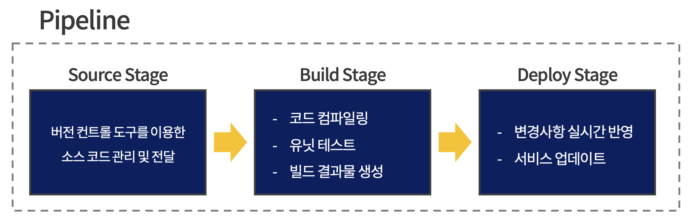
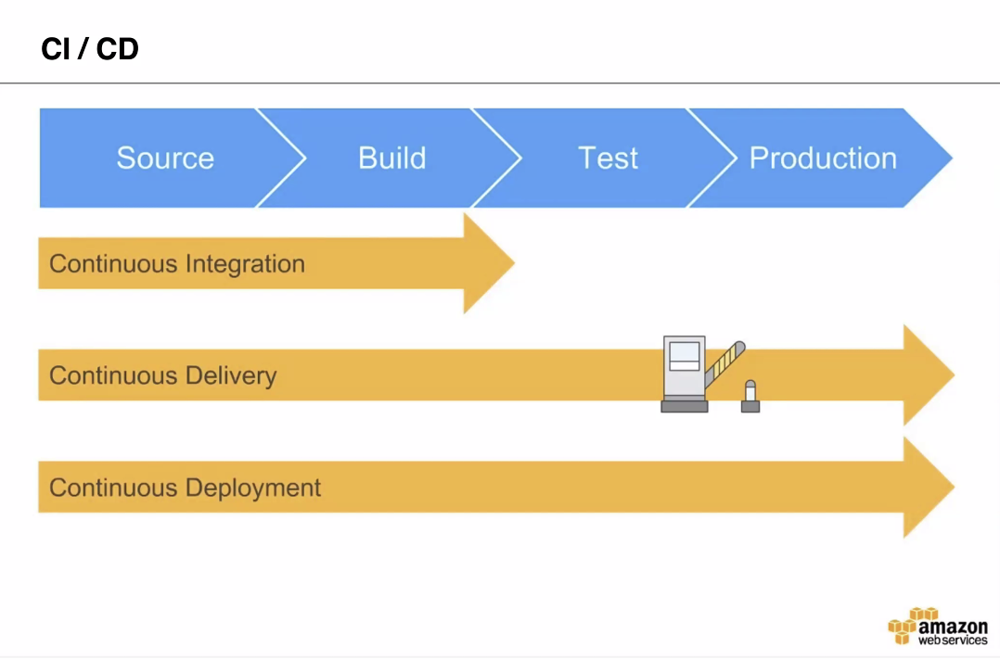
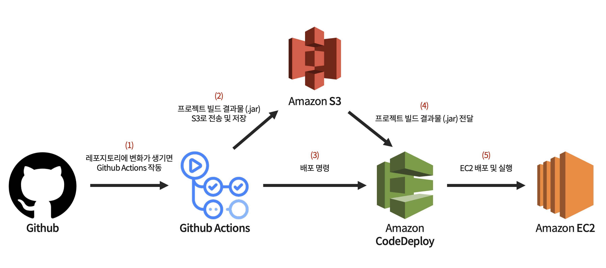

# 배포 자동화

배포 자동화란 한번의 클릭 혹은 명령어 입력을 통해 배포 과정을 자동으로 진행하는 것을 말한다.

<br>

배포 자동화가 필요한 이유는 다음과 같다.

- 수동적이고 반복적인 배포 과정을 자동화하여 시간을 절약할 수 있다.

- 휴먼 에러)를 방지할 수 있다.

  > ❓ **휴먼 에러 (Human Error)**
  >
  > 사람이 수동적으로 배포 과정을 진행하는 중에 생기는 실수를 의미한다.

<br>

### 배포 자동화 파이프라인

<br>

배포에서 파이프라인(Pipeline)은 **소스 코드의 관리부터 실제 서비스로의 배포 과정을 연결하는 구조**를 말한다.

파이프라인은 전체 배포 과정을 여러 단계(Stages)로 분리하며,  

순차적으로 실행된 단계마다 주어진 작업(Actions)을 수행한다.

<br>



<br>

1. **Source Stage**  
   : 원격 저장소에 관리되고 있는 소스 코드에 변경 사항이 일어날 경우, 이를 감지하고 다음 단계로 전달한다.

2. **Build Stage**  
   : Source 단계에서 전달받은 코드를 컴파일・빌드・테스트하여 가공한 후, 결과물을 다음 단계로 전달한다.

3. **Deploy Stage**  
   : Build 단계에서 전달받은 결과물을 실제 서비스에 반영하는 작업을 수행한다.

<br>

> 🚨 파이프라인의 단계는 상황과 필요에 따라 세분화되거나 간소화될 수 있다.

<br>

***

<br>

## 🛠 AWS Pipeline을 통한 배포 자동화

<br>

### AWS 개발자 도구

<br>

AWS 개발자 도구 섹션에서 제공하는 서비스를 활용하여 배포 자동화 파이프라인을 구축할 수 있다.

<br>

**🔸 CodeCommit**

Source Stage를 구성할 때 사용하며, Github와 유사한 서비스를 제공하는 **버전 관리 도구**이다.

Github에 비해 보안 관련 기능에 강점을 가지지만,  

사용 요금에 대한 부담이 있을 수 있다.

<br>

**🔸 CodeBuild**

Build Stage에서 사용하며, **유닛 테스트, 컴파일, 빌드**와 같은 Build Stage에서 필수적으로 실행되어야할 작업들을 명령어를 통해 실행할 수 있다.

> 사용자가 작성한 ```buildspec.yml``` 파일을 참조하여 작업을 수행한다.

<br>

**🔸 CodeDeploy**

Deploy Stage에서 사용되며, 실행되고 있는 서버 어플리케이션에 **실시간으로 변경사항을 전달**할 수 있다.

또한 S3 서비스를 통해 S3 버킷으로 업로드 된 **정적 웹사이트에도 변경사항을 실시간으로 전달하고 반영**할 수 있다.

> 사용자가 작성한 ```appspec.yml``` 파일을 참조하여 작업을 수행한다.

<br>

**🔸 CodePipeline**

각 단계를 연결하는 파이프라인을 구축할 때 사용한다.

<br><br>

### 개발 환경 구축

<br>

먼저 EC2 인스턴스에 배포 자동화에 필요한 프로그램들을 설치해야한다.

<br>

**1. Java 설치**

```bash
$ sudo apt update
$ sudo apt install openjdk-11-jre-headless
```

<br>

**2. AWS CLI 설치**

```bash
$ curl "https://awscli.amazonaws.com/awscli-exe-linux-x86_64.zip" -o "awscliv2.zip"
$ sudo apt install unzip
$ unzip awscliv2.zip
$ sudo ./aws/install

# 설치 여부 확인
$ aws --version
```

<br>

**3. CodeDeploy Agent 설치**

```bash
$ sudo apt update
$ sudo apt install ruby-full  # [Y / n] 선택시 Y 입력
$ sudo apt install wget
$ cd /home/ubuntu
$ sudo wget https://aws-codedeploy-ap-northeast-2.s3.ap-northeast-2.amazonaws.com/latest/install
$ sudo chmod +x ./install
$ sudo ./install auto > /tmp/logfile

# 서비스 실행 상태 확인 (active → 실행 중)
$ sudo service codedeploy-agent status
```

<br><br>

### EC2 인스턴스 역할 부여

<br>

1️⃣ EC2 → 인스턴스 → 인스턴스 선택 후 ```[태그]``` 확인

- Key - Value 쌍의 값이 설정되어 있다.

<br>

2️⃣ 인스턴스 선택 후 ```[보안]``` → ```[IAM 역할]``` → ```[권한]``` 확인

- **AmazonEC2RoleForSSM** : Session Manager를 통해 EC2 인스턴스에 연결하기 위한 권한

- **AmazonS3FullAccess**

- **AmazonEC2RoleforAWSCodeDeploy**

- **AWSCodeDeployRole**

- **AmazonSSMFullAccess**

위의 권한들 선택 후 ```[정책 연결]```

<br>

3️⃣ ```[IAM 역할]``` → ```[신뢰 관계]``` → ```[신뢰 정책 편집]```

- 신뢰 관계란, 해당 역할을 취할 수 있는 서비스나 사용자를 명시하는 부분이다.

- Access 정책 부여를 통해 역할을 생성했지만, Access 할 수 있는 서비스를 신뢰 관계에서 명시함으로써 역할이 확실히 완성된다.

<br>

```json
"Service": "ec2.amazonaws.com"

  ▼ 아래와 같이 수정 ▼

"Service": ["ec2.amazonaws.com", "codedeploy.ap-northeast-2.amazonaws.com"]
```

<br><br>

### EC2를 활용한 파이프라인 구축 예제

<br>

1️⃣ 로컬 환경의 ```project_name/DeployServer``` 경로에 ```appspec.yml``` 파일을 생성

- ```appspec.yml```은 CodeDeploy-Agent가 인식하는 파일이다.

- CodeDeploy에서 지정한 각 단계에 맞춰 어떠한 Shell Script를 실행하는지 지정한다.
  
  <br>

  ```yml
  version: 0.0
  os: linux

  files:
    - source: /
      destination: /home/ubuntu/build

  hooks:
    BeforeInstall:
      - location: server_clear.sh
        timeout: 3000
        runas: root
    AfterInstall:
      - location: initialize.sh
        timeout: 3000
        runas: root
    ApplicationStart:
      - location: server_start.sh
        timeout: 3000
        runas: root
    ApplicationStop:
      - location: server_stop.sh
        timeout: 3000
        runas: root
  ```

  ▲ _appspec.yml_

<br><br>

2️⃣ 로컬 환경의 ```project_name/DeployServer``` 경로에 ```buildspec.yml``` 파일을 생성

- ```buildspec.yml```은 CodeBuild-Agent가 인식하는 파일이다.

- CodeBuild에서 지정한 각 단계에 맞춰 동작을 특정하여 명령한다.

  <br>

  ```yml
  version: 0.2

  phases:
    install:
      runtime-versions:
        java: corretto11
    build:
      commands:
        - echo Build Starting on `date`
        - cd DeployServer
        - chmod +x ./gradlew
        - ./gradlew build
    post_build:
      commands:
        - echo $(basename ./DeployServer/build/libs/*.jar)
  artifacts:
    files:
      - DeployServer/build/libs/*.jar
      - DeployServer/scripts/**
      - DeployServer/appspec.yml
    discard-paths: yes
  ```

  ▲ _buildspec.yml_

<br><br>

3️⃣ 프로젝트 최상위에 ```scripts``` 디렉토리를 생성하고,  
&emsp; ```initialize.sh```, ```server_clear.sh```, ```server_start.sh```, ```server_stop.sh``` 파일을 생성

- 각 파일은 ```appspec.yml```이 구성하고 있는 배포 수명 주기에 따라서 실행된다.

  <br>

  ```yml
  #!/usr/bin/env bash
  chmod +x /home/ubuntu/build/**
  ```

  ▲ _initialize.sh는 빌드 결과물을 실행할 수 있도록 **실행 권한을 추가**한다._

  <br>

  ```yml
  #!/usr/bin/env bash
  rm -rf /home/ubuntu/build
  ```

  ▲ _server_clear.sh는 빌드 결과물이 저장 되어있는 build 디렉토리를 제거한다._

  <br>

  ```yml
  #!/usr/bin/env bash
  cd /home/ubuntu/build
  sudo nohup java -jar DeployServer-0.0.1-SNAPSHOT.jar > /dev/null 2> /dev/null < /dev/null &
  ```

  ▲ _server_start.sh는 ```DeployServer-0.0.1-SNAPSHOT.jar```라는 빌드 결과물을 실행한다._

  <br>

  ```yml
  #!/usr/bin/env bash
  sudo pkill -f 'java -jar'
  ```

  ▲ _server_stop.sh는 실행중인 Spring Boot 프로젝트를 종료한다._

<br><br>

4️⃣ AWS CodeDeploy → 배포 → 어플리케이션 → ```[어플리케이션 생성]```

- 리소스명으로 어플리케이션 이름을 입력

- **EC2/온프레미스**로 컴퓨팅 플랫폼을 설정

<br><br>

5️⃣ 생성된 어플리케이션의 ```[배포 그룹]``` → ```[배포 그룹 생성]```

- 배포 그룹의 이름은 ```리소스명-group``` 형태로 입력

- **EC2 인스턴스에 연결되어있는 IAM역할**로 서비스 역할 영역을 설정

- **Amazon EC2 인스턴스**로 환경 구성 선택 후, 위에서 확인한 Name 태그의 Key - Value를 태그 그룹에 입력

- 로드 밸런싱 활성화 체크 해제

<br><br>

6️⃣ AWS CodePipeline → 파이프라인 → ```[파이프라인 생성]```

- 리소스명으로 파이프라인 이름을 입력

- Github(버전2)로 소스 공급자 설정 후, ```[GitHub에 연결]``` → Only select repositories

- 레포지토리 이름과 브랜치 이름 설정

- 출력 아티팩트 형식은 **CodePipeline 기본값**으로 설정

- 빌드 스테이지의 빌드 공급자는 **AWS CodeBuild**로 설정 후, ```[프로젝트 생성]```

  - 리소스명으로 프로젝트 이름 입력

  - 운영 체제는 **Amazon Linux 2**로 설정

  - 런타임은 **Standard**로 설정

  - 이미지는 **aws/codebuild/amazonlinux2-x86_64-standard:3.0**으로 설정

  - Buildspec은 **DeployServer/buildspec.yml**을 입력

  <br>

- 배포 스테이지  

  - 배포 공급자는 **AWS CodeDeploy**로 설정

  - 리전은 **아시아 태평양(서울)**로 설정

  - 어플리케이션 이름은 생성해둔 어플리케이션 이름 입력

  - 배포 그룹은 생성해둔 배포 그룹 이름 입력

  <br>

7️⃣ 파이프라인 생성과 동시에 **소스 코드의 배포가 자동으로 실행**

<br>

> 🚨 **Deploy Stage에서 실패가 발생하는 경우**
>
> EC2 인스턴스의 터미널에 ```cd /opt/codedeploy-agent/deployment-root/deployment-logs```를 입력
>
> 해당 위치의 로그 파일을 확인하여 stdout, stderr 확인 가능

<br><br>

### 환경 변수 설정

<br>

1️⃣ AWS Parameter Store → ```[파라미터 생성]```

- 이름에 환경 변수명 ```/spring-boot-aws/리소스명/spring.datasource.url```을 입력

  > ```/prefix/name/key```의 순서로 네이밍 규칙에 맞게 작성되어야 한다.

  <br>

- 원하는 유형으로 값을 저장

- 값에 원하는 환경 변수를 입력

<br><br>

2️⃣ build.gradle 파일 수정

```java
dependencies {
    implementation 'org.springframework.cloud:spring-cloud-starter-aws-parameter-store-config'
}

dependencyManagement {
	imports {
		mavenBom "org.springframework.cloud:spring-cloud-starter-parent:Hoxton.SR12"
	}
}
```

▲ _build.gradle 코드 추가_

<br><br>

3️⃣ ```/src/main/resources/``` 경로에 ```bootstrap.yml``` 파일 생성

```yml
aws:
  paramstore:
    enabled: true
    prefix: /spring-boot-aws
    name: # 리소스명 작성
    profileSeparator: _
```

▲ _bootstrap.yml은 AWS Parameter Store에 저장된 변수를 조회하는 파일이다._

<br><br>

4️⃣ ```application.properties``` 수정

```properties
server.port=8080
spring.jpa.database=mysql
spring.jpa.database-platform=org.hibernate.dialect.MySQL5InnoDBDialect
# spring.datasource.url=jdbc:mysql://{AWS RDS Endpoint}/test?useSSL=false&characterEncoding=UTF-8&serverTimezone=UTC
# spring.datasource.username={RDS Mysql Admin id}
# spring.datasource.password={RDS Mysql Admin password}
spring.datasource.driver-class-name=com.mysql.cj.jdbc.Driver
# config.domain={AWS S3 Endpoint}
```

▲ _Parameter Store에 환경 변수를 추가했으므로, 해당 설정들은 필요하지 않다._

<br>

5️⃣ Commit, Push 한 후, 파이프라인을 통해 변경사항을 전달

<br>

***

<br>

## 🛠 Github Actions를 통한 배포 자동화

<br>

Github Actions는 Github가 공식적으로 제공하는 빌드, 테스트 및 배포 파이프라인을 자동화 할 수 있는 **CI/CD 플랫폼**을 말한다.

레포지토리에서 Pull Request, Push와 같은 이벤트를 트리거로 Github 작업 워크플로우(Workflow)를 구성할 수 있다.

> ❓ **워크 플로우 (Workflow)**
> 
> 하나 이상의 작업이 실행되는 자동화 프로세스를 말하며,  
> 각 작업은 자체 가상 머신 또는 컨테이너 내부에서 일어난다.
> 
> 워크 플로우는 ```.yml``` 파일에 의해 구성되며,  
> 테스트, 배포 등 기능에 따라 여러개의 워크 플로우도 만들 수 있다.
> 
> 생성된 워크 플로우는 ```.github/workflows``` 디렉토리에 위치한다.

<br>

### CI/CD

<br>

CI/CD는 지속적인 통합, 지속적인 서비스 제공, 지속적인 배포를 의미하며,

어플리케이션 개발 단계를 자동화하여 어플리케이션을 더욱 짧은 주기로 고객에게 제공하는 방법이다.

<br>



<br><br>

### Github Actions를 통한 배포 flow

<br>



<br>

- **Github Actions**  
  : 설정 파일(```.yml```)에 따라 **레포지토리 변동사항을 트리거로 작동**

<br>

- **S3**  
  : 정적 웹페이지 배포가 아닌, Github Actions에서 빌드한 결과물을 버킷에 저장하는 **저장소 역할**

<br>

- **CodeDeploy**  
  : 배포 명령을 받은 CodeDeploy는 S3에 저장된 빌드 결과물을 EC2 인스턴스로 이동한다.  
  &nbsp; 프로젝트 최상단에 위치한 ```appspec.yml``` 설정 파일에 의해 쉘 스크립트 등 단계에 따른 동작을 실행한다.

<br>

- **EC2**  
  : 설정 파일(```.yml```)과 쉘 스크립트(```.sh```)에 의해 각 배포 결과를 로그로 저장하며, 빌드 파일(```.jar```)을 실행한다.

  <br>

  > 해당 과정들이 진행되기 위해서는 EC2 인스턴스에 Code Deploy Agent와 JDK 11 설치가 필요하다.

<br><br>

### Github Actions 생성

<br>

1️⃣ Github의 레포지토리에서 ```[Actions]```를 클릭하여 워크 플로우를 선택

- 빈 yml 설정 파일로 설정할 수도 있고, 추천 워크 플로우 구성을 선택하여 진행할 수도 있다.  

- Java with Gradle을 선택

<br>

2️⃣ 워크 플로우를 생성하는 동시에 ```gradle.yml``` 파일이 Push 되는 트리거가 발생하고, Github Actions가 실행

- ```[Actions]``` 탭에서 워크 플로우의 단게별 진행 상황을 확인할 수 있다.

- 레포지토리의 최근 커밋 내역에서도 진행, 성공, 실패 여부를 확인할 수 있다.

<br><br>

### Github Secret 등록

1️⃣ 레포지토리의 ```[Settings]``` → ```[Secret]``` → ```[Actions]``` 탭에서 Secret 생성

- 워크 플로우를 실행하는 과정에서 액세스 키가 필요하지만, 공개되면 보안 이슈가 발생할 수 있어서 암호화한다.

<br>

2️⃣ Name에 변수의 이름을 작성하고, Value에 변수의 값을 작성한다.

- IAM User를 생성할 때 볼 수 있는 액세스 키 ID 값과, 비밀 액세스 키 값을 각각 저장한다.

- 한 번 저장하면 덮어쓰기는 가능하지만, 저장된 값을 확인하거나 수정하는 것은 불가능하다.

<br><br>

### gradle.yml 수정

<br>

```yml
name: Java CI with Gradle

on:
  push:
    branches: [ "main" ]

permissions:
  contents: read

# 환경 변수에 S3 버킷 이름 추가
env:
  S3_BUCKET_NAME: be-0-name

jobs:
  build:

    runs-on: ubuntu-latest

    steps:
    - uses: actions/checkout@v3
    - name: Set up JDK 11
      uses: actions/setup-java@v3
      with:
        java-version: '11'
        distribution: 'temurin'
    - name: Build with Gradle
      uses: gradle/gradle-build-action@67421db6bd0bf253fb4bd25b31ebb98943c375e1
      with:
        arguments: build
    
    # build 후 프로젝트를 압축
    - name: Make zip file
      run: zip -r ./practice-deploy.zip .
      shell: bash
    
    # Access Key와 Secret Access Key를 통해 권한 확인
    - name: Configure AWS credentials
      uses: aws-actions/configure-aws-credentials@v1
      with:
        aws-access-key-id: ${{ secrets.AWS_ACCESS_KEY }}
        aws-secret-access-key: ${{ secrets.AWS_SECRET_ACCESS_KEY }}
        aws-region: ap-northeast-2
    
    # 압축한 프로젝트를 S3로 전송
    - name: Upload to S3
      run: aws s3 cp --region ap-northeast-2 ./practice-deploy.zip s3://$S3_BUCKET_NAME/practice-deploy.zip
```

▲ _gradle.yml_

<br>

- 위와 같이 작성 후 Github에 Push하면 Github Actions가 동작하여 S3 버킷에 압축 파일이 전송된다.

<br><br>

### 빌드 파일 배포 및 실행

1️⃣ S3에 저장된 빌드 파일을 EC2 인스턴스로 전달하기 위한 **CodeDeploy 설정**

- ```[CodeDeploy]``` → ```[배포]``` → ```[어플리케이션]```에서 어플리케이션 생성

  - 어플리케이션 이름 작성 및 **EC2/온프레미스** 플랫폼 선택

  <br>

- 생성된 어플리케이션 내에 배포 그룹 생성  

  - 배포 그룹 이름은 ```{어플리케이션 이름}-group``` 형식으로 작성  

  - 서비스 역할에 **githubActions-CodeDeploy-Role**을 선택하여 CodeDeploy에 IAM 역할 연결

  - 환경 구성은 **EC2 인스턴스**를 선택하여 Key-Value에 EC2 인스턴스의 태그 작성

  - 로드 밸런싱 활성화 체크 해제

  <br>

2️⃣ .yml 파일 설정

- 최상위 디렉토리에 CodeDeploy의 동작을 모아놓은 ```appspec.yml``` 파일 생성

  ```yml
  version: 0.0
  os: linux
  files:
    - source:  /
      destination: /home/ubuntu/action
      overwrite: yes

  permissions:
    - object: /
      pattern: "**"
      owner: ubuntu
      group: ubuntu

  hooks:
    ApplicationStart:
      - location: scripts/deploy.sh
        timeout: 60
        runas: ubuntu
  ```

  ▲ _appspec.yml_

<br>

3️⃣ ```scripts``` 폴더 생성 후, ```deploy.sh``` 파일 생성

- 해당 쉘 스크립트는 EC2 배포 진행 상황 별 로그를 기록하고, 새로 배포된 빌드 파일을 실행한다.

  ```sh
  #!/bin/bash
  BUILD_JAR=$(ls /home/ubuntu/action/build/libs/practice-githubAction-deploy-0.0.1-SNAPSHOT.jar)
  JAR_NAME=$(basename $BUILD_JAR)

  echo "> 현재 시간: $(date)" >> /home/ubuntu/action/deploy.log

  echo "> build 파일명: $JAR_NAME" >> /home/ubuntu/action/deploy.log

  echo "> build 파일 복사" >> /home/ubuntu/action/deploy.log
  DEPLOY_PATH=/home/ubuntu/action/
  cp $BUILD_JAR $DEPLOY_PATH

  echo "> 현재 실행중인 애플리케이션 pid 확인" >> /home/ubuntu/action/deploy.log
  CURRENT_PID=$(pgrep -f $JAR_NAME)

  if [ -z $CURRENT_PID ]
  then
    echo "> 현재 구동중인 애플리케이션이 없으므로 종료하지 않습니다." >> /home/ubuntu/action/deploy.log
  else
    echo "> kill -9 $CURRENT_PID" >> /home/ubuntu/action/deploy.log
    sudo kill -9 $CURRENT_PID
    sleep 5
  fi


  DEPLOY_JAR=$DEPLOY_PATH$JAR_NAME
  echo "> DEPLOY_JAR 배포"    >> /home/ubuntu/action/deploy.log
  sudo nohup java -jar $DEPLOY_JAR >> /home/ubuntu/deploy.log 2>/home/ubuntu/action/deploy_err.log &
  ```

  ▲ _deploy.sh_

<br>

4️⃣ ```gradle.yml``` 파일 수정

- 워크 플로우 하단에 Code Deploy 배포 명령을 추가한다.

  ```yml
  jobs:
    build:      
      steps:
      ...
      # CodeDeploy에게 배포 명령
      - name: Code Deploy
        run: >
          aws deploy create-deployment --application-name {어플리케이션 이름}
          --deployment-config-name CodeDeployDefault.AllAtOnce
          --deployment-group-name {배포 그룹 이름}
          --s3-location bucket=$S3_BUCKET_NAME,bundleType=zip,key=practice-deploy.zip
  ```

  ▲ _gradle.yml_

<br><br>

### 배포 결과 및 로그 확인

<br>

1️⃣ EC2 인스턴스의 퍼블릭 IP 혹은 DNS를 통해 웹페이지에 접근하여 **배포 결과 확인**

- 포트 번호까지 함께 작성해야 한다.

<br>

2️⃣ EC2 인스턴스를 통해 **배포 로그 확인**

- ```cd ~/action/```을 통해 폴더에 접근한 뒤, ```ps -ef | grep java``` 명령어를 통해 실행중인 Java 프로세스를 확인할 수 있다.

- ```action``` 폴더에서 ```cat deploy.log``` 명령어를 통해 빌드 과정의 로그를 확인할 수 있다.

- 빌드 파일이 정상적으로 실행하지 못한다면 ```deploy_err.log``` 파일에 기록된다.

<br><br>

***

_2022.12.12. Update_

_2022.12.10. Update_