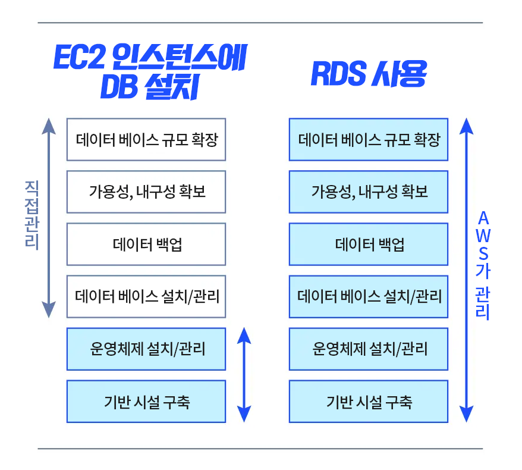
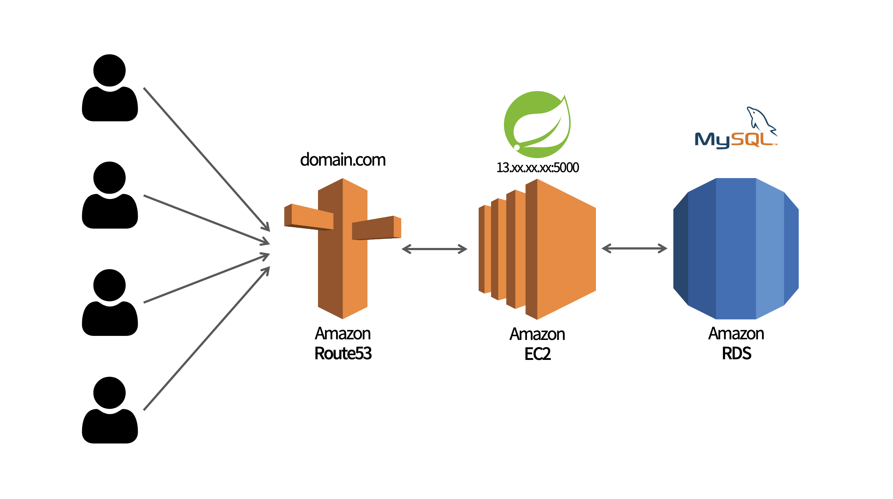

# AWS (Amazon Web Service)

아마존 웹 서비스(AWS)는 아마존닷컴의 클라우드 컴퓨팅 서비스이다.

<br>

## Amazon EC2(Elastic Compute Cloud)

<br>

EC2란 아마존 웹 서비스에서 제공하는 클라우드 컴퓨팅 서비스를 말한다.

> **❓ 클라우드 컴퓨팅**  
>
> 인터넷(클라우드)을 통해 서버, 스토리지, DB 등의 컴퓨팅 서비스를 제공하는 서비스

<br>

EC2 서비스는 사용한 만큼 비용을 지불하며, 필요에 따라 성능, 용량을 자유롭게 조절할 수 있다.

즉, **AWS에서 비용, 성능, 용량 면에서 탄력적인 클라우드 컴퓨터를 제공하는 서비스**이다.

<br>

**💡 장점**

- 구성하는데 필요한 시간이 짧다.

- AMI를 통해 다양한 운영체제에 대한 선택이 가능하다. (CPU, RAM, 용량까지 구성 가능)

- 전세계에 아마존이 만들어 놓은 데이터 센터가 있어 인프라가 좋다.

<br>

**💡 AMI (Amazon Machine Image)**  

인스턴스를 생성하는데 필요한 소프트웨어 구성(운영체제, 어플리케이션 서버, 어플리케이션)이 포함된 템플릿을 말한다.

- 인스턴스를 생성한다는 것은 AMI를 토대로 운영체제, CPU, RAM, 런타임 등이 구성된 컴퓨터를 빌리는 것을 말한다.

<br>

AWS에서 빌릴 PC는 사용 용도에 맞게 운영체제, 런타임 등이 구성된 Setting을 선택할 수 있다.

- 이 외에도 필요에 따라 직접 AMI를 구성할 수 있다.

<br>

***

<br>

## RDS (Relational Database Service)

<br>

RDS는 AWS에서 제공하는 관계형 데이터베이스 서버이다.

<br>



<br>

EC2 인스턴스에 DB를 설치하여 데이터를 관리하면 자동으로 관리를 담당하는 부분이 적기 때문에

사용자가 DB 엔진 설치와 버전 관리, 데이터 백업 등의 작업을 직접 해야한다.

<br>

반면에 RDS를 사용할 경우에는 데이터베이스 유지 보수와 관련된 일들을 RDS에서 자동으로 관리한다.

사용자는 초기 설정을 제외하고는 DB에 저장된 데이터를 관리하는 일만 하게 된다.

<br>

또한 다양한 데이터베이스 엔진 선택지를 제공하므로

필요와 목적에 맞게 데이터베이스 엔진을 선택하여 효율성을 높일 수 있다.

<br>

***

<br>

## S3 (Simple Storage Service)

<br>

S3는 AWS에서 제공하는 클라우드 스토리지 서비스이다.

> **❓ 클라우드 스토리지 (Cloud Storage)**
>
> 인터넷 공간에 데이터를 저장하는 저장소
>
> 웹 환경 어디에서나 저장된 데이터에 접근할 수 있다는 **뛰어난 접근성**이 장점이다.
>
> Google Drive, Naver MyBox, Onedrive 등이 해당된다.

<br>

**💡 장점**

- **높은 확장성**  
  : S3는 스토리지의 용량을 무한히 확장할 수 있으며, 사용량에 따른 비용만 지불하면 된다.

<br>

- **강력한 내구성**  
  : S3는 99.999999999%의 내구성을 보장하므로 저장된 파일을 유실할 가능성이 적다.

<br>

- **높은 가용성**  
  : S3는 99.99%의 가용성을 보장하여 시스템 장애 없이 서비스를 이용할 수 있다.

<br>

- **다양한 스토리지 클래스 제공**  
  : 저장소를 어떤 목적으로 활용할지에 따라 효율적으로 선택할 수 있는 다양한 스토리지 클래스가 존재한다.

  - Standard 클래스 : 빠른 데이터 접근 속도, 빠른 데이터 액세스 요청 처리 속도, 높은 비용
   
  - Glacier 클래스 : 느린 데이터 접근 속도, 느린 데이터 액세스 요청 처리 속도, 저렴한 비용

<br>

- **정적 웹사이트 호스팅 가능**  
  : S3에서는 버킷을 통해 정적 웹사이트 호스팅이 가능하다.

  - 정적 파일 : 서버의 개입 없이 클라이언트에 제공될 수 있는 파일
  
  - 웹 호스팅 : 서버의 한 공간을 임대하여 웹 사이트의 배포, 운영이 가능하게 만들어주는 서비스

  - 버킷 : S3에 저장되는 파일이 담기는 곳으로, 파일을 저장하는 최상위 디렉토리이다.

  <br>

  > **💡 버킷의 특징**
  >
  > - S3에서 저장되는 모든 파일은 버킷 안에 저장되어야 한다.
  >
  > - 버킷은 무한한 양의 파일을 저장할 수 있다.
  >
  > - 각 버킷은 이름을 가지고 있는데, 해당 버킷의 이름은 각 리전(버킷이 생성된 지역)에서 고유해야 한다.
  >
  > - 버킷의 정책을 생성하여, 해당 버킷에 대한 액세스 권한을 부여할 수 있다.

  <br>

  > **💡 버킷의 객체**
  >
  > - 버킷에 담기는 데이터를 객체라고 한다.
  >
  > - 객체는 파일과 메타데이터로 구성된다.
  >
  > - 파일은 키-값 페어 형식으로 데이터를 저장하며, 실제 데이터를 저장한다.
  >
  > - 파일의 키는 각 객체를 고유하게 만들어주는 식별자 역할을 하며, 해당 키를 통해 원하는 객체를 검색할 수 있다.
  >
  > - 메타데이터는 객체의 생성일, 크기, 유형과 같은 객체에 대한 정보가 담긴 데이터를 말한다.
  >
  > - 모든 객체는 고유한 URL 주소를 가지고 있어, URL 주소를 통해서 객체에 접근이 가능하다.
  >
  > - URL 주소는 ```http://[버킷 이름].S3.amazonaws.com/[객체 키]``` 형식으로 구성되어 있다.

<br>

***

<br>

## 배포 전략 (Deploy Strategy)

<br>

### 🔸 클라이언트 배포

S3를 이용하여 사용자에게 클라이언트 앱을 **정적 파일로 빌드하여 제공**한다.

- asset 자체가 정적인 경우, 있는 그대로 배포할 수 있다.

> **❓ 빌드**
> 
> 불필요한 데이터를 없애고, 통합/압축하여 배포하기 최적화된 상태를 만드는 것을 말한다.
> 
> 데이터의 용량이 줄어들고 웹 사이트 로딩 속도가 빨라진다.

<br>

AWS 에서 제공하는 CDN 서비스인 **CloudFront**를 통해서 각지의 데이터 센터에 데이터를 분산시켜 저장해 뒀다가  

가까운 지역에서 데이터를 주는 방식으로 사용자에게 **더 빠른 서비스를 제공**할 수 있다.

<br>

### 🔸 서버 배포

EC2 서비스를 통해 서버를 구성하고 서비스를 제공할 수 있다.

<br>

### 🔸 데이터베이스 배포

RDS 서비스를 통해 EC2를 통해 배포된 서버 어플리케이션의 데이터를 저장, 제공하는 데이터베이스를 배포할 수 있다.

<br>

### 🔸 DNS

AWS에서 제공하는 **Route 53**을 통해 직관적인 도메인 주소로 서비스에 접근하도록 할 수 있다.

<br>

✔️ _최종적인 3 Tier-Architecture 배포 전략은 아래와 같다._



<br><br>

***

_2022.12.03. Update_