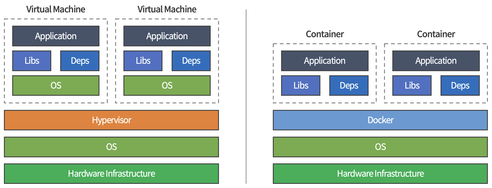

# Docker (도커)

도커는 리눅스 컨테이너(lxc) 기술이다.

컨테이너 기술은 어플리케이션을 컨테이너 내에 구성하여 각자 고유의 의존성을 갖도록 할 수 있다.

<br>

> 예를 들어 A 프로그램과 B 프로그램이 있다.
>
> A 프로그램은 php 7 버전을 요구하고, B 프로그램은 php 6 버전을 요구할 때
>
> php의 의존 관계를 가지고 있는 두 어플리케이션 중에 하나는 제대로 된 실행을 보장할 수 없다.

<br>

### **💡 컨테이너 기술의 특징**

<br>

1. 의존성 충돌 문제를 해결해준다.

   - 개발과 배포 환경을 일치시킨다.

     어플리케이션 구성 자체를 컨테이너화 해서 환경을 일치시킨다.

     <br>

   - 수평 확장을 쉽게 해준다.

     리버스 프록시의 한 종류인 **로드 밸런서**를 사용하여 여러 동일한 서버 중 한 곳을 이용할 수 있도록 한다.

     <br>

   - 각 서버에 새로운 내용을 배포하기 쉽게 만들어준다.

     새로운 버전의 어플리케이션을 여러 서버 중 몇 대에만 운영하여 테스트할 수도 있다.

     쿠버네티스와 같은 오케스트레이션 도구를 사용하여 이러한 기능을 구현할 수 있다.

     <br>

<br>

2. 각 컨테이너는 철저하게 어플리케이션 실행 환경이 격리되어 있다.

   - 프로세스

     특정 컨테이너에서 작동하는 프로세스는 기본적으로 컨테이너 안에서만 액세스 가능하다.  

     컨테이너 안에서 실행되는 프로세스는 다른 컨테이너의 프로세스에게 영향을 줄 수 없다.
     
    <br>

   - 네트워크

      기본적으로 컨테이너 하나에 하나의 IP 주소가 할당된다.

      <br>

   - 파일 시스템

      컨테이너 안에서 사용되는파일 시스템은 구획화 되어있다.

      따라서 해당 컨테이너에서의 명령이나 파일 등의 액세스를 제한할 수 있다.

<br>

***

<br>

## Docker

<br>

Docker에서 사용하는 키워드는 컨테이너, 이미지, 레지스트리 등이 있다.

<br>

### 🔸 컨테이너

<br>

컨테이너는 어플리케이션이 의존성, 네트워크 환경, 파일 시스템에 구애받지 않고,  

도커라는 기술 위에 실행될 수 있도록 만든 어플리케이션 상자를 말한다.

<br>

### 🔸 이미지

<br>

이미지는 어플리케이션 및 구성을 함께 담아놓은 템플릿을 의미하며, 모든 컨테이너는 이미지로부터 실행된다.  

이미지를 이용해 여러 개의 컨테이너를 생성할 수 있고, 이로 인해 수평 확장이 가능하다.

이미지는 기본 이미지로부터 변경 사항을 추가/커밋해서 또 다른 이미지로 만들 수 있다.

<br>

### 🔸 레지스트리

<br>

레지스트리는 이미지를 저장하고 배포, 공유하는데 사용한다.

레지스트리의 종류로는 Docker Hub, Amazon ECR 등이 있다.

<br>

***

<br>

## Docker CLI

<br>

### 🔸 Image

<br>

```bash
docker image pull docker/whalesay:latest
```

▲ _이미지를 받아오는 명령어_

<br>

제공된 ```docker/whalesay:latest``` 이미지는 Registry Account, Repository Name, Tag 세 부분으로 구성되어 있다.

- **레지스트리 (Registry)**  

  - 도커 이미지를 관리하는 공간  

  - 지정하지 않을 시, 도커 허브(Docker Hub)를 기본 레지스트리로 설정

  - Docker Hub, Private Docker Hub, 회사 내부용 레지스트리 등으로 설정 가능

  > ```docker```는 Docker hub를 뜻한다.

<br>

- **레포지토리 (Repository)**

  - 레지스트리 내에 도커 이미지가 저장되는 공간 (이미지 이름이 사용되기도 함)  

  - Github의 Repository와 비슷한 개념

<br>

- **태그 (Tag)**

  - 주로 해당 이미지를 설명하는 버전 정보를 입력

  - 지정하지 않을 시, ```latest``` 태그를 기본으로 설정

<br><br>

```bash
docker image ls
```

▲ _이미지 리스트 출력_

<br><br>

```bash
docker image rm {이미지}
```

▲ _이미지 삭제_

<br><br>

### 🔸 Container

<br>

```bash
docker (container) run (<옵션>) <이미지 식별자> (<명령어>) (<인자>)
```
▲ _컨테이너를 생성하는 명령어_

<br>

**💡 docker run 옵션**

- ```-d``` : 컨테이너를 백그라운드에서 실행

- ```-it``` : 컨테이너를 종료하지 않은채로 터미널의 입력을 컨테이너로 계속 전달

- ```--name``` : 컨테이너 ID 대신 컨테이너 이름 부여

- ```-e``` : 컨테이너의 환경변수 설정

- ```-p``` : 로컬 호스트와 컨테이너 간의 포트를 연결한다.

- ```-v``` : 호스트와 컨테이너 간의 볼륨 설정을 위해서 사용

- ```-w``` : Dockerfile의 WORKDIR 설정을 덮어쓰기 위해서 사용

- ```--entrypoint``` : Dockerfile의 ENTRYPOINT 설정을 덮어쓰기 위해서 사용

- ```--rm``` : 컨테이너가 중지되거나 종료될 때, 관련 리소스를 모두 제거. 일회성으로 실행할 때 사용

<br><br>

```bash
docker container ps -a
```

▲ _컨테이너 리스트 출력_

<br>

- ```container ps``` : 컨테이너 리스트 출력

- ```-a``` : (Option) 종료된 컨테이너를 포함해서 출력한다. 기본값은 실행 중인 컨테이너만 출력

<br><br>

```bash
docker container rm {컨테이너 이름}
```

▲ _컨테이너 삭제_

<br><br>

```bash
docker exec -it {컨테이너 이름} bash
```

▲ _컨테이너 내부에서 bash shell 실행_

<br><br>

### 🔸 Docker Container에 파일 복사하기

<br>

사용할 모든 파일이 이미지에 구성되어 있는 경우도 있지만,  

서버는 도커 컨테이너를 통해 실행하지만, 구성 파일은 로컬에서 가져오는 방식도 있다.

로컬에 있는 파일과 도커 이미지를 연결하는 방법은 CP(Copy)를 이용하는 방법과 Docker Volume을 이용하는 방법이 있다.

- CP : 호스트와 컨테이너 사이에 파일을 **복사(Copy)**

- Volume : 호스트와 컨테이너 사이에 공간을 **마운트(Mount)**

> ❓ **마운트 (Mount)**
>
> 저장 공간을 다른 장치에서 접근할 수 있도록 경로를 허용해서, 마치 하나의 저장 공간을 이용하는 것처럼 보이게 하는 작업

<br>

위처럼 로컬의 구성 파일과 서버를 따로 구성하면 아래와 같은 장점이 존재한다.

- 서버에 문제가 생기는 것을 호스트와 별개로 파악할 수 있다.

- 문제가 생긴 서버를 끄고, 공장 초기화를 하듯 도커 이미지로 서버를 재구성 할 수 있다.

<br><br>

#### **💡 httpd 웹 서버**

<br>

httpd(http daemon)은 Apache HTTP Server를 실행할 수 있는 오픈소스 웹 서버 소프트웨어이다.

```/usr/local/apache2/htdocs/``` 경로에 웹 서버와 관련된 파일들이 저장되어 있다면, 해당 파일을 기반으로 웹 서버를 실행한다.

<br>

```bash
docker container run --name {컨테이너 이름} -p 818:80 httpd
```

▲ _httpd 실행_

<br>

- ```-p 818:80``` : 두 포트를 연결한다. 818 포트는 로컬호스트의 포트, 80은 컨테이너의 포트이다.
  
<br>

이후 로컬 호스트의 파일 경로에서 아래 명령어를 통해 컨테이너에 파일을 전달한다.

```bash
docker container cp ./ {컨테이너 이름}:/usr/local/apache2/htdocs/
```

▲ _현재 폴더의 파일을 뒤 경로에 복사_

<br>

### 📋 [***도커 컨테이너 데이터 볼륨 관리***](https://www.joinc.co.kr/w/man/12/docker/Guide/DataWithContainer)

<br><br>

### 🔸 Docker 이미지 만들기

<br>

Docker Container를 이미지 파일로 변환하면 아래와 같은 장점이 있다.

- 이전에 작업했던 내용을 다시 한 번 수행하지 않아도 된다.

- 배포 및 관리가 유용하다.

<br>

#### **1️⃣ 구동한 Docker Container를 이미지로 만드는 방법**

<br>

```bash
docker container commit {컨테이너 이름} {저장할 이미지 이름}
```

▲ _구동한 Docker Container를 commit_

<br>

이후 ```docker images``` 명령어를 통해 저장된 이미지를 확인할 수 있다.

<br><br>

#### **2️⃣ Docker Image 빌드를 위한 파일인 Dockerfile로 만드는 방법**

<br>

Dockerfile은 확장자가 없고, 이름이 Dockerfile인 이미지 파일의 설명서이다.

<br>

로컬 호스트의 파일 경로에 Dockerfile을 생성하고, 텍스트 에디터를 통해 명령을 작성한다.

```bash
FROM httpd:2.4  # 베이스 이미지를 httpd:2.4로 사용
COPY ./ /usr/local/apache2/htdocs/  # 호스트의 현재 경로 파일을 생성할 이미지 경로에 복사
```

<br>

이후 ```docker build``` 명령어를 통해 Dockerfile로 도커 이미지 파일을 생성한다.

```bash
docker build {저장할 이미지 이름} .
```

<br>

### 📋 [**Dockerfile 공식문서**](https://docs.docker.com/engine/reference/builder/)

<br>

***

<br>

## 두 개의 Docker Image 사용하기

<br>

두 개 이상의 도커 컨테이너를 연결하는 명령어는 ```docker-compose```가 있다.

docker-compose를 사용하기 위해서는 ```docker-compose.yml``` 파일을 생성한다.

```yml
version: '3.8'

services:
  nginx:
    image: sebcontents/client
    restart: 'always'
    ports:
      - "8080:80"
    container_name: client

  spring:
    image: 0xnsky/server-spring
    restart: 'always'
    ports:
      - "4999:3000"
    container_name: server-spring
```

▲ _docker-compose.yml_

<br>

이후 yml 파일이 있는 위치에서 명령어를 통해 해당 파일을 실행한다.

```bash
docker-compose up
```

▲ _docker-compose.yml에 정의된 이미지를 컨테이너로 실행_

<br>

```bash
docker-compose down
```

▲ _실행된 컨테이너를 종료_

<br><br>

```docker-compose.yml``` 파일을 통해 **볼륨**과 **환경 변수**를 설정하는 방식은 아래 코드와 같다.

<br>

```yml
version: '3.8'

services:
  nginx:
    image: sebcontents/client
    restart: 'always'
    ports:
      - "8080:80"
    container_name: client

  spring:
    image: 0xnsky/server-spring
    restart: 'always'
    ports:
      - "4999:3000"
    container_name: server-spring
    volumes:
      - "./volumefolder:/data"

  mysql:
    image: mysql:latest
    restart: 'always'
    ports:
      - "3307:3306"
    container_name: database
    environment:
      MYSQL_ROOT_PASSWORD: root_계정_비밀번호
      MYSQL_DATABASE: 초기_생성_데이터베이스
      MYSQL_USER: 유저_이름
      MYSQL_PASSWORD: 유저_패스워드
```

<br>

컨테이너가 제대로 실행되었다면 yml 파일이 위치한 곳에 ```volumefolder``` 디렉토리가 생성된다.

해당 폴더 내에 생성된 파일은 ```docker exec```를 통해 접근한 서버 컨테이너 터미널에서  

```cd /data``` 명령어를 통해 이동한 디렉토리에 동일하게 생성된다.

<br>

### 📋 [***Docker Hub의 Mysql Image***](https://hub.docker.com/_/mysql)

<br>

***

<br>

## Container vs VM(Virtual Machine)

<br>

컨테이너 기술과 가상 머신(VM)은 둘 다 프로세스, 네트워크, 파일 시스템을 격리할 수 있다는 장점을 공유한다.

하지만 작동 원리에서 많은 차이점을 가지고 있다.

<br>



<br>

**💡 VM**

- 실행하는 과정에서 많은 컴퓨팅 자원을 필요로 한다.

- 해당 VM 위에 운영체제(OS)를 설치해야 한다.

  > ❓ **하이퍼바이저 (Hypervisor)**
  >
  > VM을 생성하고 구동하는 소프트웨어

<br>

**💡 Container**

- 한 호스트의 컴퓨터에 여러 컨테이너를 띄워도 컴퓨터 자원을 많이 사용하지 않는다.

- 도커 이미지는 보통 어플리케이션 단위로 만들어져 있다.

- 각 컨테이너는 호스트 OS의 커널(Kernel)을 공유하고 있다.

  > ❓ **커널 (Kernel)**
  >
  > 시스템 콜과 같이 OS의 핵심 기능을 구현한 프로그램

<br><br>

***

_2022.12.09. Update_