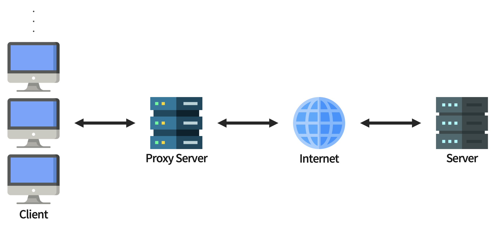
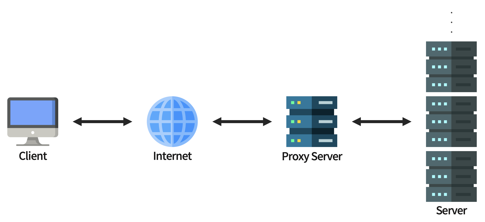

# 운영 전략

<br>

## 프록시 서버 (Proxy Server)

<br>

프록시 서버는 클라이언트가 서버와 소통할 때,  

서버에 바로 접근하지 않고 자신을 통해 서버에 접근할 수 있도록 해주는 일종의 **대리 서버**이다.

<br>

### 프록시 서버의 종류

<br>

#### **🔸 Forward Proxy**

<br>



<br>

Forward Proxy는 클라이언트 가까이에 위치한 프록시 서버를 말하며, 클라이언트를 대신해 서버에 요청을 전달한다.

<br>

**💡 장점**

- 캐싱을 통한 빠른 서비스 이용 가능  

  : 여러 클라이언트가 동일한 요청을 보내는 경우 첫 응답의 결과 데이터를 캐시에 저장해 놓고,  
  &nbsp; 이후 서버에 재 요청을 보내지 않아도 다른 클라이언트에게 빠르게 전달할 수 있다.

  <br>

- 보안  

  : 클라이언트에서 프록시 서버를 거친 후 서버에 요청이 도착하기 때문에,  
  &nbsp; 서버에서 클라이언트의 IP 추적이 필요한 경우 클라이언트의 IP가 아닌 프록시 서버의 IP가 전달된다.

  &nbsp; 서버가 응답받은 IP는 프록시 서버의 IP이기 때문에 서버에게 클라이언트를 숨길 수 있다.

<br><br>

#### **🔸 Reverse Proxy**

<br>



<br>

Reverse Proxy는 서버 가까이에 위치한 프록시 서버를 말하며, 서버를 대신해서 클라이언트에 응답을 제공한다.

<br>

**💡 장점**

- 분산 처리  
  
  : 클라이언트-서버 구조에서 사용자가 많아져 서버에 과부하가 올 경우를 위해 부하를 분산할 수 있다.  
  &nbsp; 프록시 서버로 요청이 들어오면 여러 대의 서버로 요청을 나누어 전달 후 처리한다.

  <br>

- 보안  

  : 클라이언트 입장에서 요청을 보내는 서버가 프록시 서버가 되므로 실제 서버의 IP 주소가 노출되지 않는다.

<br>

***

<br>

## 수평 확장

<br>

### 로드 밸런서 (Load Balancer)

<br>

서비스에 너무 많은 요청 혹은 너무 잦은 요청을 보내게 되면 서버에는 과부하가 오게 된다.

과부하로 인해 서버가 원할한 서비스를 제공하지 못하는 경우를 해결하기 위해서 **서버의 하드웨어 업그레이드**나 **서버의 갯수를 늘리는 방법**을 택할 수 있다.

<br>

**🔸 Scale-Up**

<br>

Scale-Up은 물리적으로 서버의 사양을 높이는 하드웨어적인 방법이다.

<br>

**💡 장점**

- 서버의 수를 늘리지 않아 공간적으로 이점이 있다.

- 프로그램 구현에 있어서 변화가 필요없다.

<br>

**💡 단점**

- 서버의 사양을 높이는데 많은 비용이 든다.

- 하드웨어의 업그레이드에는 한계가 존재한다.

<br><br>

**🔸 Scale-Out**

<br>

Scale-Out은 서버의 갯수를 늘려 하나의 서버가 받는 부하를 분산시키는 방법이다.

장・단점의 경우 Scale-Up 방식과 상반된다.

<br>

Scale-Out 방식으로 부하를 처리하는 경우, 

클라이언트로부터 온 요청을 어느 서버로 보낼지 정해주는 기술을 **로드 밸런싱**이라고 하며

로드 밸런싱의 역할을 하는 것을 **로드 밸런서**라고 한다.

<br>

**💡 로드 밸런서의 종류**

- L2  

  : 데이터 전송 계층에서 Mac 주소를 바탕으로 로드 밸런싱한다.

- L3  

  : 네트워크 계층에서 IP 주소를 바탕으로 로드 밸런싱한다.

- L4

  : 전송 계층에서 IP 주소와 Port를 바탕으로 로드 밸런싱한다.

- L7

  : 응용 계층에서 클라이언트의 요청을 바탕으로 로드 밸런싱한다.

<br><br>

### 오토 스케일링 (Auto Scaling)

<br>

오토 스케일링은 Scale-Out 방식으로 서버를 증설할 때, 자동으로 서버(리소스)를 관리해주는 기능이다.

서버의 처리량이 증가하면 자동으로 리소스를 추가하고, 처리량이 감소하면 리소스를 감소시켜 적절한 분산 환경을 만들어준다.

> Auto Scaling은 AWS 기반의 서비스이며, 다른 클라우드 서비스의 경우 기능의 이름이나 방식이 다를 수 있다.

<br>

**💡 장점**

- 동적 스케일링  
  
  : 사용자의 요구 수준에 따라 리소스를 동적으로 스케일링 할 수 있다. (제한이 없다)

  <br>

- 로드 밸런싱  

  : 로드 밸런서와 함께 사용하면 다수의 EC2 인스턴스에게 워크 로드를 효과적으로 분배할 수 있어서  
  &nbsp; 사용자가 정의한 규칙에 따라 워크 로드를 효과적으로 관리할 수 있다.

  <br>

- 타겟 트래킹  

  : 특정 타겟에만 오토 스케일링을 할 수 있으며, 사용자가 설정한 타겟에 맞춰 EC2 인스턴스의 수를 조정한다.

  <br>

- 헬스 체크와 서버 플릿 관리  

  : 오토 스케일링을 사용하면 EC2 인스턴스의 헬스 체크 상태를 모니터링 할 수 있다.  
  &nbsp; 헬스 체크 과정에서 특정 인스턴스의 문제가 감지되면, 자동으로 다른 인스턴스로 교체한다.

<br><br>

### EC2 Auto Scaling

<br>

오토 스케일링은 EC2 인스턴스 뿐 아니라 다른 인스턴스와도 결합이 가능하지만, EC2 사용자에게 가장 수요가 많다.

EC2 Auto Scaling은 오직 EC2 서버라는 리소스만 대상으로 하는 서비스이다.

<br>

#### **🔸 시작 템플릿 (Launch Template, Launch Configuration)**

시작 템플릿은 AMI 상세 정보, 인스턴스 타입, 키 페어, 시큐리티 그룹 등 인스턴스에 대한 모든 정보를 담고 있다.

만약, 시작 템플릿을 사용하지 않을 경우에는 시작 구성을 생성할 수 있다.

시작 구성은 EC2 Auto Scaling이 사용자를 위해 생성하는 EC2 인스턴스 유형을 지정한다는 점에서 시작 템플릿과 비슷하다.

<br>

#### **🔸 Auto Scaling 그룹 생성**

Auto Scaling 그룹은 Scale-Up 및 Scale-Down 규칙의 모음으로,  

EC2 인스턴스 생성부터 삭제까지의 모든 동작에 대한 규칙과 정책을 담고 있다.

<br>

#### **🔸 Scaling 유형**

- 인스턴스 레벨 유지  

  : 기본 스케일링 계획으로도 불리며, 항상 실행 상태를 유지하고자 하는 인스턴스의 수를 지정할 수 있다.  
  &nbsp; 일정한 수의 인스턴스가 필요한 경우 최소, 최대, 원하는 용량에 동일한 값을 설정할 수 있다.

  <br>

- 수동 스케일링 (비추천)

  : 기존 Auto Scaling 그룹의 크기를 수동으로 변경할 수 있다.  
  &nbsp; 수동 스케일링을 하면 사용자가 직접 콘솔, API, CLI 등으로 수동으로 인스턴스를 추가・삭제해야 한다.

  <br>

- 일정별 스케일링

  : 스케일링 트래픽의 변화를 예측할 수 있고, 특정 시간에 얼마나 트래픽 증가량의 패턴을 파악했을때 사용하기 좋다.

  <br>

- 동적 스케일링

  : 수동 변화에 대응하여 Auto Scaling 그룹의 용량을 조정하는 방법을 말한다.  
  &nbsp; 해당 방식은 CloudWatch가 모니터링하는 지표를 추적하여, 경보 상태일 때 수행할 스케일링 규칙을 정한다.  

> 이와 같은 스케일링 정책을 정의할 때는 항상 Scale-Up과 Scale-Down 2가지의 정책을 작성해야한다.

<br>

***

<br>

## 웹 서버

<br>

### Tomcat

<br>

Tomcat은 서블릿 컨테이너만 있는 오픈소스 웹 어플리케이션 서버이다.

<br>

**💡 특징**

- 자바 어플리케이션을 위한 대표적인 오픈 소스 WAS(Web Application Server)이다.

- 오픈소스이므로 라이센스 비용에 대한 부담 없이 사용 가능하다.

- 독립적으로도 사용 가능하며, Apache와 같이 다른 웹 서버와 연동하여 함께 사용할 수 있다.

- 자바 서블릿 컨테이너에 대한 공식 구현체로, Spring Boot에 내장되어 있어 별도의 설치과정이 필요하지 않다.

<br>

**🔸 Tomcat 의존성 확인**

인텔리제이 상단의 View → Tool Windows → Gradle 혹은 우측의 Gradle 탭을 누르면 확인할 수 있다.

<br><br>

### Jetty

<br>

Jetty는 이클랩스 재단의 HTTP 서버이자 자바 서블릿 컨테이너이다.

<br>

**💡 특징**

- 타 웹 어플리케이션 대비 적은 메모리를 사용하여 가볍고 빠르다.

- 어플리케이션에 내장이 가능하다.

- 경량 웹 어플리케이션으로 소형 장비, 소규모 프로그램에 적합하다.

<br>

**🔸 Spring Boot 서버 변경**

```build.gradle``` 파일에서 ```spring-boot-starter-web``` 의존성 모듈 내에는 Tomcat이 기본으로 내장되어 있기 때문에 제외시켜준다.

```java
dependencies {
    implementation ('org.springframework.boot:spring-boot-starter-web') {
  	    exclude module: 'spring-boot-starter-tomcat'
   	}
}
```

<br>

이후 Tomcat을 제외했다면, 대체할 서버로 Jetty의 의존성을 추가한다.

```java
implementation ('org.springframework.boot:spring-boot-starter-jetty')
```

<br>

의존성 추가 후 프로젝트를 빌드 및 실행하면 Spring Boot가 Jetty를 통해 실행되는 것을 볼 수 있다.

<br><br>

### NginX

<br>

NginX는 가볍고 높은 성능을 보이는 오픈소스 웹 서버 소프트웨어이다.

<br>

Tomcat이나 Jetty가 자바 서블릿 컨테이너 혹은 웹 어플리케이션 서버였다면,  

NginX는 웹 서버로 **클라이언트에게 정적 리소스를 빠르게 응답**하기 위한 웹 서버로 사용할 수 있다.

<br>

**💡 특징**

- 트래픽이 많은 웹 사이트의 확장성을 위해 개발된 고성능 웹 서버이다.

- 비동기 이벤트 기반으로 적은 자원으로 높은 성능과 동시성을 위해 개발되었다.

- 다수의 클라이언트 연결을 효율적으로 처리할 수 있다.

- 클라이언트와 서버 사이에 존재하는 리버스 프록시 서버로 사용할 수 있다.

- NginX를 클라이언트와 서버 사이에 배치하여 무중단 배포를 할 수 있다.

<br>

**🔸 NginX를 통한 프록시 서버 구성**

NginX는 ```[클라이언트 - NginX - 서버]``` 형태의 리버스 프록시 서버로 사용할 수 있다.

<br>

1️⃣ NginX 설치 및 실행

```bash
$ brew install nginx
```

▲ _NginX 설치_

<br>

```bash
$ brew services start nginx
```

▲ _NginX 실행_

<br>

```localhost:8080```으로 접속하면 NginX가 잘 실행되었는지 확인할 수 있다.

<br><br>

2️⃣ NginX 설정 파일 수정

```bash
$ nginx -t  # 설정 파일의 위치 확인
$ vim /usr/local/etc/nginx/nginx.conf   # 설정 파일 수정
```

<br>

```
server {
		listen       80;

        ...

		location / {
				...
				proxy_pass http://localhost:8080;
				proxy_set_header X-Real-IP $remote_addr;
				proxy_set_header X-Forwarded-For $proxy_add_x_forwarded_for;
				proxy_set_header Host $http_host;
		}
}
```

▲ _nginx.conf 파일 수정_

<br>

3️⃣ 재시작 및 Spring Boot 서버 실행

```bash
$ brew services restart nginx
```

▲ _NginX 재시작_

<br>

이후 ```localhost```를 통해 접속하면 ```An error occurred.``` 화면이 출력되지만,

Spring Boot가 8080 포트에서 정상적으로 실행되면 해당 서버의 웹 페이지가 출력된다.

<br><br>

**🔸 NginX를 통한 로드 밸런싱 구성**

<br>

1️⃣ 여러 개의 Spring Boot 서버 실행

```bash
./gradle build
```

▲ _프로젝트 빌드_

<br>

```bash
java -jar example-0.0.1-SNAPSHOT.jar
```

▲ _기본 포트(8080)에서 빌드 파일 실행_

<br>

```bash
java -Dserver.port=8081 -jar example-0.0.1-SNAPSHOT.jar
```

▲ _8081 포트에서 빌드 파일 실행_

<br><br>

2️⃣ NginX 설정 파일 수정

```bash
$ nginx -t  # 설정 파일의 위치 확인
$ vim /usr/local/etc/nginx/nginx.conf   # 설정 파일 수정
```

<br>

```
http {
    ...

    upstream backend {
        server localhost:8080;
        server localhost:8081;
    }

    server {
        ...

        location / {
            proxy_pass http://backend;
        }
    }
}
```

▲ _nginx.conf 파일 수정_

<br>

위 코드는 ```backend```라는 서버 그룹을 만든 뒤, 그룹 자체로 ```location```에 전달을 하는 구조이다.

<br>

### 📋 [***NginX 공식 문서***](https://docs.nginx.com/nginx/admin-guide/)

<br>

***

<br>

## VPC (Virtual Private Cloud)

<br>

VPC는 클라우드 내에 Private 공간을 제공함으로써, 클라우드를 Public과 Private 영역으로 논리적으로 분리할 수 있게 해준다.

VPC를 분리함으로써 리소스를 격리하여 확장성을 가질 수 있고, 네트워크에 대한 완전한 통제권을 가질 수 있다.

<br>

### VPC 구성 요소 및 용어

<br>

**🔸 IP Address**

IP는 컴퓨터 네트워크에서 장치들이 서로를 인식하고 통신을 하기 위해서 사용하는 특수한 번호로 IPv4, IPv6로 나뉘어 있다.

```127.0.0.1```과 같이 십진수의 형태로 이루어져 있지만, 실제로는 2진수 8자리의 형태, 즉 8bit씩 총 32bit로 구성되어 있다.

이때 각 8bit의 형태를 옥텟(Octet)이라고 부르며, ```.```로 구분한다.

<br>

**🔸 IP Address Class**

클래스는 A, B, C, D, E의 5가지 클래스로 나누어져 있으며, D와 E는 멀티캐스트용, 연구 개발을 위한 예약 IP라서 보통 사용되지 않는다.

클래스는 IPv4 주소에서 호스트가 연결된 8bit 네트워크 영역과 해당 네트워크 내에서 호스트 주소를 가리키는 영역을 구분하기 위해서 사용한다.

<br>

- A 클래스

|Network Address|Host Address|Host Address|Host Address|
|:-:|:-:|:-:|:-:|
|0 - 127|0 - 255|0 - 255|0 - 255|

```0.0.0.0```은 자체 네트워크를 의미하기 때문에 제외되고,  
```127.x.x.x```는 자기 자신을 가리키기 위한 목적으로 예약된 IP 주소이기 때문에 사용할 수 없다.

<br>

- B 클래스

|Network Address|Host Address|Host Address|Host Address|
|:-:|:-:|:-:|:-:|
|128 - 191|0 - 255|0 - 255|0 - 255|

<br>

- C 클래스

|Network Address|Host Address|Host Address|Host Address|
|:-:|:-:|:-:|:-:|
|192 - 223|0 - 255|0 - 255|0 - 255|

<br><br>

### CIDR (Classless Inter-Domain Routing)

<br>

CIDR은 사이더라고 불리며,  
클래스 없는 도메인 간 라우팅 기법으로, 국제 표준의 IP 주소 할당 방법이며, IP 클래스 방식을 대체한 방식이다.

기존에는 클래스에 따라 정해진 네트워크 영역과 호스트 영역을 사용해야 했다면, CIDR은 원하는 만큼 네트워크 영역을 지정하여 운용할 수 있다.

<br>

```127.0.0.1 /16```에서 ```/16```은 첫 16bit를 Network Address로 사용한다는 의미이다.

<br><br>

### 서브넷 (Subnet)

<br>

서브넷은 서브네트워크(Sub Network)의 줄임말로 IP 네트워크의 논리적인 하위 부분을 가리키며,  

서브넷을 통해 하나의 네트워크를 여러 개로 나눌 수 있다.

<br>

VPC를 사용하면 퍼블릭 서브넷, 프라이빗 서브넷, VPN only 서브넷 등 필요에 따라 다양한 서브넷을 생성할 수 있다.

- Public Subnet : 인터넷을 통해 연결할 수 있는 서브넷

- Private Subnet : 인터넷을 연결하지 않고, 보안을 유지하는 배타적인 서브넷

- VPN only Subnet : 기업 데이터 센터와 VPC를 연결하는 서브넷

<br>

서브넷은 VPC의 CIDR 블록을 이용해 정의되며, 최소 크기의 서브넷은 ```/28```이다.

서브넷은 AZ당 최소 하나를 사용할 수 있고, 여러 개의 AZ에 연결되는 서브넷은 만들 수 없다.

> **❓ AZ (Availability Zone)**
>
> AZ는 클라우드 서비스를 사용할 수 있는 국가(지역)를 말한다.
>
> 한 국가 내부에서도 데이터 센터들이 나누어져 있는데, 여기서 국가를 리전(Region), 한 국가 내부의 가용성 영역을 AZ라고 한다.
> 
> AZ는 **네트워크 속도와 안전성**, **재난과 같은 데이터 소실로부터의 안전**을 위해 사용한다.

<br><br>

### 라우팅 테이블 (Routing Table)

<br>

라우팅 테이블은 트래픽의 전송 방향을 결정하는 라우트와 관련된 규칙을 담을 테이블로, 

목적지를 향한 최적의 경로로 데이터 패킷을 전송하기 위한 모든 정보를 담고 있다.

쉽게 말해서, 하나의 지점에서 또 다른 지점으로 가기 위한 모든 정보를 제공하기 위한 테이블이라고 할 수 있다.

<br><br>

***

_2022.12.13. Update_