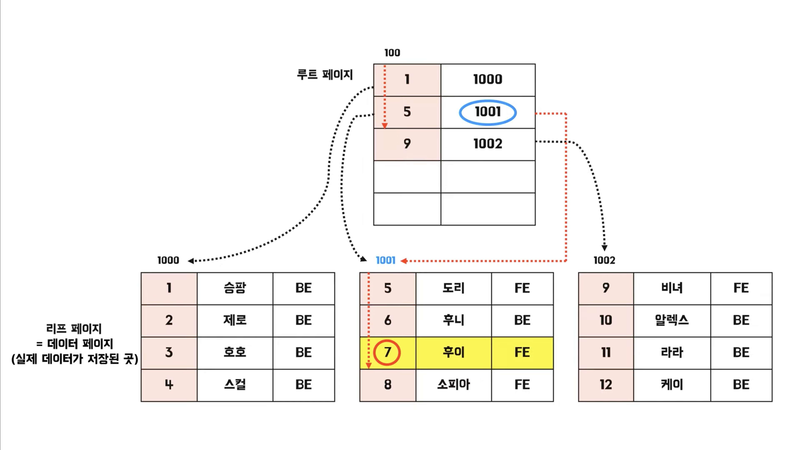
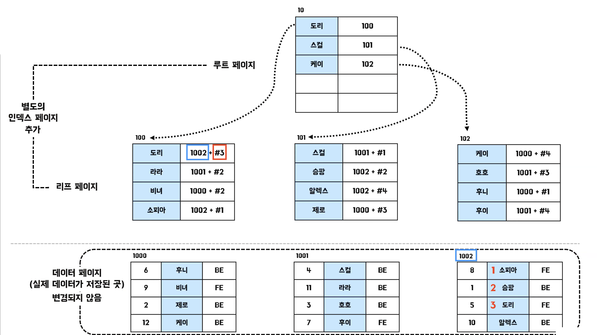

# 인덱스 (Index)

인덱스는 테이블에서 원하는 데이터를 쉽고 빠르게 찾기 위해 사용한다.

인덱스를 지정한 칼럼을 기준으로 메모리 영역에 일종의 목차를 생성하는 원리로 작동된다.

추가적인 저장을 하기 때문에 Insert, Update, Delete 시에는 속도가 저하될 수 있지만,  
조회 시에는 속도 향상이 되기 때문에 Update, Delete를 하기 위해 해당 데이터를 조회하는 것은 인덱스가 있다면 빠르게 조회가 가능하다.

<br>

### 🔸 인덱스 생성

```sql
CREATE INDEX idx_name ON table_name (column_name, …);

ALTER TABLE table_name ADD INDEX idx_name (column_name);
```

<br>

### 🔸 인덱스 확인

```sql
SHOW INDEX FROM table_name;
```

```sql
EXPLAIN SELECT * FROM table_name WHERE 조건;
```
▲ 실행 계획을 통해 특정 쿼리에서 인덱스를 사용하는지 확인 가능

<br>

### 🔸 인덱스 삭제

```sql
ALTER TABLE table_name DROP INDEX idx_name;
```

<br>

***

<br>

## 인덱스를 설정하는 기준

인덱스는 조회 시 자주 사용되는 조건이며, 고유한 값 위주로 설정하는게 좋다.

카디널리티, 선택도, 활용도, 중복도를 고려하면 좋으며, ```WHERE``` 절에 사용할 때 효과가 있다.

<br>

### 🔸 카디널리티 (Cardinality)

카디널리티가 **높을 수록** 인덱스 설정에 좋은 칼럼이다.

> 카디널리티가 높다 = 중복 정도가 낮다

<br>

이름과 성별이 있을 때, 이름은 중복 정도가 낮고 성별은 중복되는 값이 많으니 이름이 카디널리티가 더 높다고 할 수 있다.

<br>

### 🔸 선택도 (Selectivity)

선택도가 **낮을 수록** 인덱스 설정에 좋은 칼럼이다.

이름, 전화번호, 성별 칼럼을 20개 가진 테이블이 있을 때,  
이름은 2명씩 같고, 남녀 5:5의 비율을 가진다고 가정해보자.

이름의 선택도는 2 / 20 * 100 = 10%  
전화번호의 선택도는 1 / 20 * 100 = 5%  
성별의 선택도는 10 / 20 * 100 = 50%

<br>

### 🔸 활용도

실제 작업에서 해당 칼럼이 얼마나 활용되는지에 대한 값이다.

<br>

### 🔸 중복도

중복 인덱스 여부에 대한 값이다.

인덱스 성능을 고려하지 않고 생성하거나 같은 칼럼에 중복 인덱스가 생성된 경우 성능이 저하될 수 있다.

> **💡 주요 인덱스 컬럼**  
> 
> - **Table** : The name of the table.
> - Non_unique: 0 if the index cannot contain duplicates, 1 if it can.
> - **Key_name** : The name of the index. If the index is the primary key, the name is always PRIMARY.
> - **Seq_in_index** : The column sequence number in the index, starting with 1.
> - **Column_name** : The column name.
> - **Collation** : How the column is sorted in the index. This can have values A (ascending) or NULL (not sorted).
> - **Cardinality** : An estimate of the number of unique values in the index.
> - **Index_type** : The index method used (BTREE, FULLTEXT, HASH, RTREE)

<br>

***

<br>

## 인덱스 조회 시 주의 사항

```between```, ```like```, ```<```, ```>``` 등 범위 조건에서  
해당 칼럼은 인덱스를 타지만, 그 뒤 인덱스 칼럼은 인덱스가 사용되지 않는다.

```sql
WHERE status = XX and is_premium = YY and dead_line > ZZ
```

위의 값들이 모두 인덱스가 설정이 되어 있을 때, ```is_premium``` 칼럼은 인덱스가 사용되지 않는다.

<br>

```=```, ```in```은 다음 칼럼도 인덱스를 사용한다.

단, ```in```의 경우 서브쿼리가 인자값에 포함되면 서브쿼리의 외부가 먼저 실행되고 ```in```은 체크조건으로 실행되므로 성능상 이슈가 발생한다.

<br>

인덱스로 사용된 칼럼값을 그대로 사용해야만 인덱스가 사용된다.

```sql
-- 인덱스 X
WHERE price * 10 > 10000

-- 인덱스 O
WHERE price > 10000 / 10
```

<br>

***

<br>

## 인덱스의 종류

### 🔸 클러스터 인덱스 (Clustered Index)



<br>

클러스터 인덱스는 테이블당 하나만 존재할 수 있다.  
따로 지정하지 않을 시, PK를 지정한 칼럼이 자동으로 클러스터 인덱스가 된다.

데이터 입력, 수정, 삭제 시에 항상 정렬된 상태를 유지한다.

<br>

**💡 주로 사용하는 경우**

- 테이블 데이터의 업데이트가 자주 되지 않는 경우 
- MAX, MIN, COUNT 등의 쿼리로 Group By 등의 조회를 하는 경우
- 항상 정렬된 방식으로 데이터를 반환해야하는 경우
- 읽기 작업이 월등히 많은 경우

<br>

### 🔸 논 클러스터 인덱스 (Non-Clustered Index)



<br>

논클러스터 인덱스는 데이터 원본은 정렬되지 않고, 별도의 인덱스 페이지를 추가한다.

해당 인덱스 페이지는 ```파일 그룹 번호 + 데이터페이지 번호 + 페이지 내의 row```로 구성되는 포인터(RID)와 키값으로 구성된다.

> 책의 가장 뒷편에 색인(INDEX)처럼 단어로 페이지를 찾는 느낌이다.

<br>

**💡 주로 사용하는 경우**

- ```WHERE```이나 ```JOIN```과 같이 조건문을 활용하여 테이블을 필터링할 경우
- 데이터가 자주 업데이트 될 경우
- 특정 칼럼이 쿼리에서 자주 사용될 경우

<br>

### 📋 참고 자료

- [우아한테크](https://www.youtube.com/watch?v=edpYzFgHbqs&t=1211s)

- [기억보다는 기록을](https://jojoldu.tistory.com/243)

<br>

***

_2023.04.05. Update_