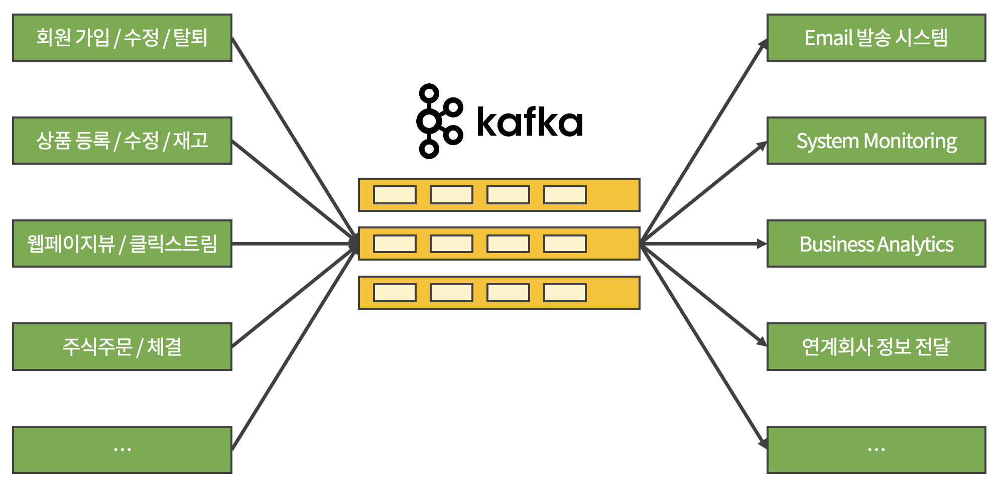
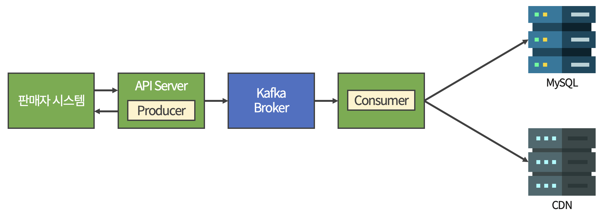

# Apache Kafka

Kafka는 실시간 데이터 처리에 특화된 이벤트 스트리밍 플랫폼이다.

Kafka를 사용하면 아래와 같이 시스템 간의 직접적인 연결을 중재하여 의존성을 낮출 수 있고,  
변동이나 장애 상황으로부터 비교적 자유로워질 수 있다.

 

▲ _Point-to-Point 구조_

 

▲ _Publish-Subscribe 구조_

  

또한 아래와 같이 동기 방식의 백엔드 어플리케이션에서는 

API 응답이나 시스템 처리량이 제한적이고, API 자체가 실패하는 경우가 발생하여 사용자의 불만이나 재처리 이슈가 발생할 수 있다.

 

▲ _동기 방식의 상품 등록 시스템 프로세스_

 

이를 Kafka를 사용하여 비동기 방식으로 개선하면 

API 요청과 무관하게 독립적으로 로직을 실행할 수 있고, 필요에 따라 Consumer를 증설하여 독자적으로 처리량을 확대할 수 있다.

▲ _비동기 방식의 상품 등록 시스템 프로세스_

 

## 🔸 Kafka 구조

▲ _Kafka 구조_

 

특정 노드의 갑작스러운 장애 상황에서도 서비스 중단이나 데이터 유실 없이 안정적으로 시스템을 유지하기 위해 **Cluster 형태**로 구성한다.

데이터 복제(Replication)와 결합하여 흔히 **고가용성 구성**이라고 한다.

 

▲ _Kafka Cluster 구조_

 

- Leader Partition : Producer와 Consumer가 연결되어 쓰기와 읽기가 실행되는 파티션

- Follower Partition : Replication Factor에 의해 만들어진 복제본으로 Leader Partition에 문제가 생겼을 때 언제라도 Leader가 될 수 있도록 데이터를 지속적으로 체크하여 만약의 장애 상황을 대비하는 파티션

 

### 🚨 장애 상황 발생

1. Leader Partition에 장애가 발생하면 Kafka Cluster 내의 컨트롤러 모듈이 탐지한다.

2. Follow Partition을 Leader로 만들어 서비스를 지속하도록 한다.

3. Leader 교체 순간에는 일시적으로 쓰기・읽기 타임 아웃이 발생할 수 있는데,  
   Producer는 새로운 Leader Partition이 확정될 때까지 Retry를 통해 서비스 영향을 최소화한다.

4. 새로운 Leader 선정이 완료되면 Producer와 Consumer는 다시 정상적 발행을 시작한다.

 

▲ _Kafka Partition 구조_

 

Partition을 여러 개 만들게 되면 Consumer Group 내의 Consumer 숫자를 증가시켜 병렬 처리 능력을 향상시킬 수 있다.

 

Topic이 여러 개의 Partition으로 나뉘게 되면 Producer의 메시지 발행 시 여러 메시지를 어떤 Partition에 기록할지 결정할 방법이 필요한데,  

일반적으로 발행 메시지 내에 키 값이 비어있으면 메시지들은 모든 Partition에 라운드 로빈 방식으로 기록된다.

 

단, Consumer의 메시지 처리 순서를 보장하기 위해서는 Partition을 하나만 사용하거나  

여러 개의 Partition 사용시에는 라운드 로빈 방식이 아닌  

발행 메시지의 키 설정을 통해 특정 키의 경우 동일한 Partition에 할당되도록 강제하여 하나의 Partition 내에서는 순서를 보장할 수 있다.

 

> **💡 라운드 로빈 (Round Robin)**
>
> 그룹 내에 있는 요소들을 합리적인 순서에 입각하여 뽑는 방법  
> 
> 보통 리스트의 **맨 위에서 아래로 가며 하나씩** 뽑는 방식으로 진행된다.

 

***

 

## 🔸 Kafka 용어

|용어|설명|
|:-:|:-:|
|**Zookeeper**|Kafka 브로커를 하나의 클러스터로 코디네이트하는 분산 코디네이션 시스템|
|**Kafka Broker**|Kafka 어플리케이션이 설치되어 있는 서버 또는 노드|
|**Topic**|Kafka 데이터 저장소 (폴더와 비슷한 개념)|
|**Partition**|각 Topic 당 데이터를 분산 처리하는 단위|
|**Offset**|Partition 내의 각 레코드를 고유하게 식별하는 순차적인 ID|
|**Producer**|메시지를 Broker의 Topic에 전달하는 어플리케이션 (Publisher)|
|**Consumer**|Broker의 Topic에 저장된 메시지를 가져가는 어플리케이션 (Subscriber)|
|**Consumer Group Rebalancing**|Consumer 그룹 내의 각 컴슈머의 파티션 소유권 이관 작업|
|**Broker Partition Replication**|Partition 복제 기능|
|**ISR** **(In Sync Replica)**|Leader, Follower Partition이 모두 동기화 된 상태|
|**Consumer Lag**|Topic의 최신 Offset과 Consumer Offset 간의 차이|

  

***

_2023.05.24. Update_