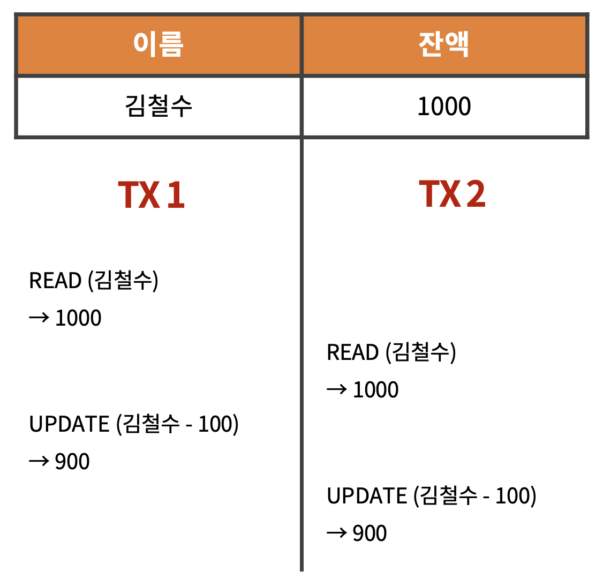

# Lock

락은 멀티쓰레드 환경에서 **동시성 제어**를 위해 사용하는 방법이다.

<br>

예를 들어, 1000원의 잔고가 있는 상황에서 두 트랜잭션이 동시에 작동한다고 가정한다면 아래와 같이 나타낼 수 있다.

<br>



<br>

동시에 같은 데이터에 접근해서 읽기 및 업데이트를 하는 과정에서 없는 데이터에 대한 출금이 이루어 질 수 있다는 문제점이 있다.

이러한 문제점을 해결하기 위해서 락(Lock)을 사용하는데, 락을 사용하면 아래와 같이 작동하게 된다.

<br>


<br>

동시 다발적으로 100원을 출금하는 것이 아니라 하나의 작업이 이루어지고 있을 때 접근하지 못하도록 막아 순차적으로 작업을 처리하도록 하는 방법이다.

<br>

***

<br>

## MySQL의 Lock

MySQL에서는 트랜잭션의 커밋 또는 롤백 시점에 락의 잠금이 풀린다.

즉, **트랜잭션의 범위가 곧 락의 범위**이다.

<br>

### 🔸 읽기락과 쓰기락

MySQL은 읽기락과 쓰기락을 제공한다.

<br>

||읽기락 (Shared Lock)|쓰기락 (Exclusive Lock)|
|:-:|:-:|:-:|
|**읽기락 (Shared Lock)**|O|대기|
|**쓰기락 (Exclusive Lock)**|대기|대기|

<br>

읽기락(Shared Lock)은 서로 락을 공유할 수 있다.  
반면 쓰기락(Exclusive Lock)이 접근 중인 데이터에는 접근이 불가능하다.

<br>

```sql
SELECT ... FOR SHARE
```
▲ _읽기락을 거는 명령어_

<br>

```sql
SELECT ... FOR UPDATE
```
▲ _쓰기락을 거는 명령어_

<br>

매번 락이 발생할 경우 성능 저하가 발생할 수 있기 떄문에  

MySQL에서 일반 SELECT는 Consistent Non-blocking Read로 동작한다.

> **💡 Consistent Non-blocking Read**
>
> 대기 없이 스냅샷을 통해 읽기 작업을 수행하는 방법
> 
> 📋 [***MySQL Docs***](https://dev.mysql.com/doc/refman/8.0/en/innodb-consistent-read.html)

<br>

### 🔸 Lock의 범위

Lock의 종류에는 Table 전체를 관리하는 Table Lock, Row를 관리하는 Record Lock, Row와 Row 사이의 Gap을 잡는 Gap Lock 등이 존재한다.

위 Lock 중 가장 빈번하게 사용하는 종류는 Record Lock이며,

MySQL은 Record Lock에서 **INDEX를 기준으로 Lock의 범위를 설정**하게 된다.

<br>

#### **💡 Example**

```Post``` 테이블이 있고,  

해당 테이블에 ```id```, ```memberId```, ```contents```, ```createdDate```, ```createdAt``` 칼럼이 있다.

```
> DESC Post;

+-------------+--------------+------+-----+---------+----------------+
| Field       | Type         | Null | Key | Default | Extra          |
+-------------+--------------+------+-----+---------+----------------+
| id          | int          | NO   | PRI | NULL    | auto_increment |
| memberId    | int          | NO   | MUL | NULL    |                |
| contents    | varchar(100) | NO   |     | NULL    |                |
| createdDate | date         | NO   | MUL | NULL    |                |
| createdAt   | datetime     | NO   |     | NULL    |                |
+-------------+--------------+------+-----+---------+----------------+
```

<br>

해당 테이블의 인덱스는 다음과 같이 설정되어 있다.

```
> SHOW INDEX FROM Post;

+-------+------------------------------------+
| Table | Key_name                           |
+-------+------------------------------------+
| POST  | PRIMARY                            |
| POST  | POST__index_created_date           |
| POST  | POST__index_member_id_created_date |
+-------+------------------------------------+
```

<br>

해당 상황에서 락을 걸고 인덱스가 걸려있지 않은 ```contents``` 혹은 ```createdAt``` 칼럼을 통해 조회하게 된다면,  

해당 칼럼뿐만 아니라 모든 칼럼에 대해 락이 걸리면서 테이블 락이 걸리게 된다.

```sql
-- 락을 걸기 위해서는 트랜잭션을 항상 실행해야 한다.
START TRANSACTION;

-- 락을 거는 방법
SELECT * 
FROM Post 
WHERE memberId = 3 AND createdDate = '2023-05-06'
FOR UPDATE;

-- 커밋 시에 락 해제
COMMIT;
```

<br>

먼저 위와 같이 인덱스가 존재하는 칼럼에 락을 걸게 되면  

```memberId```가 3이고, ```createdDate```가 5월 6일인 데이터에 대해서만 락이 걸리게 된다.

<br>

그래서 아래와 같이 커밋을 하지 않고 다른 ```createdDate```에 대해 조회를 해도 접근이 가능하다.

```sql
START TRANSACTION;

SELECT * 
FROM Post 
WHERE memberId = 3 AND createdDate = '2023-05-07'
FOR UPDATE;
```

> ❗️ MySQL에서 새로운 트랜잭션을 실행할 때는 새로운 콘솔에서 작성해야한다.

<br><br>

반면에 아래와 같이 인덱스가 존재하지 않는 ```contents``` 칼럼을 조건으로 락을 걸게 된다면,  

```contents```의 데이터가 다른 값이라도 ```memberId```가 3인 모든 데이터에 락이 걸리게 된다.

```sql
START TRANSACTION;

SELECT * 
FROM Post 
WHERE memberId = 3 AND contents = 'String'
FOR UPDATE;
```

<br>

```sql
START TRANSACTION;

SELECT * 
FROM Post 
WHERE memberId = 3 AND contents = 'Post1'
FOR UPDATE;

-- LOCK WAIT
```

<br>

위 과정에서 트랜잭션의 실행 정보는 아래와 같이 확인할 수 있다.

```
> SELECT * FROM information_schema.INNODB_TRX;

+--------+-------------+
| trx_id | trx_state   |
+--------+-------------+
| 12346  | LOCK WAIT   |
| 12345  | RUNNING     |
+--------+-------------+
```

<br>

또한, 락을 걸고 나서 어떠한 데이터에 락이 걸렸는지에 대한 정보는 아래와 같이 확인할 수 있다.

```
> SELECT * FROM performance_schema.data_locks;

+----------+-------------------------------------+-----------+---------------------+
| ENGINE   | INDEX_NAME                          | LOCK_MODE | LOCK_DATA           |
+----------+-------------------------------------+-----------+---------------------+
| INNODB   | POST__index_member_id_created_date  | X         | 3, 1035931, 7       |
| INNODB   | POST__index_member_id_created_date  | X         | 3, 1035943, 3000050 |
| INNODB   | POST__index_member_id_created_date  | X         | 3, 1035943, 3000051 |
| INNODB   | POST__index_member_id_created_date  | X         | 3, 1035943, 3000052 |
| INNODB   | POST__index_member_id_created_date  | X         | 3, 1035943, 3000053 |
+----------+-------------------------------------+-----------+---------------------+
```

```LOCK_MODE```가 ```X```인 것은 쓰기락이 걸렸다는 의미이고,  

```LOCK_DATA```는 ```memberId``` 인덱스의 ID, ```createdDate``` 인덱스의 ID, 그리고 ```Post``` 테이블의 Primary Key인 ID를 순서대로 나타낸 것이다.

<br>

해당 Primary Key를 통해서 데이터를 조회해보면 아래와 같다.

```
> SELECT * FROM Post WHERE id IN (7, 3000050, 3000051, 3000052, 3000053);

+---------+----------+----------+-------------+---------------------+
| id      | memberId | contents | createdDate | createdAt           |
+---------+----------+----------+-------------+---------------------+
|       7 |        3 | string   | 2023-05-06  | 2023-05-06 20:57:11 |
| 3000050 |        3 | string   | 2023-05-07  | 2023-05-07 19:49:43 |
| 3000051 |        3 | string   | 2023-05-07  | 2023-05-07 19:49:45 |
| 3000052 |        3 | post1    | 2023-05-07  | 2023-05-07 19:49:51 |
| 3000053 |        3 | post1    | 2023-05-07  | 2023-05-07 19:49:51 |
+---------+----------+----------+-------------+---------------------+
```

<br>

```contents```가 ```'String'```인 경우에 대해서만 락을 걸었지만,  

```contents```에 인덱스가 걸려있지 않으므로 ```memberId```가 3인 모든 칼럼에 대해 Lock이 걸린 것을 볼 수 있다.

<br>

***

<br>

### 💡 Lock 사용 시 주의사항

<br>

락을 통해 동시성을 제어할 때는 **락의 범위를 최소화**하는 것이 중요하다.

<br>

접근을 제어하는 범위가 커질수록 뒤에서 대기하는 트랜잭션이 길어지게 되며,  

이로 인해 성능에 저하가 발생하거나 멀티쓰레드를 사용하는 이점이 사라지게 된다.

<br>

프레임워크 측면에서 살펴보면 서버에서 커넥션 풀을 관리하게 되는데  

락의 범위가 길어질 수록 커넥션 풀을 점유하는 시간이 길어지고, 최악의 경우에는 커넥션 풀의 고갈로도 이어질 수 있다.

<br><br>

***

_2023.05.07. Modified_