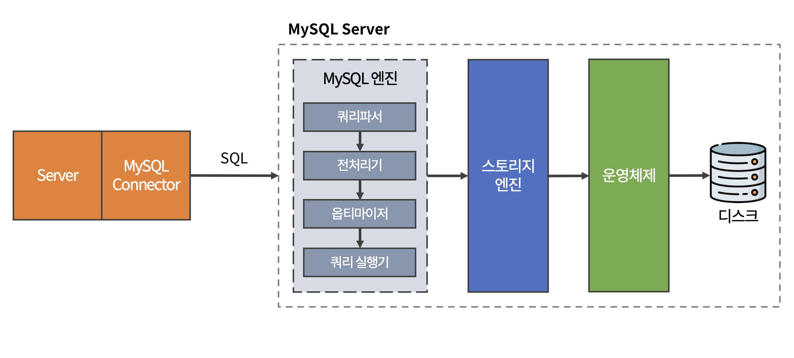

# MySQL

## MySQL 아키텍처



<br>

클라이언트에서 JSON을 통해 서버에 요청을 하듯이  
서버도 SQL을 통해 MySQL 서버에 데이터를 요청한다.

<br>

### MySQL 엔진

<br>

#### **🔸 쿼리파서**

- SQL을 파싱하여 Syntax Tree를 만든다.
- 해당 과정에서 문법 오류에 대한 검사를 진행한다.

<br>

#### **🔸 전처리기**

- 쿼리파서에서 만든 Tree를 바탕으로 전처리를 시작한다.
- 테이블이나 칼럼 존재 여부, 접근 권한 등 Semantic 오류를 검사한다.

<br>

> 쿼리파서와 전처리기에서 진행되는 과정은 컴파일 과정과 매우 유사하다.  
> 
> SQL은 프로그래밍 언어처럼 컴파일 타임에 검증할 수 없으므로 매번 구문 평가를 한다.

<br>

#### **🔸 옵티마이저**

- 쿼리를 최적으로 실행하기 위해 각 테이블의 데이터가 어떤 분포로 저장되어있는지 참조하고, 데이터를 기반으로 최적의 실행 계획을 수립해준다.
- 옵티마이저가 어떤 전략을 결정하냐에 따라 성능이 달라질 수 있다.
- 개발자가 옵티마이저의 전략을 선택하는데 도움을 줄 수 있다.
- ```EXPLAIN```을 통해 옵티마이저가 어떠한 방법을 결정했는지 확인할 수 있다.

<br>

#### **🔸 쿼리 실행기**

- 옵티마이저가 결정한 계획대로 스토리지 엔진에 요청한다.
- Handler API를 사용

> 스토리지 엔진에 요청하는 것을 Handler 요청이라고 한다.

> Handler API를 만족하는 스토리지 엔진만 구현할 수 있다면,  
> 직접 구현을 통해 스토리지 엔진을 사용할 수 있다.

<br>

### 스토리지 엔진

디스크에서 데이터를 가져오거나 저장하는 역할을 한다.

MySQL 스토리지 엔진은 플러그인 형태로 되어 있으며,  
Handler API만 맞춘다면 직접 구현해서 사용할 수 있다.

MySQL 8.0부터는 InnoDB 엔진을 기본으로 사용한다.

<br>

#### **🔸 InnoDB**

InnoDB의 핵심 키워드로는 Clustered Index, Redo-Undo, Buffer pool이 있다.

<br><br>

***

_2023.04.06. Update_