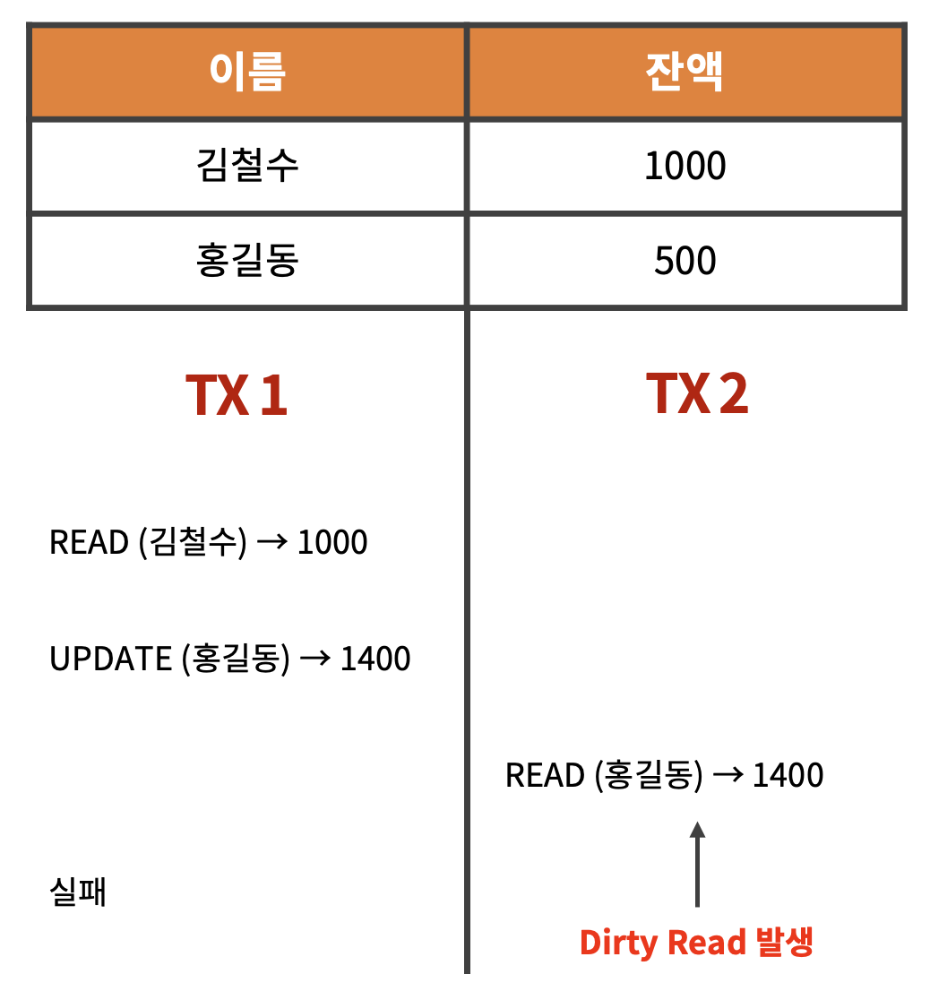
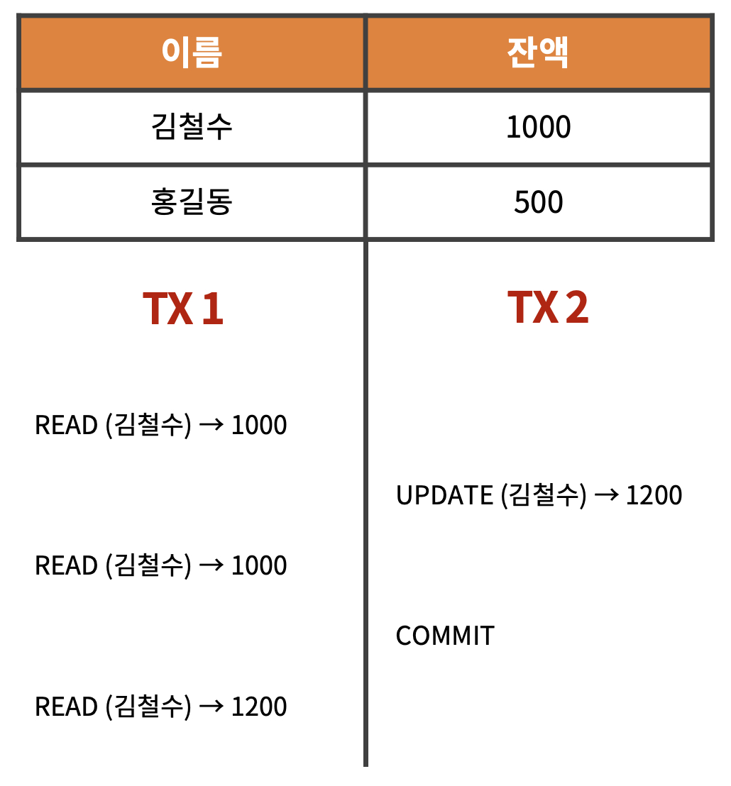
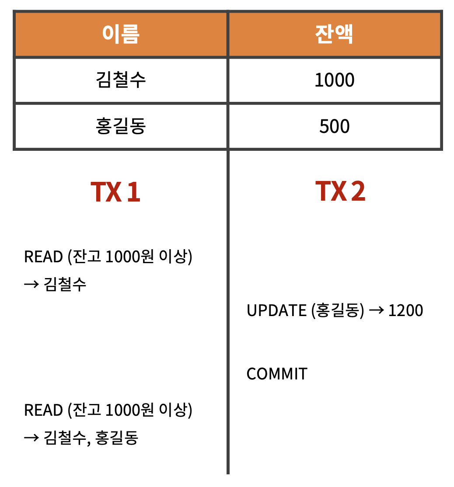

# 트랜잭션 격리 레벨 (Transaction Isolation Level)

MySQL의 InnoDB 엔진을 기준으로 작성되었습니다.

 

트랜잭션 격리 레벨은 **READ UNCOMMITED**, **READ COMMITED**, **REPEATABLE READ**, **SERIALIZABLE READ** 4가지 종류가 있다.

트랜잭션 격리 레벨은 이상 현상을 통해 설명할 수 있다.

 

***

 

## 이상 현상

 

### 🔸 Dirty Read

다른 트랜잭션에서 발생한 로직의 커밋되지 않은 데이터를 읽어오는 현상

 

  

### 🔸 Non Repeatable Read

하나의 트랜잭션에서 같은 데이터를 읽었음에도 불구하고 **다른 트랜잭션의 영향을 받아** 다른 결과를 받아오는 현상

 

  

### 🔸 Phantom Read

같은 조건으로 데이터를 조회했을 때, **다른 트랜잭션의 영향을 받아** 없던 데이터가 생기는 현상

 

  

추가적으로 Lost Update와 같은 이상 현상도 존재한다.

 

***

 

## 트랜잭션 격리 레벨

 

### 💡 격리 레벨에 따른 이상 현상 발생 가능 여부

 

||Dirty Read|Non Repeatable Read|Phantom Read|
|:-:|:-:|:-:|:-:|
|READ UNCOMMITED|O|O|O|
|READ COMMITED||O|O|
|REPEATABLE READ|||O|
|SERIALIZABLE READ||||

- 격리 수준이 강할 수록 이상 현상이 발생하지 않지만, 동시 처리량이 낮다.

  

### 🔸 READ UNCOMMITED

커밋되지 않은 데이터를 읽어오기 때문에 Dirty Read가 발생할 수 있다.

- 이상 현상이 발생할 가능성이 높아 거의 사용하지 않는다.

 

### 🔸 READ COMMITED

커밋된 데이터를 읽어오기 때문에 Dirty Read가 발생하지 않는다.

다만, 커밋된 데이터를 읽는다고 하더라도 Non Repeatable Read와 같은 문제는 발생할 수 있다.

- 가장 많이 사용하는 격리 수준

 

### 🔸 REPEATABLE READ

커밋된 데이터만 읽어오고, 추가로 트랜잭션마다 ID를 부여해서 이후에 발생된 트랜잭션에 대해서는 읽지 않는다.

그렇기 때문에 Non Repeatable Read 문제가 발생하지 않는다.

- 많이 사용하는 격리 수준이지만 데드락 이슈가 빈번하게 발생할 수 있다.

 

### 🔸 SERIALIZABLE READ

가장 강한 수준의 격리 레벨로 어떠한 이상 현상도 발생하지 않는다.

- 처리량이 낮기 때문에 많이 사용하지 않는다.

 

***

_2023.05.06. Update_