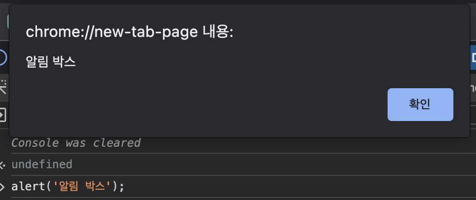
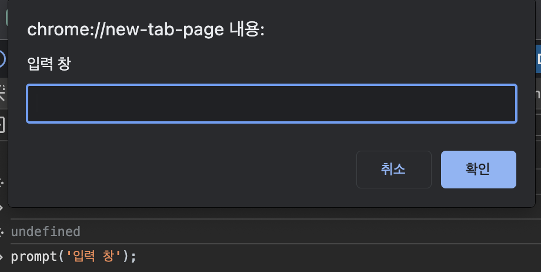
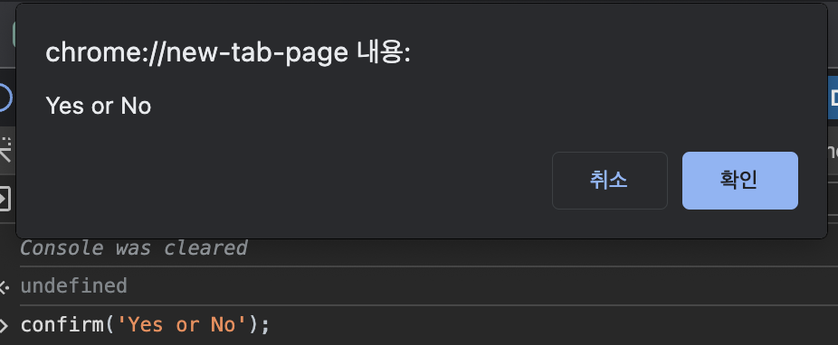

# alert, prompt, confirm

브라우저 환경에서 알림을 출력하는 JavaScript 기본 함수이다.

- **장점**  
  기본 함수라서 동작이 빠르다.

- **단점**  
  창이 떠있는 동안 스크립트가 일시정지된다.  
  스타일링이 불가능하여 모달창으로 많이 대체한다.

<br>

브라우저에서 **개발자 도구**의 **console**에서 테스트할 수 있다.

> **개발자 도구 여는 방법**  
> Window : F12  
> Mac : Cmd + Shift + I

<br>

### 🔸 alert

알림 박스를 출력한다.

```js
alert('알림 박스');
```



<br>

### 🔸 prompt

Input 박스를 출력한다.
> return : String or null

```js
prompt('입력 창');

// 2번째 파라미터로 기본 값을 설정해줄 수 있다.
prompt('입력 창', 'Default Value');
```



<br>

### 🔸 confirm

확인, 취소 알림 박스를 출력한다.
> return : Boolean

```js
confirm('Yes or No');
```



<br><br>

---

_2023.10.12. Update_