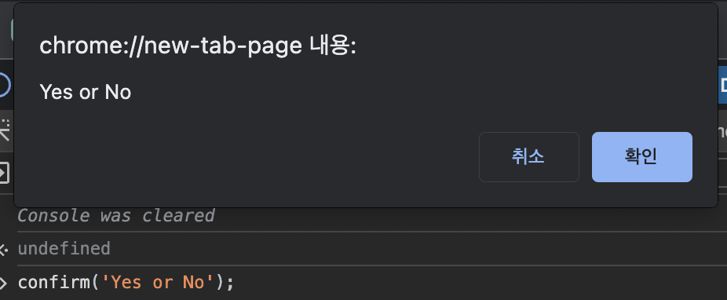

# JavaScript 기초

Java와 JavaScipt 문법의 차이점을 중점으로 정리

## 변수

변수를 선언하는 방법에는 `var`, `let`, `const`가 있다.

### 🔸 var

`var`를 사용해 변수를 선언하면, 해당 변수를 **다시 선언 할 수 있다.**

```js
var a = 10; // 10
a = 20;     // 20
a += 10;    // 30

var a = 10; // 10
```

<br>

### 🔸 let

`let`을 사용해 변수를 선언하면, 해당 변수를 **다시 선언 할 수 없다.**

```js
let a = 10; // 10
a = 20;     // 20
a += 10     // 30

let a = 10; // 불가능
```

<br>

### 🔸 const

`const`를 사용해 변수를 선언하면, 해당 변수를 **수정할 수 없다.**

```js
const a = 10;   // 10
a = 20;         // 불가능
a += 10;        // 불가능
```

<br>

## 자료형

변수 선언 시 JavaScript는 **타입**을 자동으로 지정한다.

```js
const a = 10;
const b = 'JWANNA';
const c = false;
```

<br>

또한 형변환을 할 때는 `String()`, `Number()`, `Boolean()` 등의 함수를 사용할 수 있다.

<br>

### 🔸 String

String 표현 방법은 큰 따옴표`("")`, 작은 따옴표`('')`, 백틱`(``)`이 있다.

큰 따옴표와 작은 따옴표는 차이가 없으며, 백틱을 사용하면 `${}` 표현식을 통해 변수를 삽입할 수 있다.

```js
const firstName = "Hong";
const lastName = 'JeongWan';

const myName = `My Name is ${firstName + lastName}`;
console.log(myName);
// My Name is HongJeongWan

const a = "나는 ";
const b = '살 입니다.';
const age = 20;

const myAge = `${a + (age + 7) + b}`;
console.log(myAge);
// 나는 27살 입니다.

console.log(a + age + b);
// 나는 20살 입니다.
```
▲ _자동 형변환 가능_

<br>

### 🔸 Number

숫자형에서 주의할 점

```js
console.log(1 / 0);
// Infinify

console.log('name' / 2);
// NaN (Not a Number)

Number(null);
// 0

Number(undefined);
// NaN
```

<br>

### 🔸 Boolean

Boolean에서 주의점

형변환 시 `false`를 나타내는 결과는 아래와 같다.

```js
Boolean(0);
Boolean('');
Boolean(null);
Boolean(undefined);
Boolean(NaN);
```

이 외에는 모두 true로 형변환된다.

<br>

**💡 null & undefined**

`null`은 값이 없음을 나타내고,  
`undefined`는 값이 대입되지 않음을 나타낸다.

```js
let foo;
console.log(foo);   // undefined
```

<br>

## 연산자

기본 연산자, 비교 연산자는 약간의 차이가 있다.

### 🔸 기본 연산자

Java와 기본 연산자(+, -, *, /, %), 증감 연산자(++, --), 연산자 줄여 쓰기(+=, -= 등) 대부분이 같다.

다른 점은 거듭제곱(**)을 사용할 수 있다.

```js
console.log(2 ** 3);    // 8
```

<br>

### 🔸 비교 연산자

JavaScript의 비교 연산자에는 `===`, `!==`가 추가로 존재한다.

`==`는 형변환 후 값이 같은지 확인하는 연산자이며,   
`===`는 값 뿐만 아니라 자료형도 같은지 확인하는 연산자이다.

```js
console.log(0 == '');   // true
console.log(0 == '0');  // true
console.log('' == '0'); // false

console.log(0 === '');   // false
console.log(0 === '0');  // false
console.log('' === '0'); // false
```

<br>

### 🔸 논리 연산자

논리 연산자는 Java와 같다.

- `&&` : AND  
- `||` : OR  
- `!` : NOT

<br>

## 조건문

조건문은 Java와 같다.

```js
const age = 20;
if (age > 20) {
    ...
} else if (age === 20) {
    ...
} else {
    ...
}
```

<br>

## 반복문

반복문은 Java와 비슷하다.

```js
for(let i = 0; i < 10; i++) {
    console.log(i);
}
```

```js
let i = 0;

while(i < 10) {
    if (i % 2) {
        continue;
    }
    console.log(i);
    i++;
}
```

<br>

## Switch문

Switch문은 Java와 같다.

```js
let fruit = prompt('과일 입력');

switch(fruit) {
    case '사과':
        cosole.log('100원');
        break;
    case '바나나':
        cosole.log('200원');
        break;
    case '수박':
        cosole.log('300원');
        break;
    default :
        console.log('없는 상품입니다.');
}
```

<br>

## alert, prompt, confirm

브라우저 환경에서 알림을 출력하는 JavaScript 기본 함수이다.

- **장점**  
  기본 함수라서 동작이 빠르다.

- **단점**  
  창이 떠있는 동안 스크립트가 일시정지된다.  
  스타일링이 불가능하여 모달창으로 많이 대체한다.

<br>

브라우저에서 **개발자 도구**의 **console**에서 테스트할 수 있다.

> **개발자 도구 여는 방법**  
> Window : F12  
> Mac : Cmd + Shift + I

<br>

### 🔸 alert

알림 박스를 출력한다.

```js
alert('알림 박스');
```


<br>

### 🔸 prompt

Input 박스를 출력한다.
> return : String or null

```js
prompt('입력 창');

// 2번째 파라미터로 기본 값을 설정해줄 수 있다.
prompt('입력 창', 'Default Value');
```


<br>

### 🔸 confirm

확인, 취소 알림 박스를 출력한다.
> return : Boolean

```js
confirm('Yes or No');
```



<br>

## 함수 (Function)

JavaScript의 함수는 **함수 선언문** 또는 **함수 표현식**의 방식으로 작성할 수 있다.

- 함수 선언문은 JS 실행 시 선언된 함수들을 로딩해서 저장하기 때문에 **어디서든 사용 가능**하다.

- 함수 표현식은 인터프리터가 해당 라인을 읽을 때 저장하므로 해당 함수 표현식 **아래에서만 사용 가능**하다.

### 🔸 함수 선언문

```js
function sayHello(name) {
    return `Hello, ${name}!`;
}

console.log(sayHello());
// Hello, undefined!

console.log(sayHello('JWANNA'));
// Hello, JWANNA!
```

위처럼 파라미터가 전달되지 않았을 때 undefined가 출력되는 것을 방지하기 위해 기본 값을 설정할 수 있다.

```js
function sayHello(name) {
    let newName = name || 'friend';
    return `Hello, ${newName}!`;
}

function sayHello(name = 'friend') {
    return `Hello, ${name}!`;
}
```
▲ _둘 다 name의 기본 값으로 friend를 입력받는다._

<br>

### 🔸 함수 표현식

함수 표현식은 변수에 함수를 지정하는 방식으로 화살표 표현식으로도 표현할 수 있다.

```js
const add = function(num1, num2) {
    return num1 + num2;
}

// 화살표 표현식 (Java의 람다식과 유사함)
const add = (num1, num2) => {
    return num1 + num2;
}

// 코드가 한 줄이면 return 생략 가능
const add = (num1, num2) => num1 + num2;
```

<br>

## 객체 (Object)

JavaScript의 객체는 중괄호(`{}`)를 사용하여 JSON 형식으로 표현된다.

```js
const superman = {
    name: 'clark',
    age: 33
}
```

<br>

### 🔸 접근

```js
console.log(superman.name);
console.log(superman['name']);
```

<br>

### 🔸 추가

```js
superman.gender = 'male';
superman['hairColor'] = 'black';
```

<br>

### 🔸 삭제

```js
delete superman.hairColor;
```

<br>

### 🔸 없는 프로퍼티 접근

`in`을 사용해서 특정 객체에 해당 이름을 가진 프로퍼티가 있는지 확인할 수 있다.

```js
superman.birthDay;
// undefined

'birthDay' in superman;
// false;

'age' in superman;
// true;
```

<br>

### 🔸 단축 프로퍼티

```js
const makeObject = (name, age) => {
    return {
        name: name,
        age: age,
        hobby: 'football'
    }
}
```

아래 코드는 위 코드와 같은 의미이다.

```js
const makeObject = (name, age) => {
    return {
        name,
        age,
        hobby: 'football'
    }
}
```

<br>

### 🔸 객체 반복문 in

```js
const me = {
    name: 'JWANNA',
    age: 27,
    hobby: 'programming'
}

for (x in me) {
    console.log(x);
}

/*
    name
    age
    hobby
*/

for (x in me) {
    console.log(me[x]);
}

/*
    JWANNA
    27
    programming
*/
```

<br>

### 🔸 메소드 (Method)

객체 내에서 함수를 사용할 수 있는데, 이를 메소드라고 한다.

```js
const superman = {
    name: 'clark',
    age: 30,

    // 표현 방법 1
    fly: function() {
        console.log('Fly');
    },

    // 표현 방법 2
    punch() {
        console.log('Punch');
    }
}
```

<br>

### 🔸 this

JavaScript에서 this의 객체는 실행되는 런타임에 결정된다.

> ❗️ 단, 화살표 함수는 일반 함수와는 달리 자신만의 this를 가지지않는다.  
> 
> 화살표 함수 내부에서 this를 사용할 경우, this는 전역객체를 가리킨다.  
> 브라우저 환경의 전역객체는 **window**, Node.js에서는 **global**이다.

```js
function sayHello() {
    console.log(`Hello, ${this.name}`);
}

const boy = {
    name: 'boy',
    sayHello
}

const girl = {
    name: 'girl',
    sayHello
}

boy.sayHello();  // Hello, boy
girl.sayHello(); // Hello, girl
```

<br>

## 배열 (Array)

JavaScript의 배열은 대괄호(`[]`)로 선언한다.

배열은 문자 뿐만 아니라 숫자, 객체, 함수 등도 포함할 수 있다.

<br>

### 🔸 배열의 기본 메소드

- `.length` : 배열의 길이를 나타낸다.

- `.push()` : 배열 맨 뒤에 값을 삽입한다.

- `.pop()` : 배열 맨 뒤의 값을 삭제한다.

- `unshift()` : 배열 맨 앞에 값을 삽입한다.

- `shift()` : 배열 맨 앞의 값을 삭제한다.

<br>

### 🔸 반복문을 통한 배열 탐색

- 인덱스로 탐색
  
```js
let days = ['월', '화', '수'];

for(let i = 0; i < days.length; i++) {
    console.log(days[i]);
}
```

- Iterator로 탐색

```js
let days = ['월', '화', '수'];

for(let day of days) {
    console.log(day);
}
```

Java에서는 `:`를 사용하지만 JavaScript에서는 `of`를 사용한다.

<br><br>

---

_2023.10.12. Update_