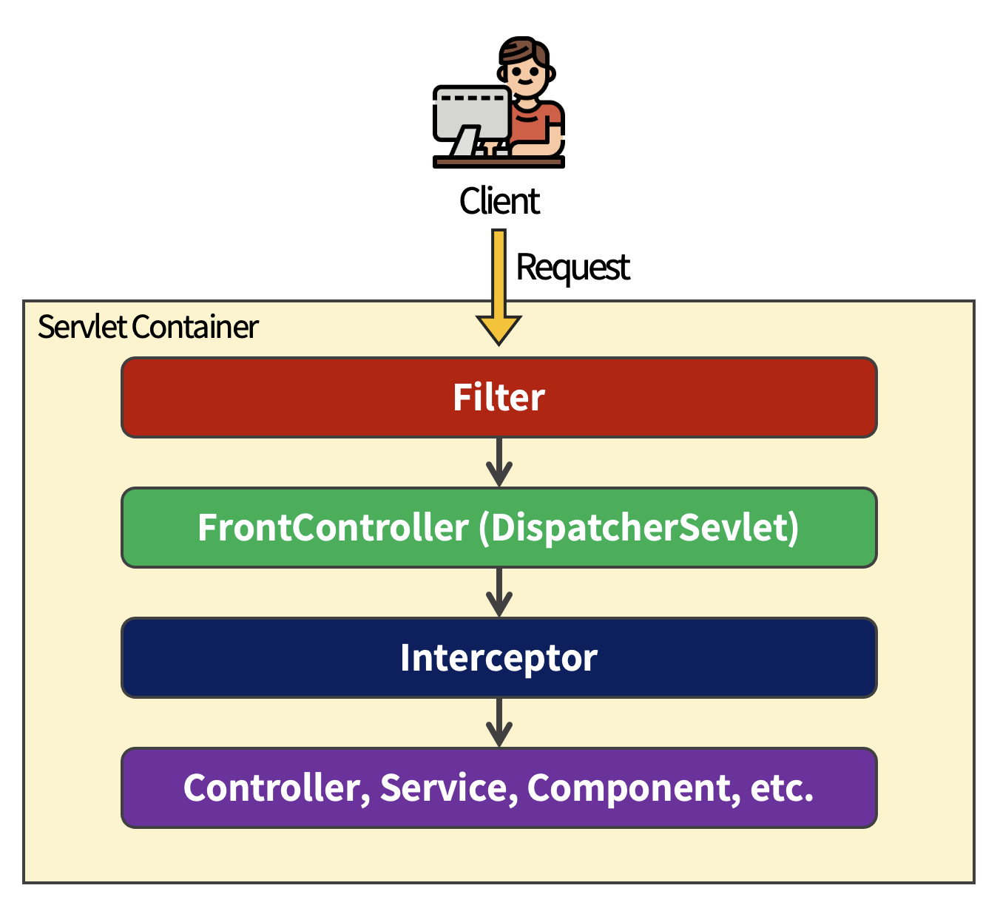

# Filter와 FilterChain

### 🔸 Filter

서블릿 필터(Servlet Filter)는 서블릿 기반 어플리케이션의 엔드포인트 요청이 도달하기 전에  

중간에서 요청을 가로챈 후 어떤 처리를 할 수 있도록 해주는 Java의 컴포넌트이다.

<br>



▲ _서블릿 기반 어플리케이션에서 Filter의 위치_

<br>

클라이언트가 서버 측 어플리케이션으로 요청을 전송하면 가장 먼저 Servlet Filter를 거치게 된다.

그 후 Filter 내의 처리가 완료되면 DispatcherServlet에서 클라이언트 요청을 핸들러에 매핑하기 위한 다음 작업을 진행한다.

<br>

### 🔸 Filter Chain

Filter Chain은 여러개의 Filter가 체인을 형성하고 있는 Filter의 묶음을 의미한다.

<br>

### 💡 Filter와 FilterChain의 특성

- Servlet FilterChain은 요청 URI path를 기반으로 HttpServletRequest를 처리한다.  
  
  따라서 클라이언트가 서버 측 어플리케이션에 요청을 전송하면  
  서블릿 컨테이너는 요청 URI 경로를 기반으로 어떤 Filter와 어떤 Servlet을 매핑할지 결정한다.

- Filter는 FilterChain 안에서 순서를 지정할 수 있으며, 지정한 순서에 따라서 동작하게 할 수 있다.

- FilterChain에서 Filter의 순서는 매우 중요하며,  
  Spring Boot에서 여러 Filter를 등록하고 순서를 지정하기 위해서는 아래 2가지 방법을 적용할 수 있다.

  - Spring Bean으로 등록되는 Filter에 ```@Order``` 어노테이션을 추가하거나,  
    ```Ordered``` 인터페이스를 구현해서 Filter의 순서를 지정할 수 있다.

  - ```FilterRegistrationBean```의 ```setOrder()``` 메서드를 이용해 Filter의 순서를 명시적으로 지정할 수 있다.

<br>

***

<br>

## Filter와 FilterChain 구현

<br>

### 1. Filter 인터페이스 구현

```java
public class FirstFilter implements Filter {

    @Override
    public void init(FilterConfig filterConfig) throws ServletException {
        Filter.super.init(filterConfig);
        System.out.println("== First Filter 생성 ==");
    }

    @Override
    public void doFilter(ServletRequest request,
                         ServletResponse response,
                         FilterChain chain) throws IOException, ServletException {

        System.out.println("== First Filter 시작 ==");
        chain.doFilter(request, response);
        System.out.println("== First Filter 종료 ==");
    }

    @Override
    public void destroy() {
        System.out.println("== First Filter Destroy ==");
        Filter.super.destroy();
    }
}
```

<br>

- ```init()```  
  
  생성한 Filter에 대한 초기화 작업 진행. 어플리케이션 실행 시 동작한다.

<br>

- ```doFilter()```  

  Filter가 처리하는 실질적인 로직 구현. 요청이 들어올 경우 동작한다.

  - ```chain.doFilter()``` 호출 이전에 전처리 작업, 호출 이후에는 후처리 작업에 대한 로직을 구현할 수 있다.

<br>

- ```destroy()```

  Filter가 컨테이너에서 종료될 때 호출, Filter가 사용한 자원을 반납하는 처리 로직 구현

<br><br>

### 2. Filter 적용을 위한 Filter Configuration 구성

```java
@Configuration
public class FilterConfiguration {

    @Bean
    public FilterRegistrationBean<FirstFilter> firstFilterRegister() {

        FilterRegistrationBean<FirstFilter> registrationBean = 
                                new FilterRegistrationBean<>(new FirstFilter());

        return registrationBean;
    }
}
```

<br>

- Servlet Filter는 ```FilterRegistrationBean``` 클래스의 **생성자**로 **Filter 인터페이스 구현 객체**를 넘겨주는 형태로 등록할 수 있다.

<br><br>

### 3. 여러 Filter에 순서 적용

Filter는 다른 Filter와 Sevlet에 영향을 주기 때문에 **실행 순서가 중요하다.**

<br>

```java
@Configuration
public class Config {

    @Bean
    public FilterRegistrationBean<FirstFilter> firstFilterRegister() {

        FilterRegistrationBean<FirstFilter> registrationBean = 
                                new FilterRegistrationBean<>(new FirstFilter());

        registrationBean.setOrder(1);

        return registrationBean;
    }

    @Bean
    public FilterRegistrationBean<SecondFilter> secondFilterRegister() {

        FilterRegistrationBean<SecondFilter> registrationBean = 
                                new FilterRegistrationBean<>(new SecondFilter());

        registrationBean.setOrder(2);
        
        return registrationBean;
    }
}
```

<br>

- ```setOrder()```  
  
  지정된 순서로 실행되도록 순서를 지정할 수 있다.

<br><br>

***

_2022.12.04. Update_