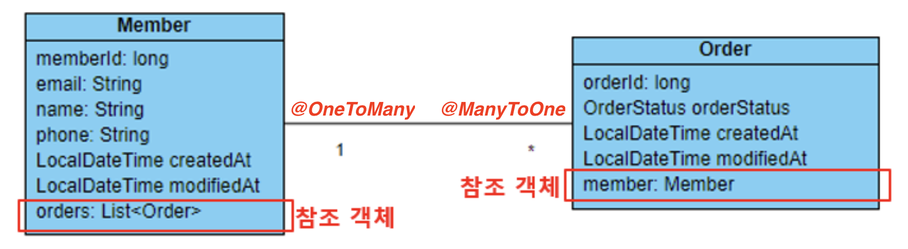

# JPA 기반 데이터 액세스 계층

## 🔸 JPA(Java Persistence API / Jakarta Persistence)

JPA는 Java에서 사용하는 ORM 기술의 표준 사양(Specification)이고,  

JPA 표준 사향을 구현한 구현체로는 Hibernate ORM, EclipseLink, DataNucleus 등이 있다.

> ORM은 객체와 데이터베이스 테이블의 매핑을 통해 Entity 클래스 객체 안에 포함된 정보를 테이블에 저장하는 기술이다.

<br>

### JPA의 위치


<br>

JPA는 데이터 액세스 계층의 상단에 위치한다.

데이터 저장 ・ 조회 등의 작업은 JPA를 거쳐 Hibernate ORM을 통해 이루어지며,  
Hibernate ORM은 내부적으로 JDBC API를 이용하여 DB에 접근하게 된다.

<br>

### 영속성 컨텍스트 (Persistence Context)

JPA에서 테이블과 매핑되는 Entity 객체 정보를 보관하는 장소이며,  
**1차 캐시** 영역과 **쓰기 지연 SQL 저장소** 영역으로 구성되어 있다.  

JPA API 중 Entity 정보를 컨텍스트에 저장하는 API를 사용하면 1차 캐시에 Entity 정보가 저장된다.

<br>

```java
dependencies {
	implementation 'org.springframework.boot:spring-boot-starter-data-jpa'
}
```
▲ _JPA API를 사용하기 위한 build.gradle 설정_

<br>

```yml
spring:
    jpa:
        hibernate:
            ddl-auto: create
        show-sql: true
```
▲ _JPA 사용을 위한 application.yml 설정_

- ```ddl-auto: create``` : Entity 클래스와 매핑되는 데이터베이스 테이블을 자동으로 생성해준다.
- ```show-sql: true``` : JPA API를 통해 실행되는 SQL 쿼리를 로그로 출력해준다.

<br>

**🛠 영속성 컨텍스트에 Entity 저장**

```java
@Getter
@Setter
@NoArgsConstructor
@Entity
public class Member {
    @Id
    @GeneratedValue
    private Long memberId;

    private String email;

    public Member(String email) {
        this.email = email;
    }
}
```
▲ _영속성 컨텍스트에 저장할 Entity_

- ```@Entity```, ```@Id``` : 해당 어노테이션들을 통해 JPA에서 Entity 클래스로 인식하게 된다.
- ```@GeneratedValue``` : DB 테이블에서 기본키가 되는 식별자를 자동으로 설정해준다.

<br>

```java
@Configuration
public class JpaBasicConfig {
    private EntityManager em;
    private EntityTransaction tx;

    @Bean
    public CommandLineRunner testJpaBasicRunner(EntityManagerFactory emFactory) {
        this.em = emFactory.createEntityManager();
        this.tx = em.getTransaction();

        return args -> {
            example();
        };
    }

    private void example() {
        tx.begin();
        Member member = new Member("hongjjwan@gmail.com");

        em.persist(member);
        tx.commit();

        Member resultMember1 = em.find(Member.class, 1L);
        System.out.println("Id: " + resultMember1.getMemberId() +
                    ", email: " + resultMember1.getEmail());

        Member resultMember2 = em.find(Member.class, 2L);
        System.out.println("Id: " + resultMember2.getMemberId() +
                    ", email: " + resultMember2.getEmail());

        System.out.println(resultMember2 == null);
    }
}
```
▲ _샘플 코드 실행을 위한 Configuration 클래스_

<br>

- ```@Configuration``` : 설정 파일에 작성   
  Bean을 등록할 때 싱글톤이 되도록 보장해준다. (만들어진 객체는 다시 생성하지 않는다.)  
  Spring Container에서 Bean을 관리할 수 있게 된다.

- ```EntityManager``` : 영속성 컨텍스트를 관리하는 클래스  
  ```EntityManagerFactory```의 ```createEntityManager()``` 메서드를 통해 EntityManager 객체를 얻을 수 있고,  
  해당 객체를 Spring으로부터 DI 받을 수 있다.

- ```EntityTransaction``` : EntityManager의 ```getTransaction()``` 메서드를 통해 객체를 얻을 수 있다.  
  JPA는 Transaction 객체를 기준으로 DB 테이블에 데이터를 저장한다.

<br>

**💡 EntityManager의 메서드**

- ```persist()``` : 영속성 컨텍스트의 **1차 캐시**에 객체 정보를 저장한다. (실제 테이블에는 X)

- ```find(클래스타입, 식별자)``` : 영속성 컨텍스트의 1차 캐시에 객체가 잘 저장되었는지 조회한다.  
  resultMember1에서는 처음에 ```persist()```를 통해 1차 캐시에 저장한 Entity 객체를 조회하고,  
  resultMember2에서는 1차 캐시에서 조회된 값이 없기 때문에 테이블에 직접 SELECT 쿼리를 전송한다.

- ```flush()``` : 영속성 컨텍스트의 변경 내용을 DB에 반영한다.

<br>

**💡 EntityTransaction의 메서드**

- ```begin()``` : Transaction을 시작하기 위해 호출하는 메서드

- ```commit()``` : 해당 메서드 호출 시점에 **영속성 컨텍스트에 저장된 Entity 객체를 DB 테이블에 저장**한다.  
  해당 메서드가 호출되면 JPA 내부적으로 ```em.flush()```를 호출한다.
  (쓰기 지연 SQL 저장소에 저장된 쿼리문을 실행한다.)

<br><br>

**🛠 영속성 컨텍스트와 DB 테이블의 Entity 정보 업데이트**

```java
private void example() {
   tx.begin();
   em.persist(new Member("hongjjwan@gmail.com"));
   tx.commit();


   tx.begin();
   Member member1 = em.find(Member.class, 1L);
   member1.setEmail("hongjwan@naver.com");
   tx.commit();
}
```

```persist```와 ```commit``` 메서드를 통해 영속성 컨텍스트와 DB에 정보를 저장한 후,  

```find``` 메서드를 통해 **영속성 컨텍스트의 1차 캐시**에 저장된 객체를 조회한다.

이후 setter로 정보를 업데이트한 뒤 ```commit```을 통해 쓰기 지연 SQL 저장소에 등록된 UPDATE 쿼리를 실행한다.

<br><br>

**🛠 영속성 컨텍스트와 DB 테이블의 Entity 정보 삭제**

```java
private void example() {
    tx.begin();
    em.persist(new Member("hongjwan@naver.com"));
    tx.commit();

    tx.begin();
    Member member = em.find(Member.class, 1L);
    em.remove(member);
    tx.commit();
}
```

```remove()``` 메서드를 통해 영속성 컨텍스트의 1차 캐시에 있는 Entity를 제거하고,  
```commit()``` 메서드를 통해 쓰기 지연 SQL 저장소에 등록된 DELETE 쿼리를 실행한다.

> **💡 쓰기 지연 SQL 저장소**  
> 
> 현재 변경된 1차 캐시의 Entity와 이전에 등록한 스냅샷을 비교한 후,  
> 변경된 값이 있으면 UPDATE, 값이 없으면 DELETE 쿼리를 실행한다.

<br>

***

<br>

## 🔸 JPA Entity 매핑

<br>

### 🛠 Entity - Table 매핑

```java
@Entity(name = "USERS")
@Table(name = "USERS")
@Getter
@Setter
@NoArgsConstructor
public class Member {
    @Id
    private Long memberId;
}
```

- ```@Entity``` : ```name``` Attribute를 사용하여 Entity 이름을 설정 (기본값 : 클래스명)

- ```@Table``` : ```name``` Attribute를 사용하여 테이블 이름 설정 - 옵션 (기본값 : 클래스명)

중복되는 Entity 클래스가 없고, 테이블 이름이 클래스명과 같을 경우에는 Attribute를 설정하지 않는 것이 권장된다.

파라미터가 없는 기본 생성자가 없는 경우 JPA에서 에러가 발생하는 경우가 있으므로, 가급적 추가해주는 것이 좋다.

<br><br>

### 🛠 기본키 매핑

기본키 매핑 방법에는 **기본키 직접 할당** 방법과 **기본키 자동 생성** 방법이 있다.

<br>

- 기본키 직접 할당

```java
Member member = new Member(1L);
```

말 그대로 생성자에 기본키를 등록하여 직접 할당하는 방식

<br>

- 기본키 자동 생성

기본키 자동 생성 방법에는 IDENTITY, SEQUENCE, TABLE을 사용하는 방식이 존재한다.

```java
public class Member {
    @Id
    @GeneratedValue(strategy = GenerationType.IDENTITY)
    private Long memberId;

    @Column(nullable = false)
    private String email;

    public Member (String email) {
      this.email = email;
    }

    ...
}
```

```@GeneratedValue``` 어노테이션의 ```strategy``` Attribute를 통해 각 방식을 지정할 수 있다.

해당 속성을 적용하면 Entity의 생성자에 기본키 값을 할당하지 않아도 자동으로 매핑이 된다.

1. IDENTITY  
   기본키 생성을 DB에 위임하는 방식으로, 주로 MySQL에서 AUTO_INCREMENT 기능과 함께 사용한다.

2. SEQUENCE  
   DB에서 제공하는 시퀀스를 사용해서 기본키를 생성하는 방식으로, 주로 Oracle에서 사용한다.

3. TABLE
   별도의 키 생성 테이블을 사용하는 방식으로, 잘 쓰이지 않는다.

4. AUTO (default)  
   JPA가 DB의 Dialect에 따라서 적절한 방식을 자동으로 선택한다.

<br>

> **💡 IDENTITY vs SEQUENCE**
> 
> SEQUENCE 방식의 경우 테이블에 저장하기 전 시퀀스 테이블에서 식별자를 미리 채워넣고 DB에 저장한다.  
>
> 반면에 IDENTITY 방식의 경우, 일단 DB에 저장한 후 DB에서 식별자를 가져와서 영속성 컨텍스트에 식별자를 추가한다.  
> 
> 이로인해 IDENTITY 방식으로 Entity를 저장할 경우, ```persist()```만 사용해도 ```commit()```이 일어나고,  
> 쓰기 지연 SQL 저장소에는 쿼리문이 이미 작동하여 존재하지 않게된다.

<br><br>

### 🛠 필드 변수 - Column 매핑

```java
public class Member {
   @Id
   @GeneratedValue(strategy = GenerationType.IDENTITY)
   private Long memberId;

   @Column(nullable = false, updatable = false, unique = true)
   private String email;

   @Column(length = 13, nullable = false, unique = true)
   private String phone;

   @Column(nullable = false)
   private LocalDateTime createdAt = LocalDateTime.now();

   @Column(nullable = false, name = "LAST_MODIFIED_AT")
   private LocalDateTime modifiedAt = LocalDateTime.now();

   @Enumerated(EnumType.STRING)
   private MemberStatus memberStatus = MemberStatus.MEMBER_CREATED;

   @Transient
   private String age;

   ...
}
```

```@Column```의 Attribute

- ```nullable``` : Column에 null을 허용하는지 여부를 나타낸다. (기본값 : true)  
  반드시 입력되어야하는 필수 정보의 경우 false를 지정한다.  
  > int나 long 등 원시 타입의 경우 null을 허용하지 않으므로 ```nullable = false```를 설정하는 것이 좋다.

- ```updateable``` : Column 데이터를 수정할 수 있는지 여부를 나타낸다. (기본값 : true)  
  한 번 등록한 후 수정이 불가능하도록 하는 정보의 경우 false를 지정한다.

- ```unique``` : Column 데이터가 유일하게 존재할 수 있는지 여부를 나타낸다. (기본값 : false)  
  ID나 Email과 같이 고유한 값이 입력되어야하는 경우 true를 지정한다.

- ```legnth``` : Column에 저장할 수 있는 문자 길이를 지정할 수 있다. (기본값 : 255)

- ```name``` : Column 이름을 필드 변수 이름과 다르게 지정할 수 있다. (기본값 : 필드 변수명)

<br>

```@Enumerated``` : enum 타입과 매핑을 위해 사용하며, **ORDINAL**과 **STRING** 2가지 타입이 존재한다.  
- STRING 타입 : enum의 이름을 테이블에 저장
- ORDINAL 타입 : enum의 순서를 테이블에 저장 (중간에 새로운 enum이 들어오면 순서가 뒤엉키게 된다)

<br>

```@Transient``` : Column과 필드 변수를 매핑하지 않는다. (DB 저장 및 조회 X)  
  주로 임시 데이터를 메모리에서 사용하기 위한 용도로 사용한다.

<br>

```@Temporal``` : ```java.util.Date```, ```java.util.Calendar``` 타입과 매핑을 위해 사용한다.

```LocalDateTime``` : Column의 TIMESTAMP 타입과 매핑된다.  
위의 클래스 타입과 다르게 ```@Temporal``` 어노테이션을 생략할 수 있다.

<br>

> **💡 @Column의 Attribute에 통과되지 않았을 경우**
>
> - nullable에 통과하지 못한 경우  
> ```PersistenceException```, ```PropertyValueException```이 래핑되어 순차적으로 발생
>
> - updateable에 통과하지 못한 경우  
> UPDATE 쿼리가 실행되지 않고 무시
> 
> - unique에 통과하지 못한 경우   
> ```IllegalStateException```이 발생하고, ```JdbcSQLIntegrityConstraintViolationException```, ```ConstraintViolationException```, ```PersistenceException```이 래핑되어 순차적으로 발생
>
> Entity 클래스에서 발생한 예외는 프레젠테이션 계층까지 전파되므로, 프레젠테이션 계층에서 catch 할 수 있다.

<br>

***

<br>

## 🔸 Entity 간의 연관 관계 매핑

연관 관계는 Entity 간에 참조할 수 있는 객체의 수에 따라 **1:1**, **1:N**, **N:1**, **N:M**으로 구분할 수 있고,  

참조하는 방향성을 기준으로 했을 때 **단방향 연관 관계**와 **양방향 연관 관계**로 구분할 수 있다.

<br>

연관 관계를 매핑할 때, 주의할 사항은 크게 3가지가 있다.

- 방향 : 단방향, 양방향 (객체 참조)
  
- 연관 관계의 주인 : 양방향일 때, 연관 관게에서 관리 주체
  
- 다중성 : 다대일(N:1), 일대다(1:N), 일대일(1:1), 다대다(N:M)

<br>

### 1. 방향

DB 테이블에서는 외래키 하나로 양 쪽 테이블 Join이 가능하지만,  
ORM에서 객체는 **참조용 필드가 있는 객체만 다른 객체를 참조**하는 것이 가능하다.

여기서 한 쪽만 참조하는 경우를 **단방향**, 양 쪽 모두 서로를 참조하는 경우를 **양방향** 연관 관계라고 한다.

> 기본적으로는 단방향 매핑을 하고, 나중에 역방향 객체 탐색이 필요하면 추가하여 양방향 매핑을 하는 것이 좋다.

<br>

### 2. 연관 관계의 주인

두 객체가 양방향 관계를 맺을 때, 연관 관계의 주인을 지정해야한다.  

Aggregate Root를 지정하듯 두 관계 중, 제어의 권한(저장, 수정, 삭제 등)을 갖는 주인을 지정한다.

> **💡 외래키가 있는 곳을 연관 관계의 주인으로 정하면 된다.**   
>
> DB에서는 무조건 다(N)에 해당하는 쪽이 외래키를 가진다.

<br>




<br>

다대일(N:1)에서 N에 해당하는 Entity에 ```@ManyToOne```이 붙은 참조 객체를  

1에 해당하는 Entity에 ```@OneToMany```가 붙은 참조 객체를 생성한다.

<br>

```@ManyToOne```가 작성된 참조 객체에는 ```@JoinColumn``` 어노테이션을 사용하여 외래키에 해당하는 Column 명을 작성해주고,  

```@OneToMany```가 작성된 참조 객체에는 ```mappedBy``` 속성을 사용하여 외래키의 역할을 하는 필드를 지정해준다.

<br>

```java
public class Member {
    @OneToMany(mappedBy = "member")
    private List<Order> orders = new ArrayList<>();
}

public class Order {
    @ManyToOne
    @JoinColumn(name = "MEMBER_ID")
    private Member member;
}
```
▲ _Member Entity와 Order Entity의 양방향 다대일 매핑_

<br>

### 3. 다중성

- ```@OneToMany```

일대다(1:N) 매핑은 단방향으로는 거의 사용하지 않는다.  

일대다 매핑을 단방향으로 사용할 경우 ```member``` 참조 객체가 없으므로 ```@JoinColumn```을 사용하는데,  

ORDER 테이블의 객체를 참조하게 되면 저장할 FK가 없기 때문에 참조할 때마다 새로운 쿼리가 발생하게 된다.

```java
public class Member {
    @OneToMany
    @JoinColumn(name = "ORDER_ID")
    private List<Order> orders = new ArrayList<>();
}
```
▲ _단방향 일대다(1:N) 매핑_


<br>

- ```@ManyToOne```

다대일(N:1) 매핑은 가장 보편적인 매핑 방법이며,  

연관 관계의 주인 설명에서도 Member Entity와 Order Entity의 양방향 다대일 매핑을 볼 수 있다.

<br>

**💡 결론적으로 일대다(1:N) 매핑보다는 다대일(N:1) 매핑을 사용하는 것이 바람직하다.**

<br>

- ```@OneToOne```

일대일(1:1) 매핑의 경우 단방향은 지원하지 않으며,  

양방향일 경우 어느 Entity에서 외래키를 관리하는게 좋을지 고민하여 관계를 매핑해야한다.

> 주로 주 테이블(부모 테이블)에 외래키를 두고 관리하는 것이 더 보편적이다.

<br>

관계 매핑의 경우에는 다대일(N:1)에서 사용한 방식을 똑같이 사용한다.

<br>

- ```@ManyToMany```

중간 테이블이 숨겨져 있어 복잡한 조인의 쿼리가 발생하는 경우가 생길 수 있으므로, 실제로 사용하지는 않는다.  

중간 테이블을 Entity로 만들어서 **중간 테이블과 기존 테이블의 다대일(N:1) 관계**로 풀어서 매핑할 수 있다.

<br>

```java
// 중간 테이블
public class OrderCoffee {
    @ManyToOne
    @JoinColumn(name = "ORDER_ID")
    private Order order;

    @ManyToOne
    @JoinColumn(name = "COFFEE_ID")
    private Coffee coffee;
}


public class Order {
    @OneToMany(mappedBy = "order")
    private List<OrderCoffee> orderCoffees = new ArrayList<>();
}

public class Coffee {
    @OneToMany(mappedBy = "coffee")
    private List<OrderCoffee> orderCoffees = new ArrayList<>();
}
```


<br><br>

***

_2022.11.03. Update_

_2022.11.02. Update_