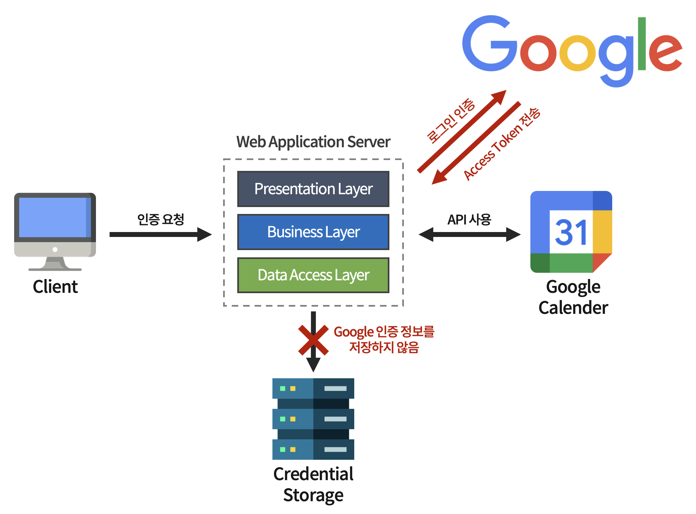

# OAuth 2

OAuth 2는 특정 어플리케이션(Client)에서 사용자의 인증을 직접 처리하는 것이 아니라,

사용자 정보를 보유하고 있는 신뢰할만한 써드 파티 어플리케이션에서 사용자의 인증을 대신 처리해주고,

Resource에 대한 자격 증명 토큰을 발급한 후, Client가 해당 토큰을 이용해 써드 파티 어플리케이션의 서비스를 사용하게 해주는 방식이다.

<br>



▲ _써드 파티 어플리케이션의 크리덴셜을 저장하지 않는 아키텍쳐_

<br>

위 그림처럼 어플리케이션에 크리덴셜이 직접적으로 제공되지 않는다.

따라서, 사용자의 크리덴셜을 이중으로 관리하지 않는 만큼 보안성도 향상된다.

<br>

***

<br>

## OAuth 2를 사용하는 어플리케이션 유형

<br>

### 🔸 써드 파티 어플리케이션에서 제공하는 API의 직접적인 사용

Google, Github, Facebook 등 신뢰할만한 써드 파티 어플리케이션에서 제공하는 API를   
직접적으로 사용하는 어플리케이션을 구현할 경우 OAuth 2를 사용한다.

사용자가 OAuth 2 인증 프로토콜을 이요해 써드 파티 어플리케이션에 대한 인증이 성공하면,  
써드파티 어플리케이션에서 제공하는 API를 활용한 커스텀 서비스를 제공한다.

<br>

### 🔸 추가적인 인증 서비스 제공 용도

일반적으로 제공하는 ID/PW 로그인 인증 외에 OAuth 2를 이용한 로그인 인증 방법을 추가적으로 제공한다.

사용자의 크리덴셜을 남기고 싶지 않을 경우 OAuth 2 로그인 인증 방법으로 로그인하게 할 수 있다.

<br>

***

<br>

## OAuth 2 동작 방식

<br>

### OAuth 2 인증 컴포넌트와 역할

<br>

**🔸 Resource Owner**

- Resource Owner는 사용하고자 하는 리소스의 소유자를 말한다.

<br>

**🔸 Client**

- Resource Owner를 대신해 보호된 Resource에 액세스하는 어플리케이션

<br>

**🔸 Resource Server**

- Client 요청을 수락하고 Resource Owner에게 Resource를 제공하는 서버

<br>

**🔸 Authorization Server**

- Client가 Resource Server에 접근할 수 있는 권한을 부여하는 서버

<br>

💡 **Ted**라는 사용자가 **A 어플리케이션**을 통해 **Google Photo**의 사진을 가져오는 경우

- Client : A 어플리케이션

- Resource Owner : Ted

- Resource Server : Google

- Authorization Server : Google Authorization Server

<br><br>

### OAuth 2 인증 처리 흐름

<br>

1. Resource Owner가 Client에게 OAuth 2 인증을 요청

2. Client는 써드 파티 어플리케이션의 로그인 페이지로 리다이렉트(Redirect)

3. Resource Owner가 로그인 인증

4. 성공 시 Client에게 Access Token 전송

5. Client가 Resource Server에게 Resource Owner 소유의 Resource 요청

6. Resource Server는 Access Token을 검증해서 Client에게 Resource 전송

<br><br>

### OAuth 2 인증 프로토콜에서 사용되는 용어

<br>

**🔸 Authorization Grant**

- Client가 Access Token을 얻기 위한 Resource Owner의 권한을 표현하는 크리덴셜

<br>

**🔸 Access Token**

- Client가 Resource Server에 있는 보호된 Resour에 액세스하기 위해 사용하는 자격 증명용 토큰

- Authorization Code와 Client Secret을 이용해 Authorization Server로부터 전달받은 Access Token으로 자격을 증명

<br>

**🔸 Scope**

- 주어진 Access Token을 사용하여 액세스할 수 있는 Resource 범위

<br><br>

### Authorization Grant 유형

<br>

**🔸 Authorization Code Grant: 권한 부여 승인 코드 방식**

- 권한 부여 승인을 위해 자체 생성한 Authorization Code를 전달하는 방식   
  > 권한 부여 승인 요청 시 응답 타입(```response_type```)을 ```code```로 지정하여 요청한다.

- 가장 많이 쓰이며 기본이 되는 방식이다.

- Refresh Token을 사용할 수 있다.


<br>

**🔸 Implicit Grant: 암묵적 승인 방식**

- 별도의 Authorization Code 없이 바로 Access Token을 발급하는 방식  
  > 권한 부여 승인 요청 시 응답 타입(```response_type```)을 ```token```으로 지정하여 요청한다.

- 자격증명을 안전하게 저장하기 힘든 Client에게 최적화된 방식

- Refresh Token을 사용할 수 없고, Authorization Server는 Client Secret을 통해 클라이언트 인증 과정을 생략한다.


<br>

**🔸 Resource Owner Password Credential Grant: 자원 소유자 자격 증명 승인 방식**

- 간단하게 로그인 시 필요한 ID/PW와 같은 정보로 Access Token을 발급받는 방식 

- Refresh Token을 사용할 수 있다.

- Authorization Server, Resource Server, Client가 모두 같은 시스템에 속해 있을 때만 사용 가능하다.


<br>

**🔸 Client Credentials Grant: 클라이언트 자격 증명 승인 방식**

- Client 자신이 관리하는 Resource 혹은 Authorization Server에 해당 Client를 위한 제한된 Resource 접근 권한이 설정되어 있는 경우 사용 가능한 방식

- Refresh Token을 사용할 수 있다.

- 자격 증명을 안정하게 보관할 수 있는 Client에서만 사용되어야 한다.


<br><br>

***

_2022.12.15. Update_