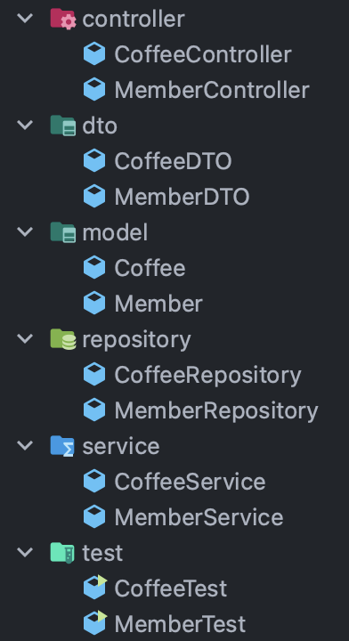

# 프레젠테이션 계층

API 계층이나 Web 계층이라고도 부르며, 웹 클라이언트의 요청 및 응답을 처리하는 레이어

Service Layer, Data Access Layer에서 발생하는 Exception을 처리해주며,  
```@Controller``` 어노테이션을 사용하여 작성된 Controller 클래스가 Presentation Layer에 속한다.

Controller와 View로 구성되어 있으며 아래와 같은 기능이 있다.  
- 공통 URI 경로, 각 기능별 URI 지정 
- 결과 처리, 페이지 이동, 예외 처리 등

URI를 어떤 방식으로 처리할 것인지에 대한 설계가 필요하다.

<br>


▲ _Spring MVC의 동작 방식 - Front Controller Pattern_

<br>

**🔸 DispatcherServlet**

클라이언트로부터 요청을 전달받아 다른 구성 요소들에게 요청에 대한 처리를 위임(Delegate)하는 역할을 한다.

<br>

**🔸 Handler**

Spring MVC에서 요청 Handler는 Controller 클래스를 의미하고,  
```@GetMapping```, ```@PostMappint```과 같은 어노테이션이 붙은 메서드를 **핸들러 메서드**라고 한다.

<br>

**🔸 Handler Mapping**

사용자와 요청을 처리하는 Handler를 매핑해주는 역할을 한다.

```@GetMapping("/{member-id}")```와 같이 HTTP Request Method와 Mapping URL을 기준으로 매핑을 한다.

```java
@GetMapping("/{member-id}")
    public String getMember(@PathVariable("member-id") long memberId) {

        // not implementation
        return null;
    }
```
▲ _Example Code_

<br>

**🔸 Handler Adapter**

Adapter는 주로 무언가를 다른 형태나 형식으로 바꾸는 역할을 하는데,  
Handler Apdapter도 다른 프레임워크의 Handler를 Spring MVC의 형태로 변환해 통합하기 위해 사용한다.

<br>

**🔸 View Resolver**

ViewResolver는 ```DispatcherServlet```에서 ‘이런 이름을 가진 View를 줘’ 라고 요청하면,  
```DispatcherServlet```에서 전달한 View 이름을 해석한 뒤 **적절한 View 객체를 리턴**해주는 역할을 한다.

<br>

***

<br>

## Controller 구현

어플리케이션 제작에서 가장 먼저 하는 일은 **어플리케이션의 경계 설정**과 **어플리케이션 기능 구현을 위한 요구 사항 수집**이다.

> 클라이언트 요청을 처리할 서버 어플리케이션의 기능으로 뭐가 필요할까?

<br>

### 패키지 구조

Spring Boot 기반의 어플리케이션에서 주로 사용되는 Java 패키지 구조는 2가지가 있다.

<br>

**🔸 기능 기반 패키지 구조(package-by-feature)**

- **어플리케이션에서 구현해야 하는 기능을 기준**으로 어플리케이션의 패키지를 구성하는 것을 말한다.

- 나누어진 패키지 안에는 하나의 기능을 완성하기 위한 계층별 클래스들이 모여있다.


<br>

**🔸 계층 기반 패키지 구조(package-by-layer)**

- 패키지를 하나의 계층(Layer)으로 보고 **클래스들을 계층별로 묶어서 관리하는 구조**를 말한다.



- ```controller```, ```dto``` 패키지는 **Presentation Layer**  
- ```model```, ```service``` 패키지는 **Service Layer**  
- ```repository```는 **Data Access Layer**에 해당

<br>

> Spring Boot 팀에서는 테스트와 리팩토링이 용이하고,  
> 향후에 마이크로 서비스 시스템으로의 분리가 상대적으로 용이한 **기능 기반 패키지 구조 사용을 권장**

<br>

### 엔트리 포인트(Entrypoint) 클래스 작성

Spring Initializr를 통해 생성한 프로젝트에는 엔트리포인트 클래스가 이미 작성되어 있다.

```java
import org.springframework.boot.SpringApplication;
import org.springframework.boot.autoconfigure.SpringBootApplication;

@SpringBootApplication
public class DemoProjectApplication {
	public static void main(String[] args) {
		SpringApplication.run(DemoProjectApplication.class, args);
	}
}
```

<br>

**🔸 ```@SpringBootApplication```의 역할**

- 자동 구성 활성화
- ```@ComponentScan```의 기능 (```@Component```가 붙은 클래스 스캔 후, Spring Bean으로 등록)
- ```@Configuration```이 붙은 클래스 스캔 후, Spring Bean으로 등록

<br>

**🔸 ```SpringApplication.run();```**

- Spring 어플리케이션을 부트스트랩하고, 실행하는 역할을 한다.

  > ❓ 부트스트랩 (Bootstrap)
  >
  > 어플리케이션 실행 전에 여러가지 설정 작업을 수행하여, 실행 가능한 어플리케이션으로 만드는 단계
  >
  > 📋 [***Bootstrap 과정***](https://itvillage.tistory.com/37)

<br>

### Handler Method 적용

```java
import org.springframework.http.HttpStatus;
import org.springframework.http.ResponseEntity;
import org.springframework.web.bind.annotation.*;

import java.util.*;

@RestController
@RequestMapping("/v1/coffees")
public class CoffeeController {

    private final Map<Long, Map<String, Object>> coffees = new HashMap<>();

    @PostMapping("/{coffee-id}")
    public ResponseEntity postCoffee(@PathVariable("coffee-id") long coffeeId,
                                     @RequestParam("engName") String engName,
                                     @RequestParam("korName") String korName,
                                     @RequestParam("price") int price) {

        Map<String, Object> map = new HashMap<>();
        map.put("coffeeId", coffeeId);
        map.put("engName", engName);
        map.put("korName", korName);
        map.put("price", price);

        coffees.put(coffeeId, map);

        return new ResponseEntity<>(map, HttpStatus.CREATED);
    }

    @GetMapping("/{coffee-id}")
    public ResponseEntity getCoffee(@PathVariable("coffee-id") long coffeeId) {

        return new ResponseEntity<>(HttpStatus.OK);
    }

    @PutMapping("/{coffee-id}")
    public ResponseEntity getCoffee(@PathVariable("coffee-id") long coffeeId,
                                    @RequestParam String engName,
                                    @RequestParam String korName,
                                    @RequestParam int price) {

        Map<String, Object> map = coffees.get(coffeeId);
        map.put("engName", engName);
        map.put("korName", korName);
        map.put("price", price);

        return new ResponseEntity<>(map, HttpStatus.OK);
    }

    @PatchMapping("/{coffee-id}")
    public ResponseEntity updateCoffee(@PathVariable("coffee-id") long coffeeId,
                                       @RequestParam long price) {

        Map<String, Object> map = coffees.get(coffeeId);
        map.put("price", price);

        return new ResponseEntity<>(map, HttpStatus.OK);
    }

    @DeleteMapping("/{delete-id}")
    public ResponseEntity deleteCoffee(@PathVariable("delete-id") long coffeeId) {

        coffees.remove(coffeeId);

        return new ResponseEntity<>(HttpStatus.NO_CONTENT);
    }
}
```

<br>

**🔸 @RestController**

```@Controller```에 ```@ResponseBody```를 붙인 어노테이션이다.

```@Controller```는 주로 View를 반환하기 위해 사용하고,  
```@RestController```는 주로 Json 형태로 객체 데이터를 반환하기 위해 사용한다.

- Spring MVC에서는 특정 클래스에 ```@RestController```를 추가하면 해당 클래스가 REST API의 리소스를 처리하기 위한 API 엔드포인트로 동작한다고 정의한다.
- ```@RestController``` 가 추가된 클래스는 어플리케이션 로딩 시, Spring Bean으로 등록된다.


<br>

**🔸 @RequestMapping()**

클라이언트의 요청과 클라이언트 요청을 처리하는 Handler Method를 매핑해준다.

```@RequestMapping```은 Controller 클래스 전체에 사용되는 공통 URL 설정을 한다.
> ex) @RequestMapping("/v1/coffees")를 작성하면,  
> http://localhost:8080/v1/coffees 와 같이 공통 URL 설정이 된다. 

RequestMapping의 Attribute로는 ```value```, ```produces``` 등이 있다.

- ```value``` : 위에서 본 공통 URL을 설정한다.
- ```produces``` : 응답 데이터를 어떤 미디어 타입으로 클라이언트에게 전송할 지를 설정한다.
  > ex) @RequestMapping(value = "/v1/coffees", produces = {MediaType.APPLICATION_JSON_VALUE})
  >
  > → JSON 형식의 데이터를 응답 데이터로 전송

<br>

**🔸 @PostMapping**

```@GetMapping```, ```@PutMapping```, ```@PatchMapping```, ```@DeleteMapping```과 같이  
클라이언트의 요청 데이터를 서버에 전달할 때 사용하는 어노테이션

- 클라이언트에서 요청 전송 시, HTTP Method 타입을 동일하게 해야한다.
- 인자로 받는 값은 ```@PathVariable```에서 사용하는 변수명이다.

<br>

**🔸 @PathVariable**

인자 앞에 사용하며, 위의 ```@PostMappint```에서 ```@PostMapping("/{id}")```와 같이 작성할 경우, 

```@PathVariable("id")```와 같이 동일한 변수명을 사용하여 URI 구분자에 변수를 추가할 수 있다.

- 만약 변수명이 다르다면 ```MissingPathVariableException```이 발생한다.

> ex) http://localhost:8080/v1/coffees/2 처럼 URI에 변수명을 추가

<br>

**🔸 @RequestParam**

인자 앞에 사용하며, ```@RequestParam("price") int price```와 같이 작성 가능하다.

주로 클라이언트 쪽에서 전송하는 요청 데이터를 쿼리 파라미터, 폼 데이터, x-www-form-urlencoded 형식으로 전송하면 이를 서버 쪽에서 전달 받을 때 사용하는 어노테이션

> ❓ **쿼리 파라미터(Query Parameter 또는 QueryString)**  
> 
> 요청 URL에서 ‘```?```’를 기준으로 붙는 key/value 쌍의 데이터  
> 
> ex) http://localhost:8080/v1/coffees/1?page=1&size=10

<br>

- ```@RequestParam```과 같이 전달 인자 없이 작성하면, 변수명을 전달 인자로 사용한다.

- key값이 존재하지 않을 경우 "BadRequest 4xx" 에러가 발생한다.
  - ```@RequestParam("name",required=false,defaultValue="")```처럼 Default 값을 설정해 방지 가능

<br>

**🔸 ResponseEntity<>()**

ResponseEntity를 사용하는 경우는 아래와 같다.

- Controller 클래스의 핸들러 메서드에서 요청 처리에 대한 응답을 구성하는데 사용
- RestTemplate으로 외부의 API 통신에 대한 응답을 전달 받아서 처리할 경우 사용

<br>

ResponseEntity 객체를 생성하면, **응답 데이터**와 **HTTP 응답 상태**를 함께 전달할 수 있다.

```java
return new ResponseEntity<>(map, HttpStatus.OK);
```

- 위의 코드에서는 Map 객체를 데이터로 전달하는데,  
Map 객체를 리턴하게되면 내부적으로 Json 형식의 응답 데이터로 변환하게 된다.

- ```HttpStatus.OK```는 200 OK를 전달하는 HTTP 응답 상태이다.  
  📋 [***HTTP Status Code***](https://developer.mozilla.org/ko/docs/Web/HTTP/Status)

<br><br>

***

_2022.10.20. Update_