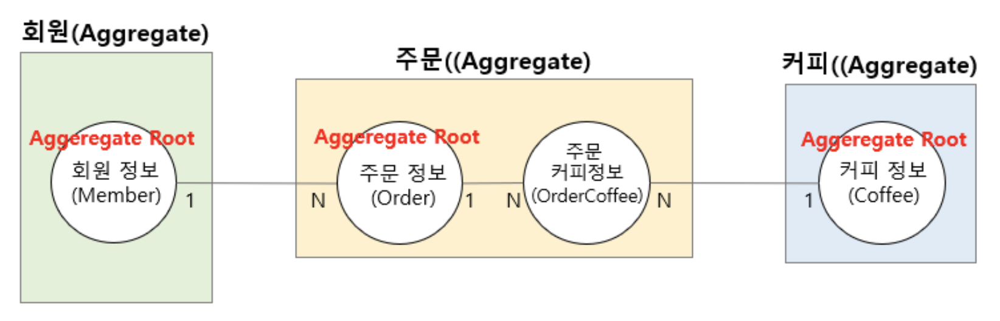

# JDBC 기반 데이터 액세스 계층

## 🔸 JDBC(Java DataBase Connectivity)

JDBC는 Java 기반 어플리케이션 코드 레벨에서 사용하는 데이터를 DB에 저장 및 업데이트 하거나 저장된 데이터를 Java 코드 레벨에서 사용할 수 있도록 Java에서 제공하는 표준 사양(Sepcification)이다.

즉, **자바에서 DB 프로그래밍을 하기 위해 사용되는 API**를 말한다.

<br>

### JDBC 동작 흐름


Java 애플리케이션 내에서 JDBC API를 사용하여 데이터베이스에 액세스하는 단순한 구조이다.

> **❓ JDBC 드라이버 (JDBC Driver)**
> 
> 데이터베이스와의 통신을 담당하는 인터페이스  
> 
> DBMS에 따라 DB를 다루는 방식이 다르다면, 사용자는 각 DBMS의 방식을 전부 알 수 없다.  
> 따라서, JDBC를 통해 추상화된 인터페이스를 제공하기만 하고,  
> DB의 종류에 상관없이 각 JDBC Driver를 통해 특정 DBMS를 사용할 수 있다.  

<br>

### JDBC API의 흐름

1. **JDBC 드라이버 로딩**  
   DriverManager 클래스를 통해서 사용하고자 하는 JDBC 드라이버 로딩

2. **Connection 객체 생성**  
   JDBC 드라이버가 정상적으로 로딩되면 DriverManager를 통해 DB와 연결되는 Connection 객체 생성

3. **Statement 객체 생성**  
   작성된 SQL 쿼리문을 실행하기 위한 Statement 객체 생성

4. **Query 실행**  
   생성된 Statement 객체를 이용해서 입력한 SQL 쿼리 실행

5. **ResultSet 객체로부터 데이터 조회**  
   실행된 SQL 쿼리문에 대한 결과 데이터 셋을 조회

6. **실행의 역순으로 Close**  
   ResultSet, Statement, Connection의 순으로 객체를 Close

<br>

### Connection Pool


<br>

Connection Pool은 Connection 객체를 미리 만들어서 보관하고, 필요할 때 제공하는 **Connection Manager**이다.

어플리케이션 로딩 시점에 Connection 객체를 미리 생성해두고,  
DB 연결이 필요할 경우 미리 만들어준 Connection 객체를 사용함으로써 어플리케이션 성능을 향상 시킬 수 있다.

> Spring Boot에서 기존에는 Apache Commons DBCP를 사용했지만,  
> 최근에는 성능면에서 이점을 가진 **HikariCP**가 기본 DBCP로 사용된다.

<br>

***

<br>

## 🔸 객체(Object) 중심 기술

기존에 사용하던 방식은 SQL 중심 기술이다.

```java
Member member = this.jdbcTemplate.queryForObject(
			    "select * from member where member_id=?", 1, Member.class);

```
▲ _Spring JDBC의 JdbcTemplate_

<br>

최근 Java에서는 SQL 중심의 기술에서 객체(Object) 중심의 기술로 지속적으로 이전을 하는 추세이다.

<br>

### 💡 ORM (Object-Relational Mappint)

ORM은 객체 중심의 데이터 액세스 기술을 말하며,

객체 중심 기술은 DB에 접근하기 위해 위 코드처럼 SQL 쿼리문을 직접 작성하기 보다는  
Java 객체를 어플리케이션 내부에서 SQL 쿼리문으로 자동 변환한 후에 DB 테이블에 접근하는 방식이다.

ORM에서는 객체의 멤버 변수와 DB의 테이블 Column이 대부분 1:1 매핑이 된다.

> 대표적인 Java ORM 기술로는 JPA(Java Persistence API)가 있다.

<br>

***

<br>

## 🔸 Spring Data JDBC

Spring Data JDBC는 ORM 기술을 사용하며, JPA의 기술적 복잡도를 낮춘 기술이라 비교적 심플하다.

<br>

Spring Data JDBC를 사용하기 위해서는 의존 라이브러리를 추가해야한다.

```java
dependencies {
	implementation 'org.springframework.boot:spring-boot-starter-data-jdbc'
	runtimeOnly 'com.h2database:h2'
}
```

<br>

또한 인메모리(In-memory) DB인 H2를 사용하기 위해 해당 의존 라이브러리도 추가하고,  
아래와 같이 ```application.yml``` 파일에 H2 관련 설정을 추가한다.

```yml
spring:
    h2:
        console:
            enabled: true
            path: /h2
    datasource:
        url: jdbc:h2:mem:test
    sql:
        init:
            schema-locations: classpath*.db/h2/schema.sql
```

- ```path:``` : Context path를 변경할 수 있다. 
- ```url:``` :JDBC URL을 변경할 수 있다.
- ```schema-locations:``` : 해당 경로의 .sql 파일의 스크립트를 읽어서, DB에 테이블을 자동으로 생성해준다.

<br>

> **💡 인메모리(In-memory) DB**
>
> 인메모리 DB는 메모리 안에 데이터를 저장하는 데이터베이스를 말한다.
>
> 어플리케이션이 실행 될 동안만 데이터를 저장하고 중지시키면 사라지는 휘발성 메모리이다.
> 
> 주로 로컬 개발 환경에서 테스트를 진행할 때,  
> 테스트에 필요한 데이터 외의 쓸데없는 데이터가 없이 정확한 테스트를 하기 위해 사용한다.

<br>

> **💡 application.yml**
>
> ```application.yml```을 사용하면 ```application.properties```보다 중복되는 프로퍼티 입력을 줄일 수 있다.

<br>

다음으로 DB의 테이블과 매핑할 Entity 클래스를 작성한다.

```java
@Getter
@Setter
public class Message {
    @Id
    private long messageId;
    private String message;
}
```

클래스명은 테이블명을 의미하고, ```@Table("테이블명")```을 통해 변경할 수 있다.

```@Id```가 작성된 멤버 변수를 Entity의 **고유 식별자 역할**을 하도록 하며, DB에서는 **Primary Key**로 지정된다.

> 
> Entity 클래스의 멤버 변수에 작성하며,  
> 해당 어노테이션이 작성된 멤버 변수는 해당 Entity의 **고유 식별자 역할**을 하고,  
> DB의 **Primary Key**로 지정한 Column에 해당된다.

<br>

이후 DB와의 연동을 담당하는 Reposiroty는 간단하게 구현이 가능하다.

```java
public interface MessageRepository extends CurdRepository<Message, Long> {
}
```

- ```CrudRepository``` : DB에 CRUD 작업을 진행하기 위해 Spring에서 지원하는 인터페이스

Generic 타입에는 Entity 클래스와, ```@Id``` 어노테이션이 붙은 멤버 변수의 데이터 타입을 지정한다.

<br>

마지막으로 Service 클래스에서 DI를 통해 Repository를 주입하여 Entity 클래스에 포함된 데이터를 DB에 저장할 수 있다.

```java
@Service
public class MessageService {

    private final MessageRepository messageRepository;

    public MessageService(MessageRepository messageRepository) {
        this.messageRepository = messageRepository;
    }

    public Message createMessage(Message message) {
        return messageRepository.save(message);
    }
}
```

CrudRepository에 구현된 메서드를 사용하여, 서비스 클래스에서 DB에 CRUD 작업을 수행할 수 있다.

|CRUD|Method| Return Type |Desciption|
|:-:|:-:|:-:|:-|
||count()|long| Repository의 데이터 개수 확인|
|CREATE|save(entity)| Entity |주어진 Entity를 저장 |
|      |saveAll(entites) | Entity |주어진 모든 Entity를 저장|
|READ| findById(id) | Iterable&lt;T> | 주어진 id로 Entity 검색 <br>(검색 결과가 없다면 Optional#empty() 반환)|
|   | existById(id) | boolean | 주어진 id를 가진 Entity가 존재하는지 검색 |
|   | findAll() | Iterable&lt;T> | Repository의 모든 Entity를 반환 |
|   | findAllById(ids) | Iterable&lt;T> | T타입이면서, 주어진 id에 해당하는 모든 Entity를 T타입으로 반환 |
|DELETE| delete(entity) | void | 주어진 Entity를 삭제 |
||deleteById(id) | void | 주어진 id를 가진 Entity를 삭제 |
||deleteAll() | void | Repository의 모든 Entity를 삭제 |
||deleteAll(entities) | void | 주어진 모든 Entity를 삭제 |

- 위 메서드의 파라미터인 Entity나 id 값이 ```null``` 값인 경우 ```IllegalArgumentException```이 발생한다.

<br>

***

<br>

## 🔸 Spring Data JDBC를 통한 Data Access Layer 구현

<br>

### **1. Domain Entity 클래스 정의**

<br>

Spring Data JDBC 기반의 데이터 액세스 계층 연동을 위해서는  
가장 먼저 **데이터베이스 테이블과 도메인 Entity 클래스의 설계**를 해야한다.

이후 1:N, N:N 등 각 도메인 간의 관계를 정의하여 ERD(Entity Relationship Diagram) 설계를 진행한다.

> DB 테이블 간의 관계는 기본키-외래키를 통해 맺어지지만, 클래스 간의 관계는 객체의 참조를 통해 관계가 맺어진다.
> 
> 1:N 관계에서 테이블은 기본키-외래키의 조인(JOIN)을 통해 데이터를 조회할 수 있지만,  
> 클래스에서는 객체 참조 리스트(List&lt;N에 해당하는 Entity>)를 통해 데이터 조회가 가능하다.

<br>

**💡 도메인 (Domain)**

어플리케이션 내의 로직들이 관여하는 **정보와 활동의 영역**을 말한다.  

> ex) 회원 가입과 회원 탈퇴와 같은 로직은 '회원'과 관련된 작업이며, 여기서 '회원'은 **도메인**이 된다.  
> 회원 가입, 회원 탈퇴와 같은 세부적인 부분을 **하위 도메인** 또는 **서브 도메인**이라고 한다.

<br>

**💡 Aggregate**

애그리거트란 비슷한 로직의 도메인들을 그룹화하여 묶어놓은 것을 말한다.

DB의 관점에서 보면 하나의 Table을 Aggregate와 1:1 매핑할 수 있다.

> 위의 회원 가입 예제에서는 '회원'이라는 Aggregate로 그룹화할 수 있다.

<br>

**💡 Aggregate Root**

애그리거트 루트는 하나의 Aggregate를 대표하는 도메인을 뜻한다.

각 Aggregate 내의 도메인 중에서 다른 도메인들과 가장 연관이 되어있는 도메인이 Aggregate Root가 된다.

DB의 관점에서 보면 Primary Key를 가진 Attribute를 Aggregate Root라고 할 수 있다.

<br>

**💡 Aggregate 객체 매핑 규칙**

1. 모든 Entity 객체의 상태는 Aggregate Root를 통해서만 변경한다.
    > 회원 탈퇴, 회원 포인트와 같은 서브 도메인에 직접 접근하는 것이 아닌   
    > '회원 정보'와 같은 Aggregate Root를 통해서 하위 도메인에 접근한 뒤, 상태를 변경해야한다.


<br>

2. 한 Aggregate 내에서의 Entity 객체 참조
    - 동일한 하나의 Aggregate 내에서는 Entity 간에 객체로 참조한다.

<br>

3. 여러 Aggregate 사이에서의 Entity 객체 참조  

아래의 커피 주문 샘플 어플리케이션 구현을 기준으로 한다.



▲ _Domain Entity Model Sample_

<br>

- 1:1, 1:N 관계의 Aggregate Root 간의 참조는 객체 참조 대신 ID로 참조한다.

```java
@Getter
@Setter
@Table("ORDERS")
public class Order {
    @Id
    private long orderId;
    private AggregateReference<Member, Long> memberId;
    ...
}
```

```AggregateReference``` 클래스를 통해 ```Member``` 클래스를 외래키로 추가하여 ID 참조를 할 수 있다.

<br>

- N:N 관계에서는 외래키 방식인 ID 참조와 객체 참조 방식이 함께 사용된다.  
  참조할 테이블에 해당되는 클래스의 ```@Id``` 필드를 멤버 변수로 가지는 별도의 참조 클래스를 사용한다.

```java
@Getter
@AllArgsConstructor
@Table("ORDER_COFFEE")
public class CoffeeRef {
    private long coffeeId;
    private int quantity;
}
```

```java
@Getter
@Setter
@Table("ORDERS")
public class Order {
    @MappedCollection(idColumn = "ORDER_ID", keyColumn = "ORDER_COFFEE_ID")
    private Set<CoffeeRef> orderCoffees = new LinkedHashSet<>();
	...
}
```

```java
@Getter
@Setter
public class Coffee {
    @Id
    private long coffeeId;
    ...
    private String CoffeeCode;
}
```

N:N 관계에서는 기본적으로 1:N과 1:N 관계로 이어줄 조인(Join) 테이블이 필요하고,  ([참조](https://github.com/H-JWANNA/TIL/blob/main/Database/Schema.md "Ref. 스키마"))  
해당 조인 테이블의 역할을 위 그림에는 '주문커피정보'가 하고, 코드에서는 ```CoffeeRef``` 클래스가 하고 있다.

'주문커피정보'는 주문 Aggregate 내에 존재하기 때문에  

> 한 Aggregate 내에서의 Entity 객체 참조  
> - 동일한 하나의 Aggregate 내에서는 Entity 간에 객체로 참조한다.

위 규칙에 따라 ```Set<CoffeeRef>```를 통해 객체 참조를 사용하여 1:N 관계를 만들 수 있다.

<br>

- CoffeRef 클래스를 보면 ```coffeeId```를 ```AggregateReference```를 사용해 ID 참조를 하지 않고 있는데,   
  N:N 관계에서는 AggregateReference를 사용하지 않아도 관계를 맺을 수 있다.

- ```@MappedCollection```은 Entity 클래스 간에 연관 관계를 맺어주는 정보를 의미한다.  
  
  keyColumn은 해당 조인 테이블의 **기본키**를 의미하고,  
  idColumn은 자식 테이블에 추가되는 **외래키**에 해당하는 Column을 의미한다.
  > ORDERS 테이블의 자식 테이블은 ORDER_COFFEE 테이블이며,  
  > ORDER_COFFEE 테이블은 ORDERS 테이블의 기본키인 ORDER_ID 값을 외래키로 가진다.

<br>

**💡 Order 클래스 구현**

```java
@Getter
@Setter
@Table("ORDERS")
public class Order {
    @Id
    private long orderId;
    private AggregateReference<Member, Long> memberId;

    @MappedCollection(idColumn = "ORDER_ID")
    private Set<CoffeeRef> orderCoffees = new LinkedHashSet<>();

    private OrderStatus orderStatus = OrderStatus.ORDER_REQUEST;
    
    private LocalDateTime createdAt = LocalDateTime.now();

    public enum OrderStatus {
        ORDER_REQUEST(1, "주문 요청"),
        ORDER_CONFIRM(2, "주문 확정"),
        ORDER_COMPLETE(3, "주문 완료"),
        ORDER_CANCEL(4, "주문 취소");

        @Getter
        private int stepNumber;

        @Getter
        private String stepDescription;

        OrderStatus(int stepNumber, String stepDescription) {
            this.stepNumber = stepNumber;
            this.stepDescription = stepDescription;
        }
    }
}
```

Order 클래스에 주문 상태 정보를 나타내는 enum 타입의 ```OrderStatus```를 추가하고,  

주문 등록 시간을 나타내는 ```LocalDateTime``` 타입의 ```createdAt```을 추가한다.

> OrderStatus는 Order 클래스 내에서만 사용하는 값이므로,  
> 외부로 분리시키지 않고 Order 클래스 멤버로 선언하여 사용할 수 있다.

<br>

**💡 테이블 생성 스크립트 추가**

위에서 설정한 schema.sql의 경로인 ```src/main/resources/db/h2/schema.sql```에 스크립트를 추가한다.

```sql
CREATE TABLE IF NOT EXISTS MEMBER (
    MEMBER_ID bigint NOT NULL AUTO_INCREMENT,
    EMAIL varchar(100) NOT NULL UNIQUE,
    NAME varchar(100) NOT NULL,
    PHONE varchar(100) NOT NULL,
    PRIMARY KEY (MEMBER_ID)
);

CREATE TABLE IF NOT EXISTS COFFEE (
    COFFEE_ID bigint NOT NULL AUTO_INCREMENT,
    KOR_NAME varchar(100) NOT NULL,
    ENG_NAME varchar(100) NOT NULL,
    PRICE number NOT NULL,
    COFFEE_CODE char(3) NOT NULL,
    PRIMARY KEY (COFFEE_ID)
);

CREATE TABLE IF NOT EXISTS ORDERS (
    ORDER_ID bigint NOT NULL AUTO_INCREMENT,
    MEMBER_ID bigint NOT NULL,
    ORDER_STATUS varchar(20) NOT NULL,
    CREATED_AT datetime NOT NULL,
    PRIMARY KEY (ORDER_ID),
    FOREIGN KEY (MEMBER_ID) REFERENCES MEMBER(MEMBER_ID)
);

CREATE TABLE IF NOT EXISTS ORDER_COFFEE (
    ORDER_COFFEE_ID bigint NOT NULL AUTO_INCREMENT,
    ORDER_ID bigint NOT NULL,
    COFFEE_ID bigint NOT NULL,
    QUANTITY int NOT NULL,
    PRIMARY KEY (ORDER_COFFEE_ID),
    FOREIGN KEY (ORDER_ID) REFERENCES ORDERS(ORDER_ID),
    FOREIGN KEY (COFFEE_ID) REFERENCES COFFEE(COFFEE_ID)
);
```

```CREATE IF NOT EXISTS```는 만약 테이블이 존재하지 않을 경우 생성한다는 의미이다.

이외의 Column 및 테이블 간의 관계 설정은 위에서 정의한 대로 생성한다.

또한, 인메모리 DB를 사용하기 때문에 테스트를 위한 별도의 ```DROP TABLE```의 과정은 필요하지 않다.

<br><br>

### **2. Service, Repository 구현**

<br>

🛠 Service 클래스가 Repository를 사용하므로 Repository를 먼저 구현하는 것이 좋다.

<br>

```java
public interface CoffeeRepository extends CrudRepository<Coffee, Long> {

    Optional<Coffee> findByCoffeeCode(String coffeeCode);

    @Query("SELECT * FROM COFFEE WHERE COFFEE_ID = :coffeeId")
    Optional<Coffee> findByCoffee(@Param("coffeeId")Long coffeeId);
}
```

```findBy~```는 쿼리 메서드로 SQL 쿼리문을 사용하지 않고 DB에 질의를 할 수 있도록 한다.  

기본적으로 상속받은 상위 인터페이스에 정의되지 않은 메서드를 정의할 때,  
```find + By + WHERE 절의 Column 이름 + (WHERE 절의 조건이 되는 데이터)```와 같이 사용하며,  
Column 이름에는 SQL Column 이름이 아닌 Entity 클래스의 멤버 변수명을 적어줘야 한다. 
> ex) findByFirstName ⭕️  /  findByFIRST_NAME ❌

<br>

```@Query``` 어노테이션을 사용하면 SQL 쿼리문을 직접 작성할 수 있다.  

쿼리문을 작성하지 않으면 ```SELECT "COFFEE"."KOR_NAME" AS "KOR_NAME", ... , "COFFEE"."COFFEE_ID" AS "COFFEE_ID" FROM "COFFEE" WHERE "COFFEE"."COFFEE_ID" = ?```와 같이 내부적으로 쿼리문을 생성한다.  
_(위의 쿼리문은 findById와 같은 의미이다.)_

> ```@Param("")``` 어노테이션은 Java8 이상에서는 자동으로 등록이 되므로 사용하지 않아도 된다.

<br>

Spring JDBC에서는 리턴 값을 Optional로 래핑할 수 있어 코드를 효율적이고 간결하게 작성할 수 있다.

<br><br>

🛠 Repository 구현이 완료되면 Service 클래스를 구현할 수 있다.

<br>
<details>
<summary> &ensp; ✔︎ CoffeeService Code</summary>
<div markdown="1">
<br>

```java
@Service
public class CoffeeService {
    private CoffeeRepository coffeeRepository;

    public CoffeeService(CoffeeRepository coffeeRepository) {
        this.coffeeRepository = coffeeRepository;
    }

    public Coffee createCoffee(Coffee coffee) {
        // 커피 코드를 대문자로 변경 - 사용자 편의성을 위함
        String coffeeCode = coffee.getCoffeeCode().toUpperCase();

        // 이미 등록된 커피 코드인지 확인
        verifyExistCoffee(coffeeCode);
        coffee.setCoffeeCode(coffeeCode);

        return coffeeRepository.save(coffee);
    }

    public Coffee updateCoffee(Coffee coffee) {
        // 조회하려는 커피가 존재하는 커피인지 확인
        Coffee findCoffee = findVerifiedCoffee(coffee.getCoffeeId());

        Optional.ofNullable(coffee.getKorName())
                .ifPresent(korName -> findCoffee.setKorName(korName));
        Optional.ofNullable(coffee.getEngName())
                .ifPresent(engName -> findCoffee.setEngName(engName));
        Optional.ofNullable(coffee.getPrice())
                .ifPresent(price -> findCoffee.setPrice(price));

        return coffeeRepository.save(findCoffee);
    }

    public Coffee findCoffee(long coffeeId) {
        return findVerifiedCoffeeByQuery(coffeeId);
    }

	// 주문에 해당하는 커피 정보 조회
    public List<Coffee> findOrderedCoffees(Order order) {
        return order.getOrderCoffees()
                .stream()
                .map(coffeeRef -> findCoffee(coffeeRef.getCoffeeId()))
                .collect(Collectors.toList());
    }

    public List<Coffee> findCoffees() {
        return (List<Coffee>) coffeeRepository.findAll();
    }

    public void deleteCoffee(long coffeeId) {
        Coffee coffee = findVerifiedCoffee(coffeeId);
        coffeeRepository.delete(coffee);
    }

    public Coffee findVerifiedCoffee(long coffeeId) {
        Optional<Coffee> optionalCoffee = coffeeRepository.findById(coffeeId);
        Coffee findCoffee =
                optionalCoffee.orElseThrow(() ->
                        new BusinessLogicException(ExceptionCode.COFFEE_NOT_FOUND));

        return findCoffee;
    }

    private void verifyExistCoffee(String coffeeCode) {
        Optional<Coffee> coffee = coffeeRepository.findByCoffeeCode(coffeeCode);
        if(coffee.isPresent())
            throw new BusinessLogicException(ExceptionCode.COFFEE_CODE_EXISTS);
    }

    private Coffee findVerifiedCoffeeByQuery(long coffeeId) {
        Optional<Coffee> optionalCoffee = coffeeRepository.findByCoffee(coffeeId);
        Coffee findCoffee =
                optionalCoffee.orElseThrow(() ->
                        new BusinessLogicException(ExceptionCode.COFFEE_NOT_FOUND));

        return findCoffee;
    }
}
```

</div>
</details>

<br>
<details>
<summary> &ensp; ✔︎ OrderService Code</summary>
<div markdown="1">
<br>

```java
@Service
public class OrderService {
    // DI
    final private OrderRepository orderRepository;
    final private MemberService memberService;
    final private CoffeeService coffeeService;

    public OrderService(OrderRepository orderRepository,
                        MemberService memberService,
                        CoffeeService coffeeService) {
        this.orderRepository = orderRepository;
        this.memberService = memberService;
        this.coffeeService = coffeeService;
    }

    public Order createOrder(Order order) {
        // 회원이 존재하는지 확인
        memberService.findVerifiedMember(order.getMemberId().getId());

        // 커피가 존재하는지 확인
        order.getOrderCoffees() // Set<CoffeeRef>
                .stream()
                .forEach(coffeeRef -> {
                    coffeeService.findVerifiedCoffee(coffeeRef.getCoffeeId()); 
                });
        return orderRepository.save(order);
    }

    public Order findOrder(long orderId) {
        return findVerifiedOrder(orderId);
    }

    public List<Order> findOrders() {
        return (List<Order>) orderRepository.findAll();
    }

    public void cancelOrder(long orderId) {
        Order findOrder = findVerifiedOrder(orderId);
        int step = findOrder.getOrderStatus().getStepNumber();

        // 주문 확인 후에는 취소할 수 없다.
        if (step >= 2) {
            throw new BusinessLogicException(ExceptionCode.CANNOT_CHANGE_ORDER);
        }

        findOrder.setOrderStatus(Order.OrderStatus.ORDER_CANCEL);
        orderRepository.save(findOrder);
    }

    private Order findVerifiedOrder(long orderId) {
        Optional<Order> optionalOrder = orderRepository.findById(orderId);
        Order findOrder =
                optionalOrder.orElseThrow(() ->
                        new BusinessLogicException(ExceptionCode.ORDER_NOT_FOUND));
        return findOrder;
    }
}
```

</div>
</details>

<br>

위의 코드를 살펴보면 Service 클래스에서 Repository 클래스를 생성자 주입하여 사용할 수 있다.

**내부적으로 검증에 대한 메서드를 작성**하고, Repository 클래스의 메서드를 활용하여 Service 클래스를 완성시킨다.

- ```isNullable``` : null 값을 허용한다는 뜻이다. update의 경우 변경하고자 하는 값이 선택적일 수 있으므로 사용한다.
- ```isPresent()``` : 값이 null면 true, 반대의 경우는 false를 반환한다.
- ```ifPresent()``` : 값이 null이 아니라면 파라미터를 실행하고, 반대의 경우는 아무 동작도 하지 않는다.
- ```orElseThrow()``` : 값이 null이 아니라면 해당 객체를 리턴하고, 반대의 경우에는 예외를 발생시킨다.

<br>

Spring JDBC에서는 ```@Id```가 추가된 멤버 변수의 값이 ```0``` 또는 ```null```이면 ```INSERT``` 쿼리를 전송하고,  
반대의 경우에는 ```UPDATE``` 쿼리를 전송하게 되므로 create와 update 모두 ```save()``` 메서드를 사용할 수 있다.

<br>

현재 delete를 사용해 테이블의 데이터 자체를 삭제하고 있지만,  
실제로는 ```MEMBER_STATUS```와 같은 Column을 두어 가입, 휴면, 탈퇴 등의 상태 정보로 나누어서 관리한다.

<br><br>

🛠 이후 기존 DTO나 Mapper 클래스, Controller 클래스, enum 등을 수정한 뒤 Sample Application을 실행하여 확인한다.

<br>

복잡한 DTO 클래스와 Entity 클래스의 매핑은 Mapper에 **default 메서드를 직접 구현**해서 직접 매핑 로직을 작성할 수 있다.

<details>
<summary> &ensp; ✔︎ OrderMapper Code</summary>
<div markdown="1">
<br>

```java
@Mapper(componentModel = "spring")
public interface OrderMapper {

    default Order orderPostDtoToOrder(OrderPostDto orderPostDto) {
        Order order = new Order();
        order.setMemberId(
					new AggregateReference.IdOnlyAggregateReference(orderPostDto.getMemberId()));
        Set<CoffeeRef> orderCoffees = orderPostDto.getOrderCoffees()
                .stream()
                .map(orderCoffeeDto -> new CoffeeRef(orderCoffeeDto.getCoffeeId(),
                        orderCoffeeDto.getQuantity()))
                .collect(Collectors.toSet());
        order.setOrderCoffees(orderCoffees);

        return order;
    }

    default OrderResponseDto orderToOrderResponseDto(CoffeeService coffeeService,
                                                     Order order) {

        long memberId = order.getMemberId().getId();

        List<OrderCoffeeResponseDto> orderCoffees =
                orderToOrderCoffeeResponseDto(coffeeService, order.getOrderCoffees());

        OrderResponseDto orderResponseDto = new OrderResponseDto();
        orderResponseDto.setOrderCoffees(orderCoffees);
        orderResponseDto.setMemberId(memberId);
        orderResponseDto.setCreatedAt(order.getCreatedAt());
        orderResponseDto.setOrderId(order.getOrderId());
        orderResponseDto.setOrderStatus(order.getOrderStatus());

        return orderResponseDto;
    }

    default List<OrderCoffeeResponseDto> orderToOrderCoffeeResponseDto(
                                                        CoffeeService coffeeService,
                                                        Set<CoffeeRef> orderCoffees) {
        return orderCoffees.stream()
                .map(coffeeRef -> {
                    Coffee coffee = coffeeService.findCoffee(coffeeRef.getCoffeeId());

                    return new OrderCoffeeResponseDto(coffee.getCoffeeId(),
                            coffee.getKorName(),
                            coffee.getEngName(),
                            coffee.getPrice(),
                            coffeeRef.getQuantity());
                }).collect(Collectors.toList());
    }
}
```

</div>
</details>

<br><br>

***

_2022.11.01. Update_

_2022.10.29. Update_