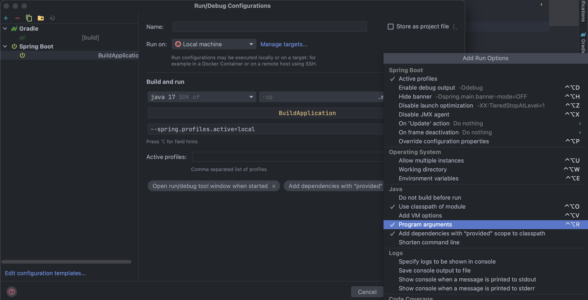

# 어플리케이션 빌드 / 실행 / 배포

## 🔸 빌드 (Build)

<br>

### IntelliJ를 이용한 빌드

Gradle의 task 명령인 ```:bootJar``` 또는 ```:build```를 통해 어플리케이션을 빌드할 수 있다.

빌드가 정상적으로 종료되면 ```build/libs``` 하위에 .jar 파일이 하나 생성된다.

<br>

> **💡 ```:build``` vs ```:bootJar```**
> 
> build task는 ```:assemble```, ```:check```와 같이 Gradle에서 빌드와 관련된 모든 task를 실행시키며,  
> 실행 가능한 jar 파일 외에 plain jar 파일을 하나 더 생성한다.
>
> bootJar task는 어플리케이션의 실행 가능한 Jar(Executable Jar) 파일을 생성하기 위한 task만 실행한다.

<br>

### Gradle Task를 이용한 빌드 (CLI 환경)

터미널이나 cmd, Git Bash 등 CLI 명령으로 입력할 수 있는 콘솔에서 프로젝트 root 경로로 이동하여 아래 명령을 실행한다.

빌드가 정상적으로 종료되면 ```build/libs``` 하위에 .jar 파일이 하나 생성된다.

<br>

- Windows Terminal
```bash
.\gradlew bootJar
```

<br>

- Mac OS, Git Bash
```bash
./gradlew build
```

<br>

### 📋 [***permission denied 에러가 발생한 경우***](https://jwanna.tistory.com/6)

<br><br>

## 🔸 실행 (Run)

<br>

### IntelliJ를 이용한 실행

항상 하던 것처럼 ~Application.java 파일을 실행

<br>

### CLI 환경에서 어플리케이션 실행

빌드를 통해 생성된 jar 파일의 디렉토리 경로로 이동하여 아래 명령을 실행한다.

```bash
java -jar 파일명.jar
```

<br>

### **💡 프로파일(Profile) 적용**

로컬 환경에서는 인메모리 DB인 H2를 사용하지만, 실제 서버 운영 환경에서는 인메모리 DB를 사용하지 않기 때문에 

로컬 환경과 서버 환경의 프로파일을 따로 설정해줄 필요가 있다.

<br>

기존 ```application.properties``` 또는 ```application.yml```은 

어플리케이션 실행 환경에 상관없이 **공통적으로 적용할 수 있는 프로퍼티**를 설정한다.

```application-local```에는 **로컬 환경**에서 사용하는 정보를 설정한다. 

```application-server```에는 **서버 환경**에서 사용하는 정보를 설정한다.

<br>

### IntelliJ에서 프로파일 적용

우측 상단 어플리케이션 실행 파일이 위치한 박스에서 [Edit Configurations]를 선택하고,  

아래와 같이 ```--spring.profiles.active=local```을 설정한다.

입력하는 칸이 보이지 않으면 우측 상단의 **Modify options**를 클릭하여   
오른쪽과 같이 Java - Program arguments를 체크해주면 된다.



<br>

다른 방법으로는 현재 작성한 부분 하단의 **Active profiles:** 부분에 ```local```을 작성해도 된다.

<br>

프로파일이 정상적으로 적용되었다면,   
어플리케이션 실행 시 ```The following 1 profile is active: local```과 같은 로그가 출력된다.

<br>

### CLI 환경에서 빌드된 실행 파일에 프로파일 적용

빌드를 통해 생성된 jar 파일의 디렉토리 경로로 이동하여 아래 명령을 실행한다.

```bash
java -jar 파일명.jar\ 
--spring.profiles.active=local
```

<span style = "color : gray">줄바꿈 시에는 \를 작성하고 공백 한 칸을 준 뒤 줄바꿈 해야한다.</span>

<br><br>

## 🔸 배포 (Deployment)

<br>

### 전통적인 배포 방법

**scp**나 **sftp** 같은 표준 유닉스 툴을 이용해서 서버로 간단히 전송하는 방법

<br>

### 클라우드 서비스를 위한 배포 방법

<br>

**PaaS(Platform as a Service)**
- Cloud Foundry, Heroku

> 대표적인 PaaS 제공 기업인 Cloud Foundry에서 제공하는 cf command line 툴을 사용하면  
> Executable Jar 파일을 손쉽게 배포할 수 있다.

<br>

cf command line 툴 사용 예시

```bash
$ cf push acloudyspringtime -p target/app-0.0.1-SNAPSHOT.jar
```

<br>

**IaaS(Infrastructure as a Service)**

- AWS Elastic Beanstalk, AWS Container Registry, AWS Code Deploy

- Azure Spring Cloud, Azure App Service

- Google Cloud

<br>

**CI / CD 플랫폼을 사용한 배포**

- Github Actions, Circle CI


<br><br>

***

_2022.11.16. Update_