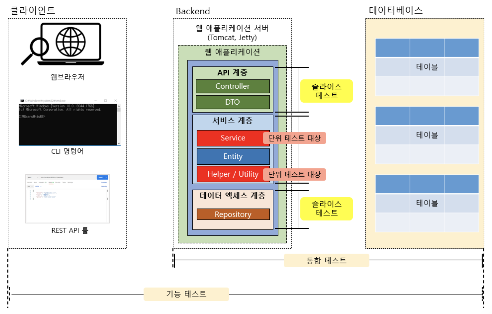

# 테스팅

어플리케이션에 대한 테스팅을 통해, 제 3자가 에러(버그)를 발견하는 것을 최소화 할 수 있다.

테스트는 대상이 검증 과정에 잘 통과하게 만들어 **최대한 더 나은 결과**를 얻기 위한 과정이다.

<br>



▲ _어플리케이션의 일반적인 테스트 분류_

<br>

- 기능 테스트 : 어플리케이션의 사용자 입장에서 어플리케이션이 제공하는 기능이 올바르게 동작하는지 테스트 (주로 QA에서 함)

- 통합 테스트 : 클라이언트 측 툴 없이 개발자가 짠 테스트 코드를 통해 테스트

- 슬라이스 테스트 (부분 통합 테스트) : 어플리케이션을 특정 계층으로 나누어 테스트

- 단위 테스트 : 비즈니스 로직의 메서드 단위로 나누어 테스트

<br>

**💡 Given - When - Then 패턴**

테스트 케이스 작성 시 사용하는 패턴으로 ```준비 - 실행 - 검증```의 세 부분으로 테스트 케이스를 작성한다.

- **Given** : 테스트에 사용하는 변수, 초기 데이터, 입력 값 등을 정의하거나 Mock 객체를 정의하는 구문이 포함된다.

- **When** : 실제로 테스트하려는 기능이 동작하는 단계로, 테스트의 실제 출력값 Actual이 포함된다.  

- **Then** : 입력으로 주어진 값과 출력을 통해 나온 출력 값을 Assertion(검증)하는 단계이다.

<br>

***

<br>

## 단위 테스트 (Unit Test)

작은 단위일 수록 연관된 기능을 생각할 필요 없이, 단순하고 빠르게 테스트를 수행할 수 있으므로

일반적으로 단위 테스트는 **최대한 독립적인 것**이 좋고, **최대한 작은 단위**로 쪼개어 테스트하는 것이 좋다.

<br>

**💡 단위 테스트를 하는 이유**

- 구현한 코드가 의도한 대로 동작하는지에 대한 결과를 빠르게 확인할 수 있다.

- 작은 단위의 테스트로 버그를 미리 찾아낼 수 있어서 상대적으로 더 적은 시간 안에 문제를 찾아낼 가능성이 높다.

<br>

### 단위 테스트를 위한 FIRST 원칙

**🔸 Fast (빠르게)**

- 일반적으로 작성한 테스트 케이스를 빠르게 동작해야한다.

<br>

**🔸 Independent (독립적으로)**

- 각각의 테스트 케이스는 독립적이여야 한다.

<br>

**🔸 Repeatable (반복 가능하도록)**

- 테스트 케이스는 어떠한 환경에서도 반복 실행이 가능해야한다.

- 외부 서비스나 리소스가 연동되는 경우 동일한 테스트 결과를 보장하지 못할 수 있기 때문에,  
  단위 테스트 시에는 외부 서비스나 리소스의 연동을 끊어주는 것이 좋다.

<br>

**🔸 Self-Validating (자가 검증이 되도록)**

- 단위 테스트는 테스트 케이스 스스로 성공 또는 실패라는 자체 검증 결과를 보여주어야 한다.

<br>

**🔸 Timely (시기 적절하게)**

- 단위 테스트는 테스트하려는 기능 구현을 하기 직전에 작성해야한다.  
- 정확히는 구현하고자 하는 기능을 단계적으로 업그레이드하면서, 그때 테스트 케이스도 단계적으로 업그레이드하는 것이 좋다.

<br><br>

### Junit을 활용한 단위 테스트

Junit은 Java 언어로 만들어진 어플리케이션용 오픈 소스 테스트 프레임워크이며, Spring Boot의 기본 테스트 프레임워크이다.

Junit은 2022년 현재 Junit 5까지 릴리즈 되었으며, 이외에도 TestNG와 같은 테스트를 위한 프레임워크가 존재한다.

<br>

```java
dependencies {
  testImplementation 'org.springframework.boot:spring-boot-starter-test'
}
```

위와 같이 설정하여 Junit을 사용할 수 있으며, Spring Boot Initializer를 이용하면 기본적으로 포함된다.

<br>

**🔸 Junit 테스트 케이스의 기본 구조**

```java
public class JunitDefaultStructure {
  @Test
  public void test1() { ... }

  @Test
  public void test2() { ... }
}
```

테스트하고자 하는 대상에 대해 ```void``` 타입의 메서드를 만들고, ```@Test``` 어노테이션을 입력하면 된다.

<br>

- ```@DisplayName("~")``` : 테스트 결과에 나타낼 이름을 설정한다.

- ```@BeforeEach``` : 각 테스트 케이스 실행 전에 해당 메서드를 실행한다. 주로 초기화 작업에 사용

- ```@BeforeAll``` : 모든 테스트 케이스 실행 전에 해당 메서드를 1번만 실행한다. **static 메서드에만 사용 가능**

- ```@AfterEach``` : 각 테스트 케이스 실행 후에 해당 메서드를 실행한다. 주로 후처리 작업에 사용

- ```@AfterAll``` : 모든 테스트 케이스 실행 후에 해당 메서드를 1번만 실행한다.

<br><br>

#### 📌 **Assertion**

Assertion은 **예상하는 결과가 참(true)이길 바라는 논리적인 표현**이며, **검증**이라고 할 수 있다.

Junit에서는 Assertion의 다양한 메서드를 사용해 테스트 대상에 대한 검증을 진행할 수 있다.

<br>

**🔸 assertEquals(), assertNotEquals()**

기대 값과 실제 값이 같은지, 같지 않은지 검증한다.

```java
@Test
public void testExample() {
  String expected = "Hello, Junit";
  String actual = "Hello, Junit";

  assertEquals(expected, actual);
}
```

<br>

**🔸 assertNull(), assertionNotNull()**

대상 객체가 null인지, null이 아닌지 검증한다.  
1번째 파라미터는 테스트 대상 객체이며, 2번째 파라미터는 테스트 실패 시 표시할 메시지이다.

```java
@Test
public void testExample() {
  String obj = null;
  String notNullObj = "hi";

  assertNull(obj, "have to be null");
  // 또는
  assertNotNull(notNullObj, "should be not null");
}
```

<br>

**🔸 assertThrows(), assertDoesNotThrows()**

대상 예외를 발생시키는지, 발생시키지 않는지 검증한다.  
1번째 파라미터는 발생이 기대되는 예외 클래스, 2번째 파라미터에는 람다 표현식을 통해 메서드를 호출한다.

```java
@Test
public void testExample() {
  String obj = null;

  assertThrows(NullPointerException.class, () -> obj.toUpperCase());
}
```

발생이 기대되는 예외가 아닌 다른 예외가 발생했다면 검증에 실패한다.  

하지만 ```NullPointerException```의 상위 클래스인 ```RuntimeException```을 기대값으로 설정하면 검증에 성공한다.

이처럼 발생이 기대되는 예외의 상위 클래스를 인자로 전달한 경우에는 검증에 성공한다.

<br>

> **💡 Executable 함수형 인터페이스**
>
> 2번째 파라미터인 람다 표현식은 Executable 함수형 인터페이스이다.
>
> Consumer 인터페이스라고 불리는 매개변수는 존재하지만 반환값은 없는 인터페이스이며,  
> ```void execute() throws Throwable;``` 메서드 하나만 정의되어 있다.

<br>

### 📋 [***Assertion에 대한 더 많은 정보***](https://junit.org/junit5/docs/current/user-guide/#writing-tests-assertions)

<br><br>

#### 📌 **Hamcrest**

Hamcrest는 Junit 기반의 단위테스트에서 사용할 수 있는 Assertion Framework이다.

자연스러운 문장형 Mathcer로 가독성을 향상 시킬 수 있고, 테스트 실패 메시지를 이해하기 쉽다는 장점이 있다.

<br>

```java
@Test
public void testExample() {
  String expected = "Hello, World";
  String actual = "Hello, Junit";

  // Junit의 Assertion
  assertEquals(expected, actual);

  // Hamcrest의 Matcher
  assertThat(actual, is(equalTo(expected)));
}
```
▲ _Hamcrest를 사용하면 하나의 영어 문장처럼 자연스럽게 읽혀 가독성 측면에서 장점이 있다._

<br>

- ```assertThat()``` : 1번째 파라미터는 실제 값, 2번째 파라미터는 기대하는 값이다.

<br><br>

#### 📌 **Assumption**

Assumption은 '~라고 가정하고'라는 뜻이며,  특정 환경에만 테스트 케이스를 실행하도록 할 때 사용한다.

<br>

**🔸 assumeTrue()**

파라미터로 입력된 값이 true이면 아래에 있는 나머지 로직을 실행

```java
@Test
public void testExample() {
  assumeTrue(System.getProperty("os.name").startWith("Mac OS X"));

  System.out.println("success");
  assertTrue(true);
}
```

<br>

### 📋 [***Assumption에 대한 더 많은 정보***](https://junit.org/junit5/docs/current/user-guide/#writing-tests-assumptions)

<br>

***

<br>

## 슬라이스 테스트 (Slice Test)

각 계층에 구현한 기능들이 잘 동작하는지 특정 계층만 잘라서 진행하는 테스트를 말한다.

각 계층은 서로 연결되어 있기 때문에 계층을 따로따로 테스트하기 위해서는 Mock(가짜 객체)을 사용해야한다.

<br>

**💡 Mockito**

- Spring Framework 자체적으로 지원하는 Mock 객체를 통한 Mocking을 해주는 오픈 소스 라이브러리

<br><br>

### Presentation Layer 테스트

해당 계층에서 테스트 대상은 대부분 클라이언트 요청을 받아들이는 핸들러인 Controller이다.

<br>

**🔸 Controller 테스트**

```java
@SpringBootTest
@AutoConfigureMockMvc
public class MemberControllerTest {

  @Autowired
  private MockMvc mockMvc;

  @Autowired
  private Gson gson;
    
  @MockBean
  private MemberService memberService;

  @Autowired
  private MemberMapper mapper;

  @Test
  public void postMemberTest() throws Exception {
    // given : 테스트용 request body 생성
    MemberDto.Post post 
              = new MemberDto.Post("hongjjwan@gmail.com", "Hong", "010-1234-1234");
    
    Member member = mapper.memberPostToMember(post);
    member.setStamp(new Stamp()); // Member Entity의 stamp 정보가 없으면 Exception 발생

    given(memberService.createMember(Mockito.any(Member.class))).willReturn(member);

    String content = gson.toJson(post);


    // when : MockMvc 객체로 테스트 대상 Controller 호출
    // - MockMvc 객체를 통해 요청 URI와 HTTP 메서드 등을 지정하고, 
    // - request body를 추가한 뒤에 request 수행
    ResultActions actions =
            mockMvc.perform(post("/v11/members")
                            .accept(MediaType.APPLICATION_JSON)
                            .contentType(MediaType.APPLICATION_JSON)
                            .content(content));

        
    // then : Controller의 메서드에서 응답으로 수신한 HTTP Status 및 response body를 통한 검증 
    MvcResult result = actions
                        .andExpect(status().isCreated())
                        .andExpect(jsonPath("$.data.email").value(post.getEmail()))
                        .andExpect(jsonPath("$.data.name").value(post.getName()))
                        .andExpect(jsonPath("$.data.phone").value(post.getPhone()))
                        .andReturn();

    System.out.println(result.getResponse().getContentAsString());
  }
}
```

<br>

**1. 어노테이션**

- ```@SpringBootTest``` : Sprint Boot 기반의 어플리케이션을 테스트하기 위한 Application Context를 생성

- ```@WebMvcTest``` : @SpringBootTest 대신에 사용 가능하며, Controller에서 의존하는 컴포넌트를 일일이 설정해야한다.

- ```@AutoConfigureMockMvc``` : Controller 테스트를 위한 어플리케이션의 자동 구성 작업

<br>

> **💡 ```@SpringBootTest``` vs ```@WebMvcTest```**
>
> ```@SpringBootTest```는 ```@AutoConfigureMockMvc```와 함께 사용되어 Controller를 테스트하는데,  
> 프로젝트에서 사용하는 Bean 전체를 ApplicationContext에 등록하여 사용한다.
> 
> → 테스트 환경 구성은 편리하지만, 실행 속도가 상대적으로 느리다. **통합 테스트에 주로 사용**
>
> ```@WebMvcTest```는 Controller 테스트에 필요한 Bean만 ApplicationContext에 등록한다.
>
> → 테스트 환경 구성은 불편하지만, 실행 속도가 상대적으로 빠르다. **Controller 슬라이스 테스트에 주로 사용**

<br>

**2. 라이브러리 및 프레임워크**

- ```MockMvc``` : Tomcat과 같은 서버를 실행하지 않고, Controller를 테스트할 수 있는 환경을 지원하는 Spring MVC 프레임워크  
  > @AutoConfigureMockMvc 어노테이션을 작성해야 사용할 수 있다.

- ```Gson``` : JSON 변환 라이브러리로 아래와 같은 설정을 추가하여 사용 가능하다.

  ```java
  dependencies {
    implementation 'com.google.code.gson:gson'
  }
  ```

- ```@MockBean``` : Application Context에 등록된 Bean에 대한 Mockito Mock 객체를 생성하고 주입하는 역할  
  - 어노테이션이 작성되면 해당 필드의 Bean에 대한 Mock 객체를 생성하고, 필드에 주입(DI)하게 된다.

<br>

**3. Given**

- ```given``` : Mock 객체가 특정 값을 리턴하는 동작을 지정하는 static 메서드  
  실제 Controller 클래스에서 사용되는 로직을 입력해 테스트한다.
  
  > import static org.mockito.BDDMockito.given;

- ```Mockito.any(클래스 타입)``` : Mockito에서 지원하는 변수 타입으로, 해당 로직의 파라미터 타입을 입력해준다.

  > ```anyInt()```, ```anyLong()```, ```anyList()``` 등으로 타입을 지정할 수 있다.

- ```doNothing()``` : void로 선언된 메서드에 ```when()```을 사용하기 위해 사용한다.

- ```when()``` : mock 객체의 행동을 설정한다.

  > ex) ```doNothing().when(memberService).deleteMember(memberId);```

- ```willReturn()``` : MemberService Mock 객체의 createMember() 메서드가 리턴할 Stub 데이터

  > **💡 Stubbing**
  >
  > 테스트를 위해 항상 Mock 객체가 일정한 동작을 하도록 지정하는 것을 말한다.

<br>

**4. When**

- ```perform()``` : 요청을 전송하는 역할을 하며, 메서드 내부에는 Controller 호출을 위한 세부 정보가 포함된다.   
  
  > ```ResultActions``` 객체를 받으며, 해당 객체는 리턴 값을 검증하고 확인하는 ```andExpect()``` 메서드를 제공한다.

- ```post(), get(), put(), delete()``` : HTTP POST METHOD와 Request URL을 설정할 수 있다.

  > import static org.springframework.test.web.servlet.request.MockMvcRequestBuilders.post;

- ```accept()``` : 클라이언트 쪽에서 리턴 받을 응답 데이터 타입을 설정한다.

- ```contentType()``` : 서버 쪽에서 처리 가능한 Content Type을 설정한다.

- ```content()``` : Request Body 데이터를 설정한다.

- 이외에도 ```param("size", String.valueOf(pageMembers.getSize()))```과 같이  
  Query Parameter로 입력되는 값에 대한 설정을 추가할 수 있다.

<br>

**5. Then**

- ```status()``` : Response Status가 뒤에 오는 상태가 맞는지 확인하는 static 메서드  
  
  > import static org.springframework.test.web.servlet.result.MockMvcResultMatchers.status;

- ```andExpect()``` : ResultActions에서 제공하는 메서드로, 리턴으로 전송한 Request에 대한 검증을 수행한다.

- ```andReturn()``` : MvcResult에서 제공하는 메서드로, 디버깅 시 Response로 전달되는 응답 데이터를 출력할 때 사용한다.

- ```jsonPath("$.data").value()``` : JsonPath의 값과 value의 인자 값이 일치하는지 확인한다. (```$```는 루트)

- ```jsonPath().isArray()``` : JS의 배열인지 확인한다. (Java의 Collection도 JS에서는 배열로 취급)
  
  > import static org.springframework.test.web.servlet.result.MockMvcResultMatchers.jsonPath;

  ### 📋 [***JsonPath***](https://joojimin.tistory.com/52)

<br><br>

### Service Layer 테스트

해당 계층에서 테스트 대상은 대부분 클라이언트 요청을 받아들이는 핸들러인 Controller이다.

<br>

**🔸 Service 테스트**

```java
@ExtendWith(MockitoExtension.class)
public class MemberServiceMockTest {

  @Mock
  private MemberRepository memberRepository;

  @InjectMocks
  private MemberService memberService;

  @Test
  public void createMemberTest() {
    // given
    Member member = new Member("hongjjwan@gmail.com", "Hong", "010-1123-1231");

    given(memberRepository.findByEmail(member.getEmail))
            .willReturn(Optional.of(member));

    // when, then
    assertThrows(BusinessLogicException.class, 
                    () -> memberService.createMember(member));
  }
}
```

<br>

- ```@ExtendWith``` : Spring을 사용하지 않고, Junit의 Mockito 기능을 사용하기 위한 어노테이션

- ```@Mock``` : 해당 필드의 객체를 Mock 객체로 생성한다.

- ```@InjectMocks``` : ```@Mock```을 통해 생성한 Mock 객체를 해당 필드에 주입한다.


<br><br>

### Data Access Layer 테스트

데이터 액세스 계층 테스트 시에는 ```DB의 상태를 테스트 케이스 실행 이전으로 되돌려 깨끗하게 한다```는 규칙을 지키는 것이 좋다.

<br>

**🔸 Repository 테스트**

```java
@DataJpaTest
public class MemberRepositoryTest {

  @Autowired
  private MemberRepository memberRepository;

  @Test
  public void savedMemberTest() {
    // given
    Member member = new Member();
    member.setEmail("hongjjwan@gmail.com");
    member.setName("Hong");
    member.setPhone("010-1111-2222");

    // when
    Member savedMember = memberRepository.save(member);

    // then
    assertNotNull(savedMember);
    assertEquals(member.getEmail(), savedMember.getEmail());
    assertEquals(member.getName(), savedMember.getName());
    assertEquals(member.getPhone(), savedMember.getPhone());
  }

  @Test
  public void findByEmailTest() {
    // given
    Member member = new Member();
    member.setEmail("hongjjwan@gmail.com");
    member.setName("Hong");
    member.setPhone("010-1111-2222");

    // when
    memberRepository.save(member);
    Optional<Member> findMember = 
                memberRepository.findByEmail(member.getEmail());

    // then
    assertTrue(findMember.isPresent());
    assertEquals(findMember.get().getEmail(), member.getEmail());
  }
}
```

<br>

- ```@DataJpaTest``` : ```@Transaction```을 포함하고 있기 때문에, 하나의 테스트 케이스 실행이 종료되는 시점에 **DB에 저장된 데이터는 rollback 처리**되어 초기 상태를 유지한다.

  > Spring JDBC 환경에서는 ```@JdbcTest```, Spring Data JDBC 환경에서는 ```@DataJdbcTest```를 사용할 수 있다.

<br><br>

***

_2022.11.16. Modified_

_2022.11.14. Update_

_2022.11.13. Modified_

_2022.11.12. Update_

_2022.11.09. Update_