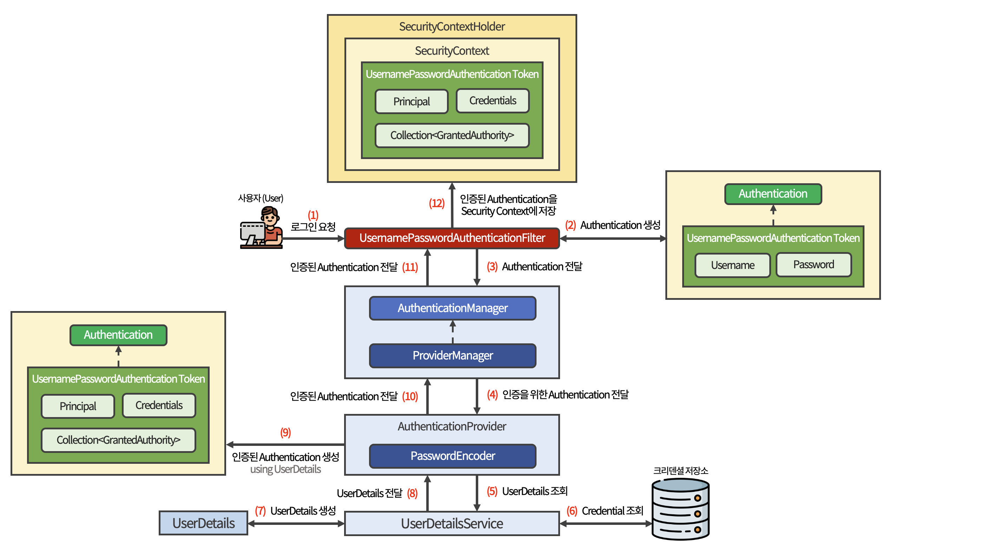

# 인증 (Authentication)

Spring Security에서는 Spring Security Filter Chain을 통해 특정 작업을 처리한다.

<br>

사용자의 인증 요청이 Spring Security Filter Chain의 특정 Filter에 도달했을 때,

Spring Security의 컴포넌트들은 아래와 같은 과정을 거쳐 사용자의 인증 요청을 처리한다.

<br>

***

<br>

## Spring Security 컴포넌트로 보는 인증 처리 흐름

<br>



<br>

1. 사용자가 로그인 폼 등을 이용해 ID/PW를 포함한 Request를 Spring Security가 적용된 어플리케이션에 전송

   - 해당 요청은 ```UsernamePasswordAuthenticationFilter```가 전달받는다.

<br>

2. 요청을 전달받아 ```UsernamePasswordAuthenticationToken```을 생성한다.  

   - 해당 ```Authentication```은 아직 **인증이 되지 않은 상태**이다.

   - ```UsernamePasswordAuthenticationToken```은 ```Authentication``` 인터페이스를 구현한 클래스이다.

<br>

3. 인증되지 않은 ```Authentication```을 ```AuthenticationManager```에게 전달한다.

   - ```AuthenticationManager```는 **인증 처리를 총괄하는 매니저 역할**을 하는 인터페이스이다.

   - ```ProviderManager```는 ```AuthencitaionManager``` 인터페이스를 구현한 클래스이다.

<br>

4. ```Authentication```을 ```AuthenticationProvider```로 전달한다.

<br>

5. ```UserDetailsService```를 통해 ```UserDetails```를 조회한다.

   - ```UserDetailsService```는 ```UserDetails```를 제공하는 컴포넌트이다.

   - ```UserDetails```는 **저장소에 저장된 사용자의 Username과 사용자 자격 증명을 위한 크리덴셜인 Password, 사용자의 권한 정보를 포함하고 있는 컴포넌트**이다.

<br>

6. ```UserDetailsService```는 DB 등의 저장소에서 사용자의 크리덴셜을 포함한 사용자의 정보를 조회한다.

<br>

7. 조회한 사용자의 크리덴셜을 포함한 사용자 정보를 기반으로 ```UserDetails```를 생성한다.

<br>

8. 생성된 ```UserDetails```를 다시 ```AuthenticationProvider```에게 전달한다.

<br>

9. ```PasswordEncoder```를 통해 전달 받은 ```UserDetails```에 포함된 암호화 된 Password와 인증을 위한 ```Authentication```안에 포함된 Password가 일치하는지 검증한다.

   - 검증에 성공하면 UserDetails를 통해 **인증된 Authentication**을 생성한다.

   - 검증에 실패하면 Exception을 발생시키고, 인증 처리를 중단한다.

<br>

10. 인증된 ```Authentication```을 ```ProviderManager```에게 전달한다.

<br>

11. 인증된 ```Authentication```을 ```UsernamePasswordAuthenticationFilter```에게 전달한다.

<br>

12. 마지막으로 ```SecurityContextHolder```를 이용해 ```SecurityContext```에 **인증된 Authentication**을 저장한다.

    - ```SecurityContext```는 Spring Security의 세션 정책에 따라서 
  
       Http Session에 저장되어 **사용자의 인증 상태를 유지**하기도 하고, 
       
       Http Session을 생성하지 않고 **무상태를 유지**하기도한다.

<br>

***

<br>

## Spring Security의 인증 컴포넌트

<br>

### 🔸 UsernamePasswordAuthenticationFilter

<br>

일반적으로 로그인 폼에서 제출되는 Username과 Password를 통한 인증을 처리하는 Filter이다.

클라이언트로부터 전달받은 Request를 Spring Security가 인증 프로세스에서 이용할 수 있도록 토큰을 생성한다.

<br>

```java
public class UsernamePasswordAuthenticationFilter extends AbstractAuthenticationProcessingFilter {}
```

해당 클래스는 ```AbstractAuthenticationProcessingFilter```를 상속하며,  

상속받은 상위 클래스에 ```doFilter()``` 메서드가 포함되어 있다.

<br><br>

```java
public class UsernamePasswordAuthenticationFilter extends ... {

    public static final String SPRING_SECURITY_FORM_USERNAME_KEY = "username";

	public static final String SPRING_SECURITY_FORM_PASSWORD_KEY = "password";
}
```

변수를 통해 로그인 폼을 통해 전송되는 Request Parameter의 디폴트 name은 ```username```, ```password```인 것을 알 수 있다.

<br><br>

```java
public class UsernamePasswordAuthenticationFilter extends ... {

    private static final AntPathRequestMatcher DEFAULT_ANT_PATH_REQUEST_MATCHER = 
                            new AntPathRequestMatcher("/login","POST");
}
```

```AntPathRequestMatcher```는 **클라이언트의 URL에 매치되는 Matcher**이다.

클라이언트의 URL이 ```/login```이고, HTTP Method가 ```POST```일 경우 매치된다는 사실을 알 수 있다.

<br><br>


```java
public class UsernamePasswordAuthenticationFilter extends ... {

	public UsernamePasswordAuthenticationFilter(AuthenticationManager authenticationManager) {
		super(DEFAULT_ANT_PATH_REQUEST_MATCHER, authenticationManager);
	}
}
```

위의 ```AntPathRequestMatcher```의 객체와 ```authenticationManager```를 상위 클래스에 전달한다.

상위 클래스에 전달된 객체는 **Filter가 구체적인 작업을 수행할지, 특별한 작업 없이 다른 Filter를 호출할지 결정하는데 사용**된다.

<br><br>


```java
public class UsernamePasswordAuthenticationFilter extends ... {

	@Override
	public Authentication attemptAuthentication(HttpServletRequest request, 
                                                HttpServletResponse response)
			                                    throws AuthenticationException {

		if (this.postOnly && !request.getMethod().equals("POST")) {
			throw new AuthenticationServiceException("Authentication method not supported: " 
                + request.getMethod());
		}

		String username = obtainUsername(request);
		String password = obtainPassword(request);
        ...
		
        UsernamePasswordAuthenticationToken authRequest = 
            UsernamePasswordAuthenticationToken.unauthenticated(username, password);
		...

		return this.getAuthenticationManager().authenticate(authRequest);
	}

}
```

```attemptAuthentication()``` 메서드는 클라이언트에서 전달한 Username과 Password 정보를 이용해 인증을 시도한다.

  - 해당 메서드는 상위 클래스의 ```doFilter()``` 메서드에서 호출된다.  

    > Filter에서 어떤 처리를 하는 시작점은 항상 ```doFilter()```이다.

<br>

```if``` 문을 통해 Http Method가 ```POST```가 아니면 Exception을 발생시킨다.

<br>

이후 Username과 Password 정보를 이용해 ```UsernamePasswordAuthenticationToken``` 을 생성한다.

  - 해당 토큰은 인증을 위해 필요한 인증 토큰이며, 인증에 성공한 토큰이 아니다.

<br>

마지막으로 ```AuthenticationManager```의 ```authenticate()``` 메서드를 호출해 인증 처리를 위임한다.

<br><br>

### 🔸 AbstractAuthenticationProcessingFilter

<br>

UsernamePasswordAuthenticationFilter가 상속하는 상위 클래스로, Spring Security에서 제공하는 Filter 중 하나이다.

<br>

해당 클래스는 HTTP 기반의 인증 요청을 처리하지만 실질적인 **인증 시도는 하위 클래스에게 맡기고,**  

인증에 성공하면 **인증된 사용자 정보를 SecurityContext에 저장**하는 역할을 한다.

<br>

```java
public abstract class AbstractAuthenticationProcessingFilter extends ... implements ... {
    
    private void doFilter(ServletRequest request,
                          ServletResponse response,
                          FilterChain chain)
                          throws IOException, ServletException {

        if(!requiresAuthentication(request, response)) {
            chain.doFilter(request, response);
            return;
        }

        try {
            Authentication authenticationResult = attemptAuthentication(request, response);

            ...

            successfulAuthentication(request, response, chain, authenticationResult);
        }
        catch (InternalAuthenticationServiceException failed) {
            ...
            unsuccessfulAuthentication(request, response, failed);
        }
    }
}
```

```if``` 문을 통해 해당 클래스가 인증 처리를 해야하는지, 다음 Filter를 호출할지 여부를 결정한다.

> 💡 ```requiresAuthentication()```   
> 
> 하위 클래스인 ```requiresAuthenticationRequestMatcher```에서 전달받은 객체를 통해  
> 들어오는 요청이 인증 처리를 해야되는지 여부를 결정한다.
>
> ```AntPathRequestMatcher```의 파라미터인 URL과 Http Method가 매칭 조건이 된다.

<br>

```attemptAuthentication()``` 메서드를 통해 하위 클래스에 인증을 시도해 줄 것을 요천한다.

인증에 성공하면 ```successfulAuthentication()``` 메서드를 호출하고, 실패하면 ```unsuccessfulAuthentication()``` 메서드를 호출한다.

- ```successfulAuthentication()```  

  인증에 성공한 이후, **SecurityContextHolder를 통해 사용자의 인증 정보를 SecurityContext에 저장**한 뒤,  
  **SecurityContext를 Http Session에 저장**한다.

- ```unsuccessfulAuthentication()```  

  **SecurityContext를 초기화**하고, ```AuthenticationFailureHandler```를 호출한다.

<br><br>

### 🔸 UsernamePasswordAuthenticationToken

<br>

Spring Security에서 Username/Password를 통해 인증을 수행하기 위해 필요한 토큰

인증 성공 후 인증에 성공한 사용자의 정보가 Token에 포함되어 ```Authentication``` 객체 형태로 ```SecurityContext```에 저장된다.

<br>

```java
public class UsernamePasswordAuthenticationToken extends ... {

    private final Object principal;
    private Object credentials;

	public static UsernamePasswordAuthenticationToken unauthenticated(Object principal, 
                                                                      Object credentials) {

		return new UsernamePasswordAuthenticationToken(principal, credentials);
	}

	public static UsernamePasswordAuthenticationToken authenticated(Object principal, 
            Object credentials, Collection<? extends GrantedAuthority> authorities) {

		return new UsernamePasswordAuthenticationToken(principal, credentials, authorities);
	}
}
```

```principal```은 Username 등의 신원, ```credentials```는 Password를 의미한다.

<br>

```unauthenticated()``` 메서드는 인증에 필요한 용도의 Token 객체를 생성한다.

```authenticated()``` 메서드는 인증에 성공한 이후 ```SecurityContext```에 저장될 Token 객체를 생성한다.

<br><br>

### 🔸 Authentication

<br>

Spring Security에서 인증 자체를 표현하는 인터페이스이다.

```UsernamePasswordAuthenticationToken``` 클래스도 ```Authentication``` 인터페이스의 메서드 일부를 구현하는 구현 클래스이다.

<br>

어플리케이션 코드 상에서 **인증을 위해 생성되는 인증 토큰**이나 **인증 성공 후 생성되는 토큰**은 하위 클래스의 형태로 생성되지만, 

**생성된 토큰을 리턴 받거나 SecurityContext에 저장될 경우에는 Authentication 형태로 리턴받거나 저장**된다.

<br>

```java
public interface Authentication extends Principal, Serializable {
    Collection<? extends GrantedAuthority> getAuthorities();
    Object getCredentials();
    Object getDetails();
    Object getPrincipal();
    boolean isAUthenticated();
    void setAuthenticated(boolean isAuthenticated) throws IllegalArgumentException;
}
```

- ```Principal``` : 사용자를 식별하는 고유 정보  
  
  - 일반적으로 Username/Password 기반 인증에서는 Username을 의미하며,  
    다른 인증 방식에서는 ```UserDetails```가 Principal이 된다.

<br>

- ```Credentials``` : 사용자 인증에 필요한 Password  

  - 인증이 이루어지고 난 후, ```ProviderManager```가 해당 Credentials를 삭제한다.

<br>

- ```Authorities``` : ```AuthenticationProvider```에 의해 부여된 사용자의 접근 권한 목록
 
  - 일반적으로 ```GrantedAuthority``` 인터페이스의 구현 클래스는 ```SimpleGrantedAuthority```이다.

<br><br>

### 🔸 AuthenticationManager

이름 그대로 인증 처리를 총괄하는 매니저 역할을 하는 인터페이스

<br>

```java
public interface AuthenticationManager {

    Authentication authenticate(Authentication authentication) 
                                        throws AuthenticationException;
}
```

인증을 위한 Filter는 ```AuthenticationManager```를 통해 느슨한 결합을 유지하고 있으며,  

인증을 위한 실질적인 관리는 ```AuthenticationManager```를 구현하는 구현 클래스를 통해 이루어진다.

<br><br>

### 🔸 ProviderManager

<br>

Spring Security에서 일반적으로 가리키는 ```AuthenticationManager``` 인터페이스의 구현 클래스

**AuthenticationProvider를 관리하고, 인증 처리를 위임하는 역할을 한다.**

<br>

```java
public class ProviderManager implements ... {

    public ProviderManager(List<AuthenticationProvider> providers,
                           AuthenticationManager parent) {
        ...
    }
}
```

```ProviderManager``` 클래스가 Bean으로 등록시, ```List<AuthenticationProvider>``` 객체를 DI 받는다.

<br>

```java
public class ProviderManager implements ... {

    for (AuthenticationProvider provider : getProviders()) {
        ...

        try {
            result = provider.authenticate(authentication);
        }

        if (result != null) {
            if (this.eraseCredentialsAfterAuthentication && 
                (result instanceof CredentialsContainer)) {
                
                ((CredentialsContainer) result).eraseCredentials();
            }
        }
    }
}
```

```for``` 문을 활용해 DI 받은 List로 적절한 ```AuthenticationProvider```를 찾는다.

적절한 객체를 찾았다면, ```authenticate()``` 메서드를 통해 ```AuthenticationProvider```에게 인증 처리를 위임한다.

인증이 정상적으로 완료되었다면, ```eraseCredentials()``` 메서드를 통해 인증에 사용된 Credentials를 제거한다.

<br><br>

### 🔸 AuthenticationProvider

<br>

```AuthenticationManager```로부터 인증 처리를 위임받아 실질적인 인증 수행을 담당하는 컴포넌트

<br>

Username/Password 기반의 인증 처리는 ```DaoAuthenticationProvider```가 담당하며,  

해당 클래스는 ```UserDetailsService```로부터 전달받은 ```UserDetails```를 이용해 인증을 처리한다.

<br>

```java
public class DaoAuthenticationProvider extends AbstractUserDetailsAuthenticationProvider {}
```

```AuthenticationProvider```의 구현 클래스는 ```AbstractUserDetailsAuthenticationProvider```이고,  

해당 클래스를 상속한 확장 클래스가 ```DaoAuthenticationProvider```이다.

따라서, 해당 추상 클래스의 ```authenticate()``` 메서드에서부터 실질적인 인증 처리가 시작된다.

<br>

```java
public class DaoAuthenticationProvider extends ... {

    @Override
    protected final UserDetails retrieveUser(String username, 
                        UsernamePasswordAuthenticationToken authentication)
                        throws AuthenticationException {
        ...
        try {
            UserDetails loadedUser = 
                    this.getUserDetailsService().loadUserByUsername(username);
        }
    }

    @Override
    protected void additionalAuthenticationChecks(UserDetails userDetails,
                        UsernamePasswordAuthenticationToken authentication)
                        throws AuthenticationException {
        ...
        if (!this.passwordEncoder.matches(presentedPassword, userDetails.getPassword())) {
            ...
        }
    }
}
```

```retrieveUser()``` 메서드는 ```UserDetailsService```로부터 ```UserDetails```를 조회하는 역할을 한다.

조회된 ```UserDetails```는 사용자를 인증하는데 사용되며, 인증에 성공할 경우 인증된 ```Authentication``` 객체를 생성하는데 사용된다.

<br>

```additionalAuthenticationChecks()``` 메서드는 ```PasswordEncoder```를 이용해 사용자의 패스워드를 검증한다.

<br>

> 💡 ```DaoAuthenticationProvider```와 ```AbstractUserDetailsAuthenticationProvider```의 호출 순서
>
> 1. AbstractUserDetailsAuthenticationProvider의 ```authenticated()``` 메서드 호출
> 
> 2. DaoAuthenticationProvider의 ```retrieveUser()``` 메서드 호출
> 
> 3. DaoAuthenticationProvider의 ```additionalAuthenticationChecks()``` 메서드 호출
> 
> 4. DaoAuthenticationProvider의 ```createSuccessAuthentication()``` 메서드 호출
> 
> 5. AbstractUserDetailsAuthenticationProvider의 ```createSuccessAuthentication()``` 메서드 호출
> 
> 6. 인증된 Authentication을 ProviderManager에게 리턴

<br><br>

### 🔸 UserDetails

<br>

저장소에 저장된 **사용자의 Username, 사용자의 자격 증명을 위한 크리덴셜인 Password, 사용자의 권한 정보**를 포함하는 컴포넌트

```AuthenticationProvider```는 ```UserDetails```를 이용해 자격 증명을 수행한다.

<br>

```java
public interface UserDetails extends Serializable {

    Collection<? extends GrantedAuthority> getAuthorities();
    String getPassword();
    String getUsername();

    boolean isAccountNonExpired();
    boolean isAccountNonLocked();
    boolean isCredentialsNonExpired();
    boolean isEnabled();
}
```

```getAuthorities()```는 사용자의 권한 정보를 나타낸다.

```getPassword()```는 사용자의 크리덴셜인 Password를 나타낸다.

```getUsername()```은 사용자의 Username을 나타낸다.

```isAccountNonExpired()```는 사용자 계정의 만료 여부를 나타낸다.

```isAccountNonLocked()```는 사용자 게정의 Lock 여부를 나타낸다.

```isCredentialsNonExpired()```는 사용자의 크리덴셜(Password) 만료 여부를 나타낸다.

```isEnabled()```는 사용자의 활성화 여부를 나타낸다.

<br><br>

### 🔸 UserDetailsService

<br>

```UserDetails```를 로드(Load)하는 핵심 인터페이스

<br>

```java
public interface UserDetailsService {
    UserDetails loadUserByUsername(String username) throws UsernameNotFoundException;
}
```

```UserDetailsService```를 구현하는 클래스는 ```loadUserByUsername()```을 통해 사용자 정보를 로드한다.

사용자의 정보를 어디에서 로드하는지는 어플리케이션에서 사용자의 정보를 어디에서 관리하고 있는지에 따라서 달라진다.

<br>

즉, 어디서 사용자 정보를 로드하든 Spring Security가 이해할 수 있는 ```UserDetails```로 리턴해주기만 하면 된다.

<br><br>

### 🔸 SecurityContext, SecurityContextHolder

```SecurityContext```는 인증된 Authentication 객체를 저장하고,

```SecurityContextHolder```는 SecurityContext를 관리하는 역할을 담당한다.

<br>

```java
public class SecurityConextHolder {

    private static SecurityContextHolderStrategy strategy;

    public static SecurityContext getContext() {
        return strategy.getContext(0;)
    }

    public static void setContext(SecurityContext context) {
        strategy.setContext(context);
    }
    ...
}
```

```SecurityContextHolderStrategy```는 SecurityContextHolder에서 사용하는 전략을 의미하며,  

기본 전략은 ```ThreadLocalSecurityContextHolderStrategy```이다.

> **❓ ThreadLocal**
>
> 쓰레드 간에 공유되지 않는 쓰레드 고유의 로컬 변수 같은 영역을 의미한다.

<br>

```getContext()``` 메서드를 통해 현재 실행 쓰레드에서 SecurityContext를 얻을 수 있다.

```setContext()``` 메서드를 통해서 현재 실행 쓰레드에 SecurityContext를 연결할 수 있다.

- ```setContext()```는 대부분 인증된 Authentication을 포함한 ```SecurityContext```를 현재 실행 쓰레드에 연결하는데 사용된다.

<br><br>

***

_2023.07.06. Modified_

_2022.12.05. Update_