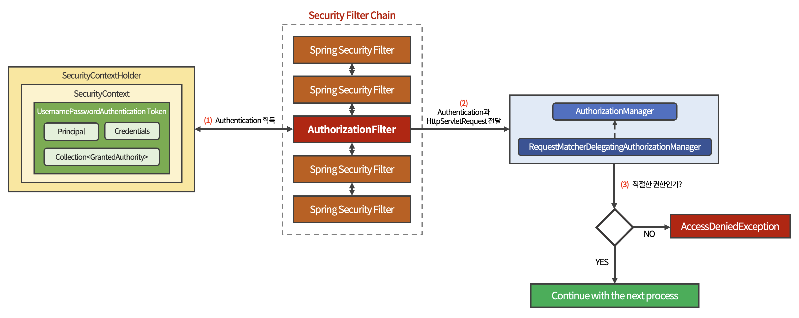

# 권한 부여 (Authorization, 인가)

권한 부여는 인증에 성공한 사용자라 할지라도,

부여된 권한 범위 내에서 어플리케이션의 리소스에 접근할 수 있어야 하는 것을 말한다.

<br>

사용자 인증 요청이 정상적으로 처리되어 인증된 사용자임이 확인된 후,  

Spring Security에서 사용자에게 어플리케이션 리소스에 대한 접근 권한을 부여한다.

<br>

***

<br>

## Spring Security 컴포넌트로 보는 권한 부여 처리 흐름

<br>



<br>

1. ```AuthorizationFilter```가 ```SecurityContextHolder```로부터 Authentication을 획득한다.

<br>

2. Authentication과 HttpServletRequest를 ```AuthorizationManager```에게 전달한다.

   - ```AuthorizationManager```는 권한 부여 처리를 총괄하는 매니저 역할을 하는 인터페이스이다.  

   - ```RequestMatcherDelegatingAuthorizationManager```는 해당 인터페이스의 구현체 중 하나이다.

    > ```RequestMatcherDelegatingAuthorizationManager```가 직접 권한 부여 처리를 하는 것이 아닌  
    >
    > ```RequestMatcher```를 통해 매치되는 ```AuthorizationManager``` 구현 클래스에게 위임한다.

<br>

3. ```RequestMatcherDelegatingAuthorizationManager``` 내부에서 매치되는 ```AuthorizationManager``` 구현 클래스가 있다면, 해당 구현 클래스가 사용자의 권한을 체크한다.

<br>

4. 적절한 권한이라면 다음 프로세스를 계속 이어나간다.

<br>

5. 적절한 권한이 아니라면 ```AccessDeniedException```이 발생된다.  

   - ```ExceptionTranslationFilter```가 해당 에러를 처리한다.

<br>

***

<br>

## Spring Security의 권한 부여 컴포넌트

<br>

### 🔸 AuthorizationFilter

<br>

URL을 통해 사용자의 액세스를 제한하는 **권한 부여 Filter**이다.

<br>

```java
public class AuthorizationFilter extends OncePerRequestFilter {

    private final AuthorizationManager<HttpServletRequest> authManager;

    public AuthorizationFilter(AuthorizationManager<HttpServletRequest> authManager) {
        ...
    }
}
```

```AuthorizationFilter``` 객체가 생성될 때, ```AuthorizationManager```를 DI 받는다.

DI 받은 클래스를 통해 권한 부여 처리를 진행한다.

<br>

```java
public class AuthorizationFilter extends ... {

    @Override
    protected void doFilterInternal(HttpServletRequest request,
                                    HttpServletResponse response,
                                    FilterChain chain)
                                    throws ServletException, IOException {

        AuthorizationDecision desicion = 
                this.authManager.check(this::getAuthentication, request);
        ...
    }
}
```

```AuthorizationManager```의 ```check()``` 메서드를 호출해 적절한 권한 부여 여부를 체크한다.

> **💡 check()**  
> 
> ```check()``` 메서드는 AuthorizationManager 구현 클래스에 따라 권한 체크 로직이 다르다.

<br><br>

### 🔸 AuthorizationManager

권한 부여 처리를 총괄하는 매니저 역할을 하는 인터페이스

<br>

```java
@FunctionalInterface
public interface AuthorizationManager<T> {

    @Nullable
    AuthorizationDecision check(Supplier<Authentication> authentication, T object);
}
```

```check()``` 메서드 하나만 정의되어 있으며, Supplier와 제네릭 타입의 객체를 파라미터로 가진다.

<br><br>

### 🔸 RequestMatcherDelegatingAuthorizationManager

```AuthorizationManager```의 구현 클래스 중 하나이며,  

직접 권한 부여 처리를 수행하지 않고 ```RequestMatcher```를 통해 매치되는 ```AuthorizationManager``` 구현 클래스에게 권한 부여 처리를 위임한다.

<br>

```java
public final class RequestMatcherDelegatingAuthorizationManager implements AuthorizationManager<HttpServletRequest> {

    @Override
    public AuthorizationDecision check(Supplier<Authentication> authentication,
                                       HttpServletRequest request) {
        ...

        for (RequestMatcherEntry<AuthorizationManager<RequestAuthorizationContext>> mapping : this.mappings) {

            RequestMatcher matcher = mapping.getRequestMatcher();
            MatchResult matchResult = matcher.matcher(request);
			if (matchResult.isMatch()) {
                ...
            }    
        }
    }
}
```

```check()``` 메서드의 내부에서 ```for``` 문을 통해 ```RequestMatcherEntry``` 정보를 얻는다.

<br>

```if``` 문에서 ```MatcherResult```의 ```isMatch()```가 true이면,  

```AuthorizationManager``` 객체를 얻은 뒤, 사용자의 권한을 체크한다.

> ```RequestMatcher```는 SecurityConfiguration에서  
> 
> ```.antMatchers("/orders/**").hasRole("ADMIN")```과 같은 메서드 체인 정보를 기반으로 생성된다.

<br><br>

***

_2022.12.05. Update_