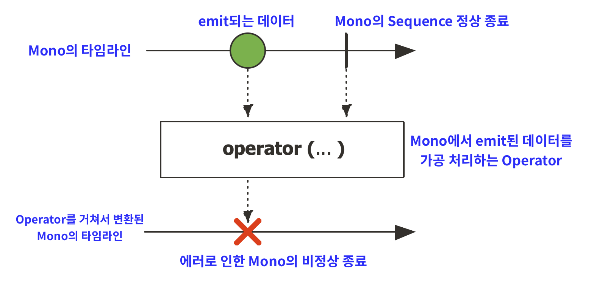
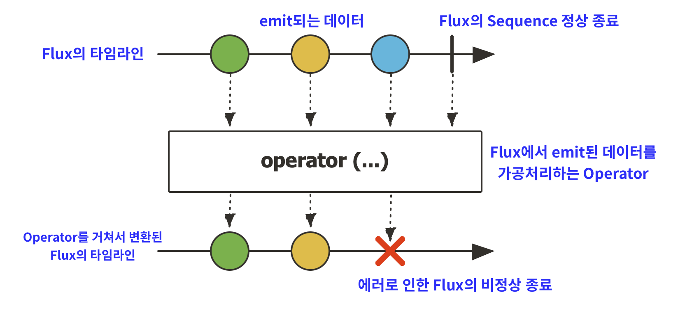
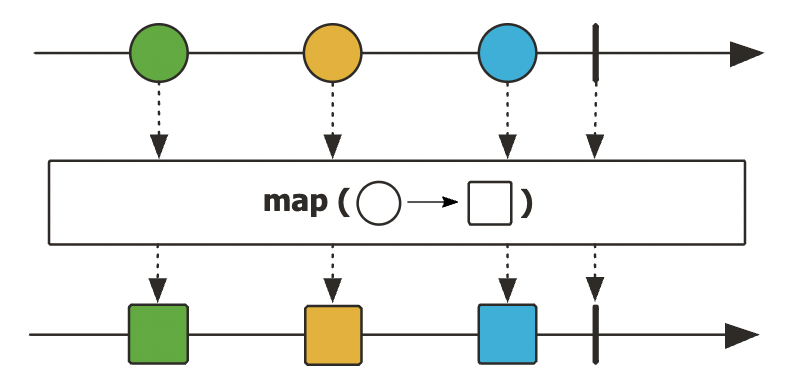

# 프로젝트 리액터 (Reactor)

<br>

## Reactor 개요

Reactor는 Reactive Streams의 구현체 중 하나로  

Reactive 기반 Spring Web Application의 핵심 기술이다.

<br>

### Reactor의 특징

- Non-Blocking 통신을 지원  
  
  서비스들 간의 통신이 잦은 MSA(MicroService Architecture) 기반 어플리케이션은  
  요청 쓰레드가 차단되는 Blocking 통신을 사용하기에는 무리가 있기 때문에, 

<br>

- Publisher 타입으로 ```Mono[0|1]```과 ```Flux[N]``` 2가지 타입을 제공  
  
  [0|1]은 0건 혹은 1건의 데이터를 emit할 수 있음을 의미하며, N은 여러건의 데이터를 emit할 수 있음을 의미한다.

<br>

- Backpressure 전략  
  
  Publisher에서 빠르게 emit하는 반면에 Subscriber의 처리 속도가 느리면 데이터가 지속적으로 쌓이는 오버플로우가 발생한다.

  Backpressure는 이러한 상황에서 데이터를 적절하게 제어하기 위해 반드시 필요한 전략이다.

  - DROP : 버퍼가 가득차면 이 후에 들어오는 데이터는 폐기하는 전략

  - LATEST : 버퍼가 가득차면 가장 최근에 emit된 데이터만 남기고 폐기하는 전략

  - BUFFER DROP LATEST : 버퍼가 가득차면 버퍼 안에 있는 데이터 중 가장 최근에 버퍼 안에 채워진 데이터를 폐기하는 전략
  
  - BUFFER DROP OLDEST : 버퍼가 가득차면 버퍼 안에 있는 데이터 중 가장 오래된 데이터를 폐기하는 전략


<br>

### Reactor 구성 요소

<br>

```java
public class HelloReactorExample {
    public static void main(String[] args) throws InterruptedException {
        Flux
            .just("Hello", "Reactor")
            .map(msg -> msg.toUpperCase())
            .publishOn(Schedulers.parallel())
            .subscribe(System.out::println,
                    error -> System.out.println(error.getMessage()),
                    () -> System.out.println("# onComplete"));

        Thread.sleep(100L);
    }
}
```
▲ _Reactor 기본 구성 요소_

<br>

- ```Flux```  
  Reactor Sequence가 **여러 건의 데이터를 처리함**을 의미한다.

<br>

- ```just()```  
  원본 데이터 소스로부터 데이터를 emit하는 **Publisher**의 역할을 한다.

<br>

- ```map()```  
  Publisher로부터 전달받은 데이터를 가공하는 역할을 한다.

<br>

- ```publishOn()```  
  Reactor Sequence에서 쓰레드 관리자 역할을 하는 **Scheduler**를 지정하는 역할을 한다.  

  Scheduler를 지정하면 publishOn()을 기준으로 Downstream의 쓰레드가 Scheduler에서 지정한 유형의 쓰레드로 변경된다. (parallel : 병렬)

<br>

- ```subscribe()```  
  3개의 파라미터는 각각 아래와 같은 역할을 한다.

  1. Publisher가 emit한 데이터를 전달받아서 처리
  2. Reactor Sequence 상에서 에러가 발생할 경우, 해당 에러를 전달받아서 처리
  3. Reactor Sequence가 종료된 후, 후처리

<br>

- ```Thread.sleep()```  
  Scheduler로 지정한 쓰레드는 데몬 쓰레드이기 때문에 main 쓰레드가 종료되면 동시에 종료된다.
  
  따라서 main 쓰레드의 동작을 잠깐 지연시켜 Scheduler를 통해 Reactor Sequence가 정상 동작을 하도록 한다.

  > **💡 데몬 쓰레드 (Daemon Thread)**
  >
  > 일반 쓰레드의 작업을 돕는 보조적인 역할을 수행하는 쓰레드를 의미한다.
  >
  > 일반 쓰레드가 모두 종료되면 데몬 쓰레드는 강제적으로 자동 종료된다.

<br>

***

<br>

## 마블 다이어그램 (Marble Diagram)

마블(Marble)은 구슬이라는 뜻으로 데이터를 의미하며, 

다이어그램 상에서 시간의 흐름에 따라 변하는 **데이터의 흐름**을 표현한다.

<br>



▲ _Mono의 마블 다이어그램_

<br>

- 마블 다이어그램을 보면 위・아래로 2개의 타임라인이 데이터가 흘러가는 시간의 흐름을 표현하고 있다.

- 구슬 모양 하나가 1건의 데이터를 의미한다.

- 수직 막대 바( **|** )는 Sequence의 정상 종료를 의미한다.

- **X** 표시는 emit된 데이터가 처리되는 과정에 에러가 발생한 것을 의미한다.

<br><br>



▲ _Flux의 마블 다이어그램_

<br>

- Flux의 경우 Mono와 다르게 여러 개의 데이터를 emit하므로 여러 개의 구슬을 가지고 있다.

<br><br>



▲ _map() Operator의 마블 다이어그램_

<br>

- ```map()``` Operator는 입력으로 들어온 데이터를 변환해서 Downstream으로 전달하는 역할을 한다.

- 색깔을 가진 동그라미 데이터를 동일한 색의 네모로 변환해서 Downstream으로 전달하고 있다.

<br>

### 📋 [***Marble Diagram***](https://projectreactor.io/docs/core/release/api/)

- 공식 문서 또는 인텔리제이의 메서드 설명에서 마블 다이어그램을 확인할 수 있다.

<br>

***

<br>

## 스케쥴러 (Scheduler)

스케쥴러는 Reactor Sequence 상에서 처리되는 동작들을   

하나 이상의 쓰레드에서 동작하도록 별도의 쓰레드를 제공해주는 쓰레드 관리자 역할을 한다.

즉, **복잡한 멀티쓰레딩 프로세스를 단순하게 해준다.**

<br>

### Scheduler 전용 Operator

<br>

- ```subscribeOn()```

  구독 시점 직후 실행되는 Operator 체인의 실행 쓰레드를 Scheduler로 지정한 쓰레드로 변경된다.

  주로 ```Scheduler.boundedElatic()```을 파라미터로 사용한다.

```java
@Slf4j
public class SchedulersExample {
    public static void main(String[] args) throws InterruptedException {
        Flux
            .range(1, 10)
            .subscribeOn(Schedulers.boundedElastic())
            .doOnSubscribe(subscription -> log.info("# doOnSubscribe"))
            .filter(n -> n % 2 == 0)
            .map(n -> n * 2)
            .subscribe(data -> log.info("# onNext: {}", data));

        Thread.sleep(100L);
    }
}

// 실행 결과
[main] - # doOnSubscribe
[boundedElastic-1] - # onNext: 4
[boundedElastic-1] - # onNext: 8
[boundedElastic-1] - # onNext: 12
[boundedElastic-1] - # onNext: 16
[boundedElastic-1] - # onNext: 20
```

위의 코드에서는 ```range()```처럼 **원본 데이터를 생성하고, 생성한 데이터를 emit하는 작업**이 구독 직후에 실행된다.

**즉, 주로 데이터 소스에서 데이터를 emit하는 원본 Publisher의 실행 쓰레드를 지정하는 역할을 한다.**

> 단, subscribeOn()의 경우 여러 번 추가해도 1개의 쓰레드만 추가로 생성된다.

<br>

- ```publishOn()```

  해당 Operator를 기준으로 Downstream 쪽 쓰레드가 Scheduler로 지정한 쓰레드로 변경된다.

  주로 ```Scheduler.parallel()```을 파라미터로 사용한다.

```java
@Slf4j
public class SchedulersExample03 {
    public static void main(String[] args) throws InterruptedException {
        Flux
            .range(1, 10)
            .subscribeOn(Schedulers.boundedElastic())
            .doOnSubscribe(subscription -> log.info("# doOnSubscribe"))

            .publishOn(Schedulers.parallel())
            .filter(n -> n % 2 == 0)
            .doOnNext(data -> log.info("# filter doOnNext"))

            .publishOn(Schedulers.parallel())
            .map(n -> n * 2)
            .doOnNext(data -> log.info("# map doOnNext"))
            .subscribe(data -> log.info("# onNext: {}", data));

        Thread.sleep(100L);
    }
}

// 실행 결과
[main] - # doOnSubscribe
[parallel-2] - # filter doOnNext
[parallel-2] - # filter doOnNext
[parallel-2] - # filter doOnNext
[parallel-2] - # filter doOnNext
[parallel-2] - # filter doOnNext
[parallel-1] - # map doOnNext
[parallel-1] - # onNext: 4
[parallel-1] - # map doOnNext
[parallel-1] - # onNext: 8
[parallel-1] - # map doOnNext
[parallel-1] - # onNext: 12
[parallel-1] - # map doOnNext
[parallel-1] - # onNext: 16
[parallel-1] - # map doOnNext
[parallel-1] - # onNext: 20
```

pulishOn()의 Downstream에 따라 실행 쓰레드가 바뀌는 것을 볼 수 있다.

**즉, 전달받은 데이터를 가공처리하는 Operator 앞에 추가해서 별도의 실행 쓰레드를 추가하는 역할을 한다.**

<br>

***

<br>

## Operators

Reactor 공식 사이트에서는 적절한 상황에 맞게 Operator를 사용할 수 있도록

상황별 Operator가 분류되어 있다.

<br>

### 🔸 새로운 Sequence를 생성(Creating)하고자 할 경우

- just()

- #### **fromStream() ⭐**

  입력으로 Stream을 전달받아 데이터를 차례대로 emit 한다.


<br>
<details>
<summary> &ensp; 📌 &nbsp; 예제 코드 </summary>
<div markdown="1">
<br>

```java
public class FromStreamExample {
    public static void main(String[] args) {
        Flux
            .fromStream(Stream.of(200, 300, 400, 500, 600))
            .reduce((a, b) -> a + b)
            .subscribe(System.out::println);
    }
}
```

- ```reduce()```  
  emit된 2개의 데이터를 순차적으로 누적 처리할 수 있는 Operator

<br>

***

</div>
</details>
<br>

- #### **fromIterable() ⭐**

  입력으로 Iterable을 전달받아 데이터를 차례대로 emit 한다.  

  List, Set, Mpa 등의 컬렉션을 fromIterable의 파라미터로 전달할 수 있다.


<br>
<details>
<summary> &ensp; 📌 &nbsp; 예제 코드 </summary>
<div markdown="1">
<br>

```java
@Slf4j
public class FromIterableExample {
    public static void main(String[] args) {
        Flux
            .fromIterable(SampleData.coffeeList)
            .subscribe(coffee -> log.info("{} : {}", coffee.getKorName(), coffee.getPrice()));
    }
}
```

<br>

***

</div>
</details>
<br>

- fromArray()

- range()

- interval()

- empty()

- never()

- defer()

- using()

- generate()

- #### **create() ⭐**  
  
  프로그래밍 방식으로 Signal 이벤트를 발생시키는 Operator  
  한 번에 여러 건의 데이터를 비동기적으로 emit 할 수 있다.
 


<br>
<details>
<summary> &ensp; 📌 &nbsp; 예제 코드 </summary>
<div markdown="1">
<br>

```java
@Slf4j
public class CreateExample {
    private static List<Integer> source = 
                Arrays.asList(1, 3, 5, 7, 9, 11, 13, 15, 17, 19);

    public static void main(String[] args) {
        Flux.create((FluxSink<Integer> sink) -> {
            sink.onRequest(n -> {
                for (int i = 0; i < source.size(); i++) {
                    sink.next(source.get(i));
                }
                sink.complete();
            });
            sink.onDispose(() -> log.info("# clean up"));
        }).subscribe(data -> log.info("# onNext: {}", data));
    }
}
```

- ```FluxSink```   
  Flux나 Mono에서 just(), fromIterable()과 같은 데이터 생성 Operator에 데이터 소스를 전달하면  
  내부에서 알아서 데이터를 emit하는 등의 Sequence를 진행하는 것이 아니라,

  프로그래밍 방식으로 직접 Signal 이벤트를 발생시켜서 Sequence를 진행하도록 해주는 기능을 한다.

- ```onRequest()```  
  Subscriber에서 데이터를 요청하면 해당 메서드의 람다 표현식이 실행된다.

- ```next()```  
  파라미터로 받은 데이터를 emit한다.

- ```complete()```  
  Sequence를 종료한다.

- ```onDispose()```  
  Sequence가 완전히 종료되기 전에 호출되며, 종료 직전 후처리 작업을 할 수 있다.

<br>

***

</div>
</details>
<br><br>

### 🔸 기존 Sequence에서 변환 작업(Transforming)이 필요한 경우

- #### **map() ⭐**

- #### **flatMap() ⭐**

  flatMap 내부로 데이터가 들어올 때마다 새로운 하나의 Sequence를 생성한다.  
  flatMap 내부에서 정의하는 Sequence를 **Inner Sequence**라고 한다.

  > ex) Upstream에서 2개의 데이터를 emit하고,  
  > flatMap 내부에서 3개의 데이터를 emit하면
  >     
  > Downstream으로 6개의 데이터를 emit한다.

<br>


<br>
<details>
<summary> &ensp; 📌 &nbsp; 예제 코드 </summary>
<div markdown="1">
<br>

```java
@Slf4j
public class FlatMapExample {
    public static void main(String[] args) throws InterruptedException {
        Flux
            .range(2, 8)
            .flatMap(dan -> Flux
                    .range(1, 9)
                    .publishOn(Schedulers.parallel())
                    .map(num -> dan + " x " + num + " = " + dan * num))
            .subscribe(log::info);

        Thread.sleep(100L);
    }
}
```

▲ _flatMap을 사용해서 2단부터 9단까지의 구구단을 출력하는 예제 (단, 작업의 처리 순서 보장 X)_

<br>

***

</div>
</details>
<br>

- #### **concat() ⭐**

  입력으로 전달하는 Publisher의 Sequence를 연결해서 차례대로 데이터를 emit한다.


<br>
<details>
<summary> &ensp; 📌 &nbsp; 예제 코드 </summary>
<div markdown="1">
<br>

```java
public class ConcatExample {
    public static void main(String[] args) {
        Flux
            .concat(Flux.just("Monday", "Tuesday", "Wednesday", "Thursday", "Friday"),
                    Flux.just("Saturday", "Sunday"))
            .subscribe(System.out::println);
    }
}
```

</div>
</details>
<br>

- collectList()

- collectMap()

- merge()

- #### **zip() ⭐**

  입력으로 전달되는 여러 개의 Publisher Sequence에서 emit된 데이터를 결합하는 역할을 한다.  

  같은 index의 데이터가 결합되므로, 먼저 emit된 데이터는 결합되어야 하는 데이터가 emit 될 때까지 기다린다.


<br>
<details>
<summary> &ensp; 📌 &nbsp; 예제 코드 </summary>
<div markdown="1">
<br>

```java
@Slf4j
public class ZipExample {
    public static void main(String[] args) throws InterruptedException {

        Flux<Long> source1 = Flux.interval(Duration.ofMillis(200L)).take(4);

        Flux<Long> source2 = Flux.interval(Duration.ofMillis(400L)).take(6);

        Flux
            .zip(source1, source2, (data1, data2) -> data1 + data2)
            .subscribe(data -> log.info("# onNext: {}", data));

        Thread.sleep(3000L);
    }
}
```

- ```interval()```  
  파라미터로 전달한 시간을 주기로 해서 0부터 1씩 증가한 숫자를 emit하는 Operator

  - ```take()``` : 지정한 숫자만큼의 데이터만 emit하고 종료하도록 할 수 있다.

<br>

***

</div>
</details>
<br>

- then()

- switchIfEmpty()

- and()

- when()

<br>

### 🔸 Sequence 내부의 동작을 확인(Peeking)하고자 할 경우

- doOnSubscribe

- #### **doOnNext() ⭐**

  데이터 emit 시에 트리거 되어 부수적인 효과를 추가할 수 있다.

  > 부수 효과는 어떠한 동작을 실행하되 리턴값이 없는 것을 의미하며,  
  >
  > ```doOnNext()```는 주로 로깅에 사용되지만, emit 시에 필요한 추가 작업이 있을 시에도 사용할 수 있다.

<br>


<br>
<details>
<summary> &ensp; 📌 &nbsp; 예제 코드 </summary>
<div markdown="1">
<br>

```java
@Slf4j
public class DoOnNextExample {
    public static void main(String[] args) {
        Flux
                .fromIterable(SampleData.coffeeList)
                .doOnNext(coffee -> validateCoffee(coffee))
                .subscribe(data -> log.info("{} : {}", data.getKorName(), data.getPrice()));
    }

    private static void validateCoffee(Coffee coffee) {
        if (coffee == null) {
            throw new RuntimeException("Not found coffee");
        }
    }
}
```

- 위와 같이 emit된 데이터의 유효성 검증을 진행할 수 있다.

<br>

***

</div>
</details>
<br>

- doOnError()

- doOnCancel()

- doFirst()

- doOnRequest()

- doOnTerminate()

- doAfterTerminate()

- doOnEach()

- doFinally()

- #### **log() ⭐**
  
  Publisher에서 발생하는 Signal 이벤트를 로그로 출력해주는 역할을 한다.


▲ _네모 모양(Logger)에 Signal 이벤트가 발생할 때마다 로그가 기록되는 것을 확인할 수 있다._

<br>
<details>
<summary> &ensp; 📌 &nbsp; 예제 코드 </summary>
<div markdown="1">
<br>

```java
public class LogExample {
    public static void main(String[] args) {
        Flux
            .fromStream(Stream.of(200, 300, 400, 500, 600))
            .log()
            .reduce((a, b) -> a + b)
            .log()
            .subscribe(System.out::println);
    }
}

// 실행 결과
[main] INFO reactor.Flux.Stream.1 - | onSubscribe([Synchronous Fuseable] FluxIterable.IterableSubscription)
[main] INFO reactor.Mono.Reduce.2 - | onSubscribe([Fuseable] MonoReduce.ReduceSubscriber)
[main] INFO reactor.Mono.Reduce.2 - | request(unbounded)
[main] INFO reactor.Flux.Stream.1 - | request(unbounded)
[main] INFO reactor.Flux.Stream.1 - | onNext(200)
[main] INFO reactor.Flux.Stream.1 - | onNext(300)
[main] INFO reactor.Flux.Stream.1 - | onNext(400)
[main] INFO reactor.Flux.Stream.1 - | onNext(500)
[main] INFO reactor.Flux.Stream.1 - | onNext(600)
[main] INFO reactor.Flux.Stream.1 - | onComplete()
[main] INFO reactor.Mono.Reduce.2 - | onNext(2000)
2000
[main] INFO reactor.Mono.Reduce.2 - | onComplete()
```

> 구독 시점에 **onSubscribe Signal 이벤트 발생**
> 
> 데이터 요청 시, **request Signal 이벤트 발생**
> 
> Publisher가 데이터를 emit할 때 **onNext Signal 이벤트 발생**
> 
> Publisher의 데이터 emit이 정상 종료되면 **onComplete Signal 이벤트 발생**

<br>

***

</div>
</details>
<br><br>

### 🔸 Sequence에서 데이터 필터링(Filtering)이 필요한 경우

- #### **filter() ⭐**

- ignoreElements()

- distinct()

- #### **take() ⭐**

- next()

- skip()

- sample()

- single()

<br>

### 🔸 에러를 처리(Handling errors)하고자 할 경우
  
- #### **error() ⭐**

  의도적으로 onError Signal 이벤트를 발생시킬 때 사용한다.


<br>
<details>
<summary> &ensp; 📌 &nbsp; 예제 코드 </summary>
<div markdown="1">
<br>

```java
@Slf4j
public class ErrorExample {
    public static void main(String[] args) {
        Mono.justOrEmpty(findVerifiedCoffee())
                .switchIfEmpty(Mono.error(new RuntimeException("Not found coffee")))
                .subscribe(
                        data -> log.info("{} : {}", data.getKorName(), data.getPrice()),
                        error -> log.error("# onError: {}", error.getMessage()));
    }

    private static Coffee findVerifiedCoffee() {
        return null;
    }
}
```

- ```justOrEmpty()```  

  파라미터로 전달되는 데이터가 null 값이어도 에러가 발생하지 않는다.  

  > ```just()```는 null 데이터를 emit하면 에러가 발생한다.

<br>

- ```switchIfEmpty()```  

  Upstream에서 전달되는 데이터가 null이면 대체 동작을 수행할 수 있다.

<br>

***

</div>
</details>
<br>

- #### **timeout() ⭐**

  입력으로 주어진 시간동안 emit되는 데이터가 없으면 onError Signal 이벤트를 발생시킨다.

  retry()와 함께 사용되는 경우가 많다.


<br>

- onErrorReturn()

- onErrorResume()

- onErrorMap()

- doFinally()

- #### **retry() ⭐**
  
  Sequence 상에서 에러가 발생할 경우, 입력으로 주어진 숫자만큼 재구독해서 Sequence를 다시 시작한다.


<br>
<details>
<summary> &ensp; 📌 &nbsp; 예제 코드 </summary>
<div markdown="1">
<br>

```java
@Slf4j
public class TimeoutRetryExample {
    public static void main(String[] args) throws InterruptedException {
        getCoffees()
                .collect(Collectors.toSet())
                .subscribe(bookSet -> bookSet
                                        .stream()
                                        .forEach(data ->
                                                log.info("{} : {}", data.getKorName(), data.getPrice())));

        Thread.sleep(12000);
    }

    private static Flux<Coffee> getCoffees() {
        final int[] count = {0};
        return Flux
                .fromIterable(SampleData.coffeeList)
                .delayElements(Duration.ofMillis(500))  // 0.5초 지연
                .map(coffee -> {
                    try {
                        count[0]++;
                        if (count[0] == 3) {
                            Thread.sleep(2000); // 2초 지연
                        }
                    } catch (InterruptedException e) {
                    }

                    return coffee;
                })
                .timeout(Duration.ofSeconds(2)) // 2초 지연되면 onError
                .retry(1) // 1회 재구독
                .doOnNext(coffee -> log.info("# getCoffees > doOnNext: {}, {}",
                        coffee.getKorName(), coffee.getPrice()));
    }
}
```

- ```delayElements()```  
  입력으로 주어진 시간만큼 각각의 데이터 emit을 지연시킨다.

> getCoffees()를 ```Set<Coffee>```로 변경하는 이유는  
> 
> timeout이 되기 전에 이미 emit된 데이터가 있으므로  
>
> 재구독 후 다시 emit된 데이터에 동일한 데이터가 있어 중복을 제거하기 위함이다.

<br>

***

</div>
</details>

<br><br>

***

_2022.12.01. Update_