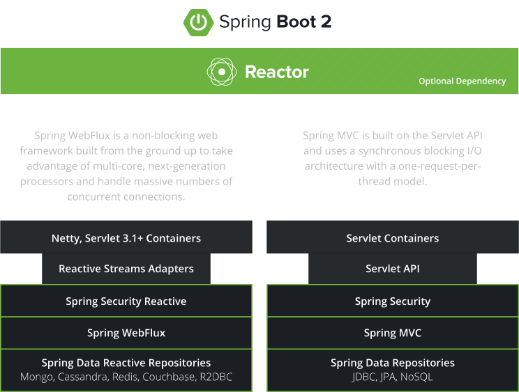

# Spring Webflux

Spring 5부터 지원하는 Reactive 웹 어플리케이션을 구현하기 위한 기술을 말한다.

<br>

## Spring Webflux vs Spring MVC



▲ _Spring Webflux와 Spring MVC의 기술 스택 비교_

<br>

### 1. Non-Blocking 통신

Spring Webflux는 **Non-Blocking 통신**을 지원한다.  

Spring MVC의 경우에는 Blocking 통신 방식을 사용한다.

<br>

### 2. Reactive Adapter

Spring Webflux는 Reactive Adapter를 사용해서 Reactor 뿐만 아니라 **RxJava 등의 다른 리액티브 라이브러리**를 사용할 수 있는 유연성을 가지고 있다.  

반면 Spring MVC는 Servlet API의 스펙에 의존적이다.

<br>

### 3. Security

Spring Webflux, Spring MVC 둘 다 보안을 적용하기 위해 Spring Security를 사용한다.

다만, Spring Webflux의 경우 Servlet Filter 방식이 아닌 WebFilter를 사용해 리액티브 특성에 맞게 인증과 권한 등의 보안을 적용한다.

<br>

### 4. Presentation Layer

Reactive Stack는 프레젠테이션 계층에서 Spring Webflux를 사용한다.

Servlet Stack은 프레젠테이션 계층에서 Spring MVC를 사용한다.

<br>

### 5. Data Access Layer

Spring Webflux는 완전한 Non-Blocking 통신을 위해 **R2DBC**를 사용한다.

JDBC API의 경우 Non-Blocking 통신을 지원하지 않는다.

<br>

> **💡 R2DBC(Reactive Relation Database Connectivity)**
>
> 관계형 데이터베이스에 Non-Blocking 통신을 적용하기 위한 표준 사양이다.
>
> MySQL, Oracle 등 데이터베이스 벤더에서는 R2DBC 사양에 맞는 드라이버를 구현해서 공급한다.

<br>

### 기타 기술 스택 비교


<br>

***

<br>

## 외부 어플리케이션 호출을 통한 Spring MVC, Spring Webflux 비교

<br>

### Spring MVC 기반 외부 어플리케이션 코드

```java
@RestController
@RequestMapping("/v11/coffees")
public class SpringMvcOutboundCoffeeController {
    @GetMapping("/{coffee-id}")
    public ResponseEntity getCoffee(@PathVariable("coffee-id") long coffeeId) throws InterruptedException {
        // Stub Data
        CoffeeResponseDto responseDto = new CoffeeResponseDto(coffeeId, "카페라떼", "CafeLattee", 4000);

        Thread.sleep(5000);
        return ResponseEntity.ok(responseDto);
    }
}
```

어플리케이션 요청 시간이 걸리는 것을 감안해서 5초간 쓰레드 동작을 멈춘다.

<br>

### Spring MVC 기반 Controller

```java
@Slf4j
@RestController
@RequestMapping("/v11/coffees")
public class SpringMvcMainCoffeeController {
    private final RestTemplate restTemplate;
    private final String uri = "http://localhost:7070/v11/coffees/1";

    public SpringMvcMainCoffeeController(RestTemplateBuilder restTemplateBuilder) {
        this.restTemplate = restTemplateBuilder.build();
    }

    @GetMapping("/{coffee-id}")
    public ResponseEntity getCoffee(@PathVariable("coffee-id") long coffeeId) {
        log.info("# call Spring MVC Main Controller: {}", LocalDateTime.now());
        
        ResponseEntity<CoffeeResponseDto> response = restTemplate.getForEntity(uri, CoffeeResponseDto.class);
        return ResponseEntity.ok(response.getBody());
    }
}
```

클라이언트 요청을 직접 처리하는 것이 아닌 ```RestTemplate```을 이용하여 외부 어플리케이션에게 요청을 전송한다.

<br>

### Spring MVC 기반 Main Application

```java
@Slf4j
@SpringBootApplication
public class SpringMvcMainSampleApplication {
    private final RestTemplate restTemplate;

	public SpringMvcMainSampleApplication(RestTemplateBuilder restTemplateBuilder) {
		this.restTemplate = restTemplateBuilder.build();
	}
	public static void main(String[] args) {
		SpringApplication.run(SpringMvcMainSampleApplication.class, args);
	}

	@Bean
	public CommandLineRunner run() {
		return (String... args) -> {
			log.info("# 요청 시작 시간: {}", LocalTime.now());

                        // (1)
			for (int i = 1; i <= 5; i++) {
				CoffeeResponseDto response = this.getCoffee();
				log.info("{}: coffee name: {}", LocalTime.now(), response.getKorName());
			}
		};
	}

	private CoffeeResponseDto getCoffee() {
		String uri = "http://localhost:8080/v11/coffees/1";
		ResponseEntity<CoffeeResponseDto> response = restTemplate.getForEntity(uri, CoffeeResponseDto.class);

		return response.getBody();
	}
}
```

```CommandLineRunner``` 또는 ```ApplicationRunner```를 이용해 외부 어플리케이션을 먼저 실행시킨 후에 메인 어플리케이션을 실행해야한다.

<br>

위 코드를 실행시키면 Blocking 방식으로 작동하는 Spring MVC의 경우 **총 25초**의 요청 시간이 소요된다.

<br><br>

### Spring Webflux 기반 외부 어플리케이션 코드

```java
@RestController
@RequestMapping("/v11/coffees")
public class SpringWebFluxOutboundCoffeeController {
    @ResponseStatus(HttpStatus.OK)
    @GetMapping("/{coffee-id}")
    public Mono<CoffeeResponseDto> getCoffee(@PathVariable("coffee-id") long coffeeId) throws InterruptedException {
        CoffeeResponseDto responseDto = new CoffeeResponseDto(coffeeId, "카페라떼", "CafeLattee", 4000);

        Thread.sleep(5000);
        return Mono.just(responseDto);
    }
}
```

위와 같이 어플리케이션 요청 시간을 감안해서 쓰레드에 5초의 지연 시간을 준다.

<br>

### Spring Webflux 기반 Controller

```java
@Slf4j
@RestController
@RequestMapping("/v11/coffees")
public class SpringWebFluxMainCoffeeController {
    private final String uri = "http://localhost:5050/v11/coffees/1";

    @ResponseStatus(HttpStatus.OK)
    @GetMapping("/{coffee-id}")
    public Mono<CoffeeResponseDto> getCoffee(@PathVariable("coffee-id") long coffeeId) throws InterruptedException {
        log.info("# call Spring WebFlux Main Controller: {}", LocalDateTime.now());

        return WebClient.create()
                .get()
                .uri(uri)
                .retrieve()
                .bodyToMono(CoffeeResponseDto.class);
    }
}
```

Webflux는 외부 어플리케이션과의 통신을 위해 ```RestTemplate```가 아닌 ```WebClient```라는 Rest Client를 사용한다.

<br>

### Spring Webflux 기반 Main Application

```java
@Slf4j
@SpringBootApplication
public class SpringWebFluxMainSampleApplication {

	public static void main(String[] args) {
		System.setProperty("reactor.netty.ioWorkerCount", "1");
		SpringApplication.run(SpringWebFluxMainSampleApplication.class, args);
	}

	@Bean
	public CommandLineRunner run() {
		return (String... args) -> {
			log.info("# 요청 시작 시간: {}", LocalTime.now());

			for (int i = 1; i <= 5; i++) {
				this.getCoffee()
						.subscribe(
								response -> {
									log.info("{}: coffee name: {}", LocalTime.now(), response.getKorName());
								}
						);
			}
		};
	}

	private Mono<CoffeeResponseDto> getCoffee() {
		String uri = "http://localhost:6060/v11/coffees/1";

		return WebClient.create()
				.get()
				.uri(uri)
				.retrieve()
				.bodyToMono(CoffeeResponseDto.class);
	}
}
```

위 코드를 실행시키면 Non-Blocking 방식으로 작동하는 Spring Webflux의 경우 **약 6초**의 요청 시간이 소요된다.

<br><br>

***

_2023.07.09. Update_

_2023.07.07. Update_