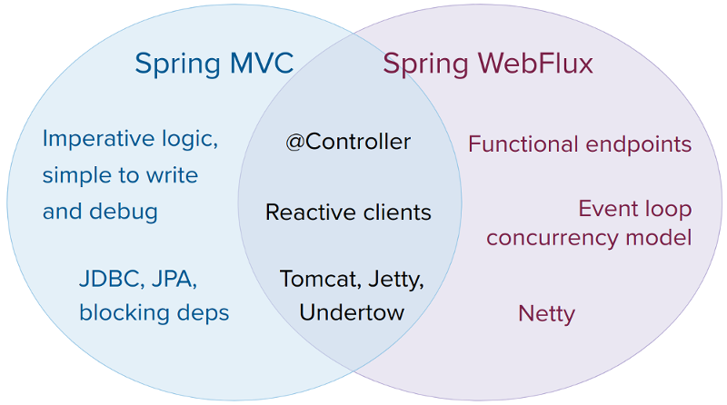

# Spring Webflux

Spring 5부터 지원하는 Reactive 웹 어플리케이션을 구현하기 위한 기술을 말한다.

 

## Spring Webflux vs Spring MVC

▲ _Spring Webflux와 Spring MVC의 기술 스택 비교_

 

### 1. Non-Blocking 통신

Spring Webflux는 **Non-Blocking 통신**을 지원한다.  

Spring MVC의 경우에는 Blocking 통신 방식을 사용한다.

 

### 2. Reactive Adapter

Spring Webflux는 Reactive Adapter를 사용해서 Reactor 뿐만 아니라 **RxJava 등의 다른 리액티브 라이브러리**를 사용할 수 있는 유연성을 가지고 있다.  

반면 Spring MVC는 Servlet API의 스펙에 의존적이다.

 

### 3. Security

Spring Webflux, Spring MVC 둘 다 보안을 적용하기 위해 Spring Security를 사용한다.

다만, Spring Webflux의 경우 Servlet Filter 방식이 아닌 WebFilter를 사용해 리액티브 특성에 맞게 인증과 권한 등의 보안을 적용한다.

 

### 4. Presentation Layer

Reactive Stack는 프레젠테이션 계층에서 Spring Webflux를 사용한다.

Servlet Stack은 프레젠테이션 계층에서 Spring MVC를 사용한다.

 

### 5. Data Access Layer

Spring Webflux는 완전한 Non-Blocking 통신을 위해 **R2DBC**를 사용한다.

JDBC API의 경우 Non-Blocking 통신을 지원하지 않는다.

 

> **💡 R2DBC(Reactive Relation Database Connectivity)**
>
> 관계형 데이터베이스에 Non-Blocking 통신을 적용하기 위한 표준 사양이다.
>
> MySQL, Oracle 등 데이터베이스 벤더에서는 R2DBC 사양에 맞는 드라이버를 구현해서 공급한다.

 

### 기타 기술 스택 비교

  

***

_2023.07.07. Update_