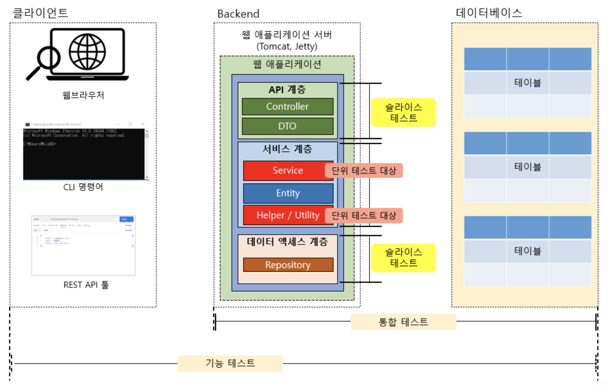

# 테스팅

어플리케이션에 대한 테스팅을 통해, 제 3자가 에러(버그)를 발견하는 것을 최소화 할 수 있다.

테스트는 대상이 검증 과정에 잘 통과하게 만들어 **최대한 더 나은 결과**를 얻기 위한 과정이다.

<br>



▲ _어플리케이션의 일반적인 테스트 분류_

<br>

- 기능 테스트 : 어플리케이션의 사용자 입장에서 어플리케이션이 제공하는 기능이 올바르게 동작하는지 테스트 (주로 QA에서 함)

- 통합 테스트 : 클라이언트 측 툴 없이 개발자가 짠 테스트 코드를 통해 테스트

- 슬라이스 테스트 (부분 통합 테스트) : 어플리케이션을 특정 계층으로 나누어 테스트

- 단위 테스트 : 비즈니스 로직의 메서드 단위로 나누어 테스트

<br><br>

## 단위 테스트 (Unit Test)

작은 단위일 수록 연관된 기능을 생각할 필요 없이, 단순하고 빠르게 테스트를 수행할 수 있으므로

일반적으로 단위 테스트는 **최대한 독립적인 것**이 좋고, **최대한 작은 단위**로 쪼개어 테스트하는 것이 좋다.

<br>

**💡 단위 테스트를 하는 이유**

- 구현한 코드가 의도한 대로 동작하는지에 대한 결과를 빠르게 확인할 수 있다.

- 작은 단위의 테스트로 버그를 미리 찾아낼 수 있어서 상대적으로 더 적은 시간 안에 문제를 찾아낼 가능성이 높다.

<br>

### 단위 테스트를 위한 FIRST 원칙

**🔸 Fast (빠르게)**

- 일반적으로 작성한 테스트 케이스를 빠르게 동작해야한다.

<br>

**🔸 Independent (독립적으로)**

- 각각의 테스트 케이스는 독립적이여야 한다.

<br>

**🔸 Repeatable (반복 가능하도록)**

- 테스트 케이스는 어떠한 환경에서도 반복 실행이 가능해야한다.

- 외부 서비스나 리소스가 연동되는 경우 동일한 테스트 결과를 보장하지 못할 수 있기 때문에,  
  단위 테스트 시에는 외부 서비스나 리소스의 연동을 끊어주는 것이 좋다.

<br>

**🔸 Self-Validating (자가 검증이 되도록)**

- 단위 테스트는 테스트 케이스 스스로 성공 또는 실패라는 자체 검증 결과를 보여주어야 한다.

<br>

**🔸 Timely (시기 적절하게)**

- 단위 테스트는 테스트하려는 기능 구현을 하기 직전에 작성해야한다.  
- 정확히는 구현하고자 하는 기능을 단계적으로 업그레이드하면서, 그때 테스트 케이스도 단계적으로 업그레이드하는 것이 좋다.

<br><br>

### Junit을 활용한 단위 테스트

Junit은 Java 언어로 만들어진 어플리케이션용 오픈 소스 테스트 프레임워크이며, Spring Boot의 기본 테스트 프레임워크이다.

Junit은 2022년 현재 Junit 5까지 릴리즈 되었으며, 이외에도 TestNG와 같은 테스트를 위한 프레임워크가 존재한다.

<br>

```java
dependencies {
  testImplementation 'org.springframework.boot:spring-boot-starter-test'
}
```

위와 같이 설정하여 Junit을 사용할 수 있으며, Spring Boot Initializer를 이용하면 기본적으로 포함된다.

<br>

**🔸 Junit 테스트 케이스의 기본 구조**

```java
public class JunitDefaultStructure {
  @Test
  public void test1() { ... }

  @Test
  public void test2() { ... }
}
```

테스트하고자 하는 대상에 대해 ```void``` 타입의 메서드를 만들고, ```@Test``` 어노테이션을 입력하면 된다.

<br>

- ```@DisplayName("~")``` : 테스트 결과에 나타낼 이름을 설정한다.

- ```@BeforeEach``` : 각 테스트 케이스 실행 전에 해당 메서드를 실행한다. 주로 초기화 작업에 사용

- ```@BeforeAll``` : 모든 테스트 케이스 실행 전에 해당 메서드를 1번만 실행한다. **static 메서드에만 사용 가능**

- ```@AfterEach``` : 각 테스트 케이스 실행 후에 해당 메서드를 실행한다. 주로 후처리 작업에 사용

- ```@AfterAll``` : 모든 테스트 케이스 실행 후에 해당 메서드를 1번만 실행한다.

<br><br>

### Assertion

Assertion은 **예상하는 결과가 참(true)이길 바라는 논리적인 표현**이며, **검증**이라고 할 수 있다.

Junit에서는 Assertion의 다양한 메서드를 사용해 테스트 대상에 대한 검증을 진행할 수 있다.

<br>

**🔸 assertEquals(), assertNotEquals()**

기대 값과 실제 값이 같은지, 같지 않은지 검증한다.

```java
@Test
public void testExample() {
  String expected = "Hello, Junit";
  String actual = "Hello, Junit";

  assertEquals(expected, actual);
}
```

<br>

**🔸 assertNull(), assertionNotNull()**

대상 객체가 null인지, null이 아닌지 검증한다.  
1번째 파라미터는 테스트 대상 객체이며, 2번째 파라미터는 테스트 실패 시 표시할 메시지이다.

```java
@Test
public void testExample() {
  String obj = null;
  String notNullObj = "hi";

  assertNull(obj, "have to be null");
  // 또는
  assertNotNull(notNullObj, "should be not null");
}
```

<br>

**🔸 assertThrows(), assertDoesNotThrows()**

대상 예외를 발생시키는지, 발생시키지 않는지 검증한다.  
1번째 파라미터는 발생이 기대되는 예외 클래스, 2번째 파라미터에는 람다 표현식을 통해 메서드를 호출한다.

```java
@Test
public void testExample() {
  String obj = null;

  assertThrows(NullPointerException.class, () -> obj.toUpperCase());
}
```

발생이 기대되는 예외가 아닌 다른 예외가 발생했다면 검증에 실패한다.  

하지만 ```NullPointerException```의 상위 클래스인 ```RuntimeException```을 기대값으로 설정하면 검증에 성공한다.

이처럼 발생이 기대되는 예외의 상위 클래스를 인자로 전달한 경우에는 검증에 성공한다.

<br>

> **💡 Executable 함수형 인터페이스**
>
> 2번째 파라미터인 람다 표현식은 Executable 함수형 인터페이스이다.
>
> Consumer 인터페이스라고 불리는 매개변수는 존재하지만 반환값은 없는 인터페이스이며,  
> ```void execute() throws Throwable;``` 메서드 하나만 정의되어 있다.

<br>

### 📋 [***Assertion에 대한 더 많은 정보***](https://junit.org/junit5/docs/current/user-guide/#writing-tests-assertions)

<br><br>

### Assumption

Assumption은 '~라고 가정하고'라는 뜻이며,  특정 환경에만 테스트 케이스를 실행하도록 할 때 사용한다.

<br>

**🔸 assumeTrue()**

파라미터로 입력된 값이 true이면 아래에 있는 나머지 로직을 실행

```java
@Test
public void testExample() {
  assumeTrue(System.getProperty("os.name").startWith("Mac OS X"));

  System.out.println("success");
  assertTrue(true);
}
```

<br>

### 📋 [***Assumption에 대한 더 많은 정보***](https://junit.org/junit5/docs/current/user-guide/#writing-tests-assumptions)

<br><br>

***

_2022.11.09. Update_