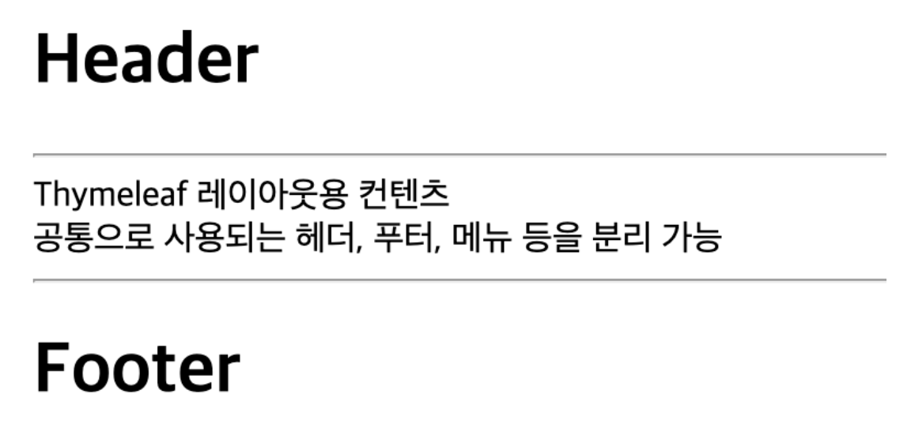

# Thymeleaf (타임리프)

Thymeleaf는 **View Template Engine**으로 JSP와 같이 서버에서 클라이언트에게 응답할 브라우저 화면을 만들어주는 역할을 한다.

### 특징

**🔸 서버 사이드 렌더링 (SSR)**

- 타임리프는 백엔드 서버에서 HTML을 동적으로 렌더링하는 용도로 사용된다.

**🔸 Natural Template**

- 타임리프는 순수한 HTML을 최대한 유지하려는 특징이 있다.  
  이는 JSP와의 가장 큰 차이점이며, 타임리프로 작성한 파일은 HTML 확장자를 가져 웹 브라우저에서 직접 파일을 열어도 내용을 확인할 수 있다.

**🔸 Spring 통합 지원**

- 타임리프는 스프링의 다양한 기능을 쉽게 사용할 수 있다.

<br>

---

<br>

## 기본 설정

**🔸 의존성 추가**

```gradle
implementation 'org.springframework.boot:spring-boot-starter-thymeleaf'
```

<br>

**🔸 HTML 문서에 네임 스페이스 추가**

```html
<html xmlns:th="http://www.thymeleaf.org"></html>
```

<br>

---

<br>

## 문법

### 표현식

- `${...}` : 변수 표현식
- `*{...}` : 선택 변수 표현식
- `#{...}` : 메세지 표현식
- `@{...}` : 링크 URL 표현식
- `~{...}` : 조각 표현식

<br>

### 기본 문법

**🔸 `th:text`** : 기본 출력

```html
<!-- 변수 출력 -->
<span th:text="${message}"></span>

<!-- 변수 + 문자열 결합 출력 -->
<span th:text="|${message} 추가 문자열|"></span>
```

<br>

**🔸 `th:each`** : 반복

```html
<!-- HTML 파일 -->
<div th:each="productName: ${productNames}">
  <span th:text="${productName}"></span>
</div>
```

<br>

**🔸 `th:if`, `th:unless`** : 조건부 평가

```html
<!-- HTML 파일 -->
<span th:if="${isMember}" th:text="회원"></span>

<!-- HTML 파일 -->
<span th:unless="${isExpired}" th:text="유효기간"></span>
```

<br>

**🔸 `th:switch`, `th:case`** : 조건에 따라 처리

```html
<!-- HTML 파일 -->
<div th:switch="${status.even}">
  <span th:case="true" th:text="|${status.index}, ${productName}    |"></span>
  <span th:case="false" th:text="|${status.index}, ${productName}    |"></span>
</div>
```

<br>

**🔸 `th:href`** : HTML a 태그처럼 링크를 처리

```html
<!-- 내부 페이지 -->
<a th:href="@{/hello}">Hello Thymeleaf </a>

<!-- 직접 URL -->
<a th:href="@{http://www.google.co.kr}">구글 사이트</a>

<!-- 변수로 전달 -->
<a th:href="@{${homePageUrl}}">쿠팡 사이트</a>

<!-- 파라미터 전달 -->
<a th:href="@{${subwayUrl}(menuItemIdx=1454)}">서브웨이 메뉴 사이트</a>
```

<br>

**🔸 `th:checked`** : 체크박스 처리에 사용되는 checked 속성 변경

```html
<!-- 라디오 버튼 체크 코드 -->
<input
  type="radio"
  id="member"
  name="member-radio"
  th:checked="${isMember}"
  valu
  e="member"
/>
<label for="member">회원</label><br />
<input
  type="radio"
  id="nonmember"
  name="member-radio"
  th:checked="${!isMember}"
  value="nonmember"
/>
<label for="nonmember">비회원</label><br />
```

<br>

### 레이아웃 문법

**🔸 의존성 추가**

```gradle
implementation 'nz.net.ultraq.thymeleaf:thymeleaf-layout-dialect:3.0.0'
```

<br>

**🔸 HTML 문서에 네임 스페이스 추가**

```html
<html xmlns:layout="http://www.ultraq.net.nz/thymeleaf/layout"></html>
```

<br>

**🔸 `th:replace`** : `th:fragment`로 선언된 HTML 태그를 다른 HTML로 교체하는 것

**🔸 `th:block`** : `layout:fragment` 속성에 선언된 이름의 내용을 가져와 채우는 것

```html
<!-- 공통 영역 헤더 코드 -->
<!DOCTYPE html>
<html lang="ko" xmlns:th="http://www.thymeleaf.org">
  <div th:fragment="header">
    <h1>Header</h1>
    <hr />
  </div>
</html>

<!-- 공통 영역 푸터 코드 -->
<!DOCTYPE html>
<html lang="ko" xmlns:th="http://www.thymeleaf.org">
  <div th:fragment="footer">
    <h1>Footer</h1>
    <hr />
  </div>
</html>
```

<br>

```html
<!-- 공통 영역 포함한 레이아웃 코드 -->
<!DOCTYPE html>
<html
  lang="ko"
  xmlns:th="http://www.thymeleaf.org"
  xmlns:layout="http://www.ultraq.net.nz/thymeleaf/layout"
>
  <head>
    <meta charset="UTF-8" />
    <title>Thymeleaf Layout Sample</title>
  </head>
  <body>
    <!-- 헤더 적용 -->
    <div th:replace="fragments/header::headerFragment"></div>

    <!-- 컨텐츠 영역 -->
    <div layout:fragment="content"></div>

    <!-- 푸터 적용 -->
    <div th:replace="fragments/footer::footerFragment"></div>
  </body>
</html>
```

<br>

```html
<!-- 레이아웃을 적용한 컨텐츠 코드 -->
<!DOCTYPE html>
<html
  lang="ko"
  xmlns:th="http://www.thymeleaf.org"
  xmlns:layout="http://www.ultraq.net.nz/thymeleaf/layout"
  layout:decorate="~{layouts/sample-layout}"
>
  <div layout:fragment="content">
    Thymeleaf 레이아웃용 컨텐츠 <br />
    공통으로 사용되는 헤더, 푸터, 메뉴 등을 분리 가능 <br />
  </div>
</html>
```

<br>

▼ 적용된 화면



<br><br>

---

_2023.08.29. Modified_

_2023.07.30. Update_
