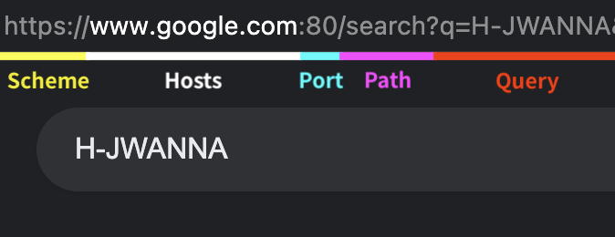

# 네트워크 (Network)

## Basic (기초)

<br>

### **🔸 LAN & WAN**

LAN(Local Area Network)는 보통 우리가 사용하는 인터넷과 같이 좁은 범위에서 연결된 네트워크를 말하고,  
WAN(Wide Area Network)는 수많은 LAN이 모여 세계의 네트워크를 구성하는 것을 말한다.

<br>

### **🔸 인터네트워킹 (Internetworking)**

네트워크를 확장하는 방법에는 2가지가 있다.  
1. 한 네트워크를 확장하는 방법
2. 네트워크와 네트워크를 연결하는 방법

이 중 여러 네트워크를 연결하는 것을 인터네크워킹이라고 한다.

<br>

💡 인터 네트워킹의 장점
- 네트워크 일부에서 고장이 나도 영향이 광범위하게 퍼지지 않는다.
- 불필요한 통신이 네트워크 전체로 확산되지 않는다.
- 개별 네트워크를 각각의 방침에 따라 관리가 가능하다.

> 전 세계적으로 인터네트워킹을 한 것이 우리가 사용하는 Internet이다.

<br>

### **🔸 프로토콜 (Protocol)**

어느 컴퓨터든 일관되게 네트워크를 사용하게 할 수 있도록 만든 통신 규격(?)

<br>

💡 주요 프로토콜 (OSI 7 - 응용 계층)

|이름|설명|
|:-:|:-:|
|HTTP|웹에서 HTML, JSON 등의 정보를 주고받는 프로토콜|
|HTTPS|HTTP에서 보안이 강화된 프로토콜|
|FTP|파일 전송 프로토콜|
|SMTP|메일을 전송하기 위한 프로토콜|
|SSH|CLI 환경의 원격 컴퓨터에 접속하기 위한 프로토콜|
|RDP|Windows 계열의 원격 컴퓨터에 접속하기 위한 프로토콜|
|WebSocket|실시간 통신, Push 등을 지원하는 프로토콜|

<br>

💡 주요 프로토콜 (OSI 4 - 전송 계층)

|이름|설명|
|:-:|:-:|
|TCP|HTTP, FTP 통신 등의 근간이 되는 인터넷 프로토콜|
|UDP|단순하고 빠르지만, 신뢰성이 낮은 인터넷 프로토콜|


<br>

### **🔸 주소 (Address)**

네트워크에 연결된 특정 PC의 주소를 나타내는 체계를 IP address(Internet Protocol address, IP 주소)라고 한다.

- IP 주소  
  TCP/IP 구조에서 컴퓨터를 식별하기 위해 사용되는 주소이며,  
  192.xxx.xxx.xxx 등의 형태를 가진다.

- MAC 주소 (Media Access Control)  
  네트워크 기기는 처음부터 제조사에서 할당하는 고유 시리얼인 MAC 주소를  
  IP 주소와 조합해야만 네트워크를 통한 통신이 가능하다.  

  이더넷에서는 네트워크상의 송수신 상대를 특정하고자 MAC 주소를 사용하고,  
  TCP/IP 에서는 IP address를 사용하기 때문이다.

  > 이더넷(Ethernet)은 컴퓨터 네트워크 기술의 하나로,  
  > 일반적으로 LAN, MAN 및 WAN에서 가장 많이 활용되는 기술 규격이다.

<br>

### **🔸 패킷 (Packet)**

기기끼리의 통신에는 회선 교환(Circuit Switching) 방식과 패킷 교환(Packet Switching)방식이 존재한다.

회선교환 방식은 데이터를 1:1로 교환하는 방식으로, 주로 음성 통화에 사용된다.

패킷교환 방식은 여러 상대와 통신이 가능하며, 컴퓨터 네트워크는 패킷교환 방식을 사용한다.

<br><br>

## IP

앞서 IP 주소는 192.xxx.xxx.xxx의 형태로 되어있다고 했는데  
자세히 말하면 **IPv4**의 주소가 192.xxx.xxx.xxx의 형태로 되어있다고 할 수 있다.  
<span style = "color : gray"> (각 영역은 8비트 필드이며 0 ~ 255 까지 나타낼 수 있음)</span>

PC의 보급이 증가하면서 IPv4로 할당할 수 있는 PC를 넘어서게 되어 IPv6(IP version 6)가 등장했다.

192.xxx.xxx.xxx 형태의 IP 주소에서 앞의 3자리는 어떤 네트워크인지 알 수 있는 네트워크부  
뒤의 1자리는 해당 네트워크부의 특정 컴퓨터를 지칭하는 호스트부로 구성되어 있다.  
> IPv4 주소에서 네트워크부가 어디까지인지 나타내는 것이 서브넷 마스크이다.  
> 서브넷 마스크: 255.255.255.0  

<br>

### IP 주소의 할당과 관리

MAC 주소가 일종의 고유 시리얼이라면, IP주소는 처음부터 주어지는 것이 아니라 할당이 되는 것이다.

192.168.1 이라는 네트워크부를 가진 네트워크에서 호스트부를 할당할 때에는 1 ~ 254까지만 할당할 수 있다.

- 호스트부가 0으로만 이루어진 것은 네트워크 주소로, 그 네트워크를 의미한다.  
- 호스트부가 1로만 이루어진 것은 브로드캐스트 주소로,  
  ARP와 같은 기능을 사용하기 위해 사용합니다.

  > ARP(Address Resolution Protocol)란?
  > 
  > 네트워크 상에서 IP 주소를 물리적 네트워크 주소로 대응시키기 위해 사용되는 프로토콜  
  > 여기서 물리적 네트워크 주소는 이더넷 또는 토큰링의 48 비트 네트워크 카드 주소를 뜻한다.

<br>

### IP 프로토콜의 한계

- **비연결성**  
  패킷을 받을 대상이 없거나 특정한 이유로 서비스 불능 상태에 빠져도 데이터를 받을 상대의 상태 파악이 불가능하기 때문에 패킷을 그대로 전송하게 된다.


- **비신뢰성**  
  송신기에서 전송한 패킷이 수신기에 오류나 문제없이 정확하게 전달이 되었는지를 확인하지 않고 보장하지도 않는다.

<br><br>

## TCP / UDP

<br>

### OSI 7계층

|계층|	이름|	단위<br>(PDU)|	예시|	프로토콜<br>(Protocols)|	디바이스<br>(Device)|
|:-:|:-:|:-:|:-:|:-:|:-:|
|7	|응용 계층<br>(Application)|	Data	|텔넷(Telnet), 구글 크롬<br>이메일, 데이터베이스 관리	|HTTP, SMTP, SSH, FTP, Telnet, DNS, modbus, SIP, AFP, APPC, MAP	||
|6|	표현 계층<br>(Presentation)|	Data|	인코딩, 디코딩<br>암호화, 복호화	|ASCII, MPEG, JPEG, MIDI, EBCDIC, XDR, AFP, PAP	||
|5|	세션 계층<br>(Session)|	Data| |		NetBIOS, SAP, SDP, PIPO, SSL, TLS, NWLink, ASP, ADSP, ZIP, DLC	||
|4|	전송 계층<br>(Transport)|	TCP-Segment, UDP-datagram|	특정 방화벽 및 프록시 서버	|TCP, UDP, SPX, SCTP, NetBEUI, RTP, ATP, NBP, AEP, OSPF|	게이트웨이|
|3|네트워크 계층<br>(Network)	|Packet	|라우터|	IP, IPX, IPsec, ICMP, ARP, NetBEUI, RIP, BGP, DDP, PLP	|라우터|
|2|	데이터링크 계층<br>(DataLink)|	Frame	|MAC 주소<br>브리지 및 스위치|	Ethernet, Token Ring, AppleTalk, PPP, ATM, MAC, HDLC, FDDI, LLC, ALOHA	|브릿지<br>스위치|
|1|	물리 계층<br>(Physical)|	Bit|	전압, 허브<br>네트워크 어댑터중계기 및 케이블 사양신호 변경 (디지털,아날로그)|	10BASE-T, 100BASE-TX, ISDN, wired, wireless, RS-232, DSL, Twinax	|허브<br>리피터|

<br>
<details>
<summary> &ensp; ✔︎ OSI 7 Layer Model </summary>
<div markdown="1">
<br>

**🔸 응용 계층**  

응용 계층(Application Layer, 7계층)에서는 OSI 7계층 모델에서 최상위 계층으로 사용자가 네트워크 자원에 접근하는 방법을 제공한다.  
그리고 계층 7은 최종적으로 사용자가 볼 수 있는 유일한 계층으로 모든 네트워크 활동의 기반이 되는 인터페이스를 제공하는데, 즉 사용자가 실행하는 응용 프로그램들이 계층 7에 속한다고 보면 된다.  
예를 들면 가상 터미널인 텔넷(telnet), 구글의 크롬(chrome), 이메일(전자우편), 데이터베이스 관리 등의 서비스를 제공한다.  

사용자와 가장 가까운 계층이다.

**🔸 표현 계층**  

표현 계층(Presentation Layer, 6계층)에서는 응용 계층으로부터 전달받은 데이터를 읽을 수 있는 형식으로 변환하는데 표현 계층은 응용 계층의 부담을 덜어주는 역할이 되기도 한다.  

응용 계층으로부터 전송받거나 응용 계층으로 전달해야 할 데이터의 인코딩과 디코딩이 이 계층에서 이루어진다.  

그리고 표현 계층은 데이터를 안전하게 사용하기 위해서 암호화와 복호화를 하는데 이 작업도 표현 계층에서 이루어진다.  
예를 들면 유니코드(UTF-8)로 인코딩 되어있는 문서를 ASCII로 인코딩 된 문서로 변환하려 할 때 이 계층에서 변환이 이루어진다.

**🔸 세션 계층**  

세션 계층(Session Layer, 5계층)에서는 두 컴퓨터 간의 대화나 세션을 관리하며, 포트(Port)연결이라고도 한다.  

모든 통신 장치 간에 연결을 설정하고 관리 및 종료하고 또한 연결이 전이중(Full duplex / 양방향)인지 반이중(half duplex / 단방향)인지 여부를 확인하고 체크 포인팅과 유휴, 재시작 과정 등을 수행하며 호스트가 갑자기 중지되지 않고 정상적으로 호스트를 연결하는 데 책임이 있다.  

즉 이 계층에서는 TCP/IP 세션을 만들고 없애고 통신하는 사용자들을 동기화하고 오류 복구 명령들을 일괄적으로 다루며 통신을 하기 위한 세션을 확립, 유지, 중단하는 작업을 수행한다.

**🔸 전송 계층**  

전송 계층(Transport Layer, 4계층)의 주목적은 하위 계층에 신뢰할 수 있는 데이터 전송 서비스를 제공하는 것이다.  
컴퓨터와 컴퓨터 간에 신뢰성 있는 데이터를 서로 주고받을 수 있도록 해주어 상위 계층들이 데이터 전달의 유효성이나 효율성을 생각하지 않도록 부담을 덜어주는데, 이때 시퀀스 넘버 기반의 오류 제어 방식을 사용한다.  

흐름 제어, 분할/분리 및 오류 제어를 통해 전송 계층은 데이터가 오류 없이 점-대-점으로 전달되게 하는데 신뢰할 수 있는 데이터 전송을 보장하는 것은 매우 번거롭기에 OSI 모델은 전체 계층을 사용한다.  

전송 계층은 연결형 프로토콜과 비 연결형 프로토콜을 모두 사용한다.  
전송 계층의 예로는 특정 방화벽이나 프록시 서버가 있다.

**🔸 네트워크 계층**

네트워크 계층(Network Layer, 3계층)에서는 2홉 이상의 통신(멀티 홉 통신)을 담당한다.  
OSI 7 계층에서 가장 복잡한 계층 중 하나로서 실제 네트워크 간에 데이터 라우팅을 담당한다.  
이때 라우팅이란 어떤 네트워크 안에서 통신 데이터를 짜여진 알고리즘에 의해 최대한 빠르게 보낼 최적의 경로를 선택하는 과정을 라우팅이라고 한다.  

네트워크 계층은 네트워크 호스트의 논리 주소 지정(ex : ip 주소 사용)을 확인한다.  
또한 데이터 스트림을 더 작은 단위로 분할하고 경우에 따라 오류를 감지해 처리한다.  
그리고 여러 개의 노드를 거칠 때마다 경로를 찾아주는 역할을 하는 계층으로서 다양한 길이의 데이터를 네트워크들을 통해 전달하고 그 과정에서 전송 계층이 요구하는 서비스 품질을 제공하기 위한 기능적, 절차적 수단을 제공한다.  

네트워크 계층은 라우팅, 흐름 제어, 세그멘테이션, 오류제어, 인터네트워킹 등을 수행한다.  
라우터가 3계층에서 동작하고, 3계층에서 동작하는 스위치도 있다.

**🔸 데이터링크 계층**  

데이터링크 계층(DataLink Layer, 2계층)은 물리적인 네트워크를 통해 데이터를 전송하는 수단을 제공한다.  

1홉 통신을 담당한다고도 말한다.  
홉(hop)은 컴퓨터 네트워크에서 노드에서 다음 노드로 가는 경로를 말한다.  
1홉 통신이면 한 라우터에서 그다음 라우터까지의 경로를 말한다.  

주목적은 물리적인 장치를 식별하는 데 사용할 수 있는 주소 지정 체계를 제공하는 것이다.  
데이터 링크 계층은 포인트 투 포인트 간의 신뢰성 있는 전송을 보장하기 위한 계층으로 CRC 기반의 오류 제어와 흐름 제어가 필요하다.  
네트워크 위의 개체들 간 데이터를 전달하고 물리 계층에서 발생할 수 있는 오류를 찾아내고 수정하는 데 필요한 기능적, 절차적 수단을 제공한다.  
이 계층의 예시를 들자면 브리지 및 스위치 그리고 이더넷 등이 있다.

**🔸 물리 계층**  

물리 계층(Physical Layer, 1계층)은 OSI 모델의 맨 밑에 있는 계층으로서, 네트워크 데이터가 전송되는 물리적인 매체이다.  
데이터는 0과 1의 비트열로 ON, OFF의 전기적 신호 상태로 이루어져 있다.  

이 계층은 전압, 허브, 네트워크 어댑터, 중계기 및 케이블 사양을 비롯해 사용된 모든 하드웨어의 물리적 및 전기적 특성을 정의한다.  
물리 계층은 연결을 설정 및 종료하고 통신 자원을 공유하는 수단을 제공하며 디지털에서 아날로그로 또는 그 반대로 신호를 변환하는 역할을 한다.  

OSI 모델에서 가장 복잡한 계층으로 간주된다.

### 📋 [더 자세한 정보](http://wiki.hash.kr/index.php/OSI_7_%EA%B3%84%EC%B8%B5)

</div>
</details>

<br>

### TCP/IP 4계층 모델

<br>

| 계층 | 이름 | 프로토콜 | 역할 |
|:-:|:-:|:-:|:-:|
|4|응용계층|HTTP, DNS, FTP, …|어플리케이션에 맞추어 통신|
|3|전송계층|TCP, UDP, …|IP와 어플리케이션을 중개해 데이터를 확실하게 전달|
|2|인터넷계층|IP, ICMP, ARP, RARP, …|네트워크 주소를 기반으로 데이터 전송|
|1|네트워크 접근 계층|Ethernet, wifi, …|컴퓨터를 물리적으로 네트워크에 연결해서 기기 간에 전송이 가능하게 함|

<br>
<details>
<summary> &ensp; ✔︎ TCP/IP 4 Layer Model </summary>
<div markdown="1">
<br>

**🔸 응용 계층**  

OSI 7 계층에서 세션계층, 프레젠테이션계층, 애플리케이션 계층에 해당한다.(5, 6, 7계층)  
응용프로그램들이 네트워크서비스, 메일서비스, 웹서비스 등을 할 수 있도록 표준적인 인터페이스를 제공한다.  
TCP/IP 기반의 응용 프로그램을 구분할 때 사용한다. (프로토콜 : HTTP, FTP, 텔넷, DNS, SMTP)

**🔸 전송 계층**  

OSI 7 계층에서 전송계층에 해당한다.  
네트워크 양단의 송수신 호스트 사이에서 신뢰성 있는 전송기능을 제공하고, 시스템의 논리주소와 포트를 가지고 있어서 각 상위 계층의 프로세스를 연결해서 통신한다.  
정확한 패킷의 전송을 보장하는 TCP와 정확한 전송을 보장하지 않는 UDP 프로토콜을 이용하며, 데이터의 정확한 전송보다 빠른 속도의 전송이 필요한 멀티미디어 통신에서 UDP를 사용하면 TCP보다 유용하다.  
통신 노드 간의 연결을 제어하고, 자료의 송수신을 담당한다. ( 프로토콜 : TCP, UDP)

**🔸 인터넷 계층**  

OSI 7 계층의 네트워크 계층에 해당한다.  
인터넷 계층의 주요 기능은 상위 트랜스포트 계층으로부터 받은 데이터에 IP패킷 헤더를 붙여 IP패킷을 만들고 이를 전송하는 것이다.  
통신 노드 간의 IP 패킷을 전송하는 기능 및 라우팅 기능을 담당한다. (프로토콜 : IP, ARP, RARP, ICMP, OSPF)

**🔸 네트워크 접근 계층(network access layer)**  

OSI 7 계층에서 물리계층과 데이터링크 계층에 해당한다.  
OS의 네트워크 카드와 디바이스 드라이버 등과 같이 하드웨어적인 요소와 관련되는 모든 것을 지원하는 계층이다.  
송신측 컴퓨터의 경우 상위 계층으로부터 전달받은 패킷에 물리적인 주소은 MAC 주소 정보를 가지고 있는 헤더를 추가하여 프레임을 만들고, 프레임을 하위계층인 물리 계층으로 전달한다.  
수신측 컴퓨터의 경우 데이터 링크 계층에서 추가된 헤더를 제거하여 상위 계층인 네트워크 계층으로 전달한다.  
CSMA/CD, MAC, LAN, X25, 패킷망, 위성통신, 다이얼 모뎀 등 전송에 사용된다. (프로토콜 : 이더넷, 토큰링, PPP)

### 📋 [더 자세한 정보](http://wiki.hash.kr/index.php/TCP/IP)

</div>
</details>

<br>

### OSI 7계층 & TCP/IP 4계층

<br>


###### _출처 : https://shlee0882.tistory.com/110_

<br>

**🔸 차이점**

|항목|	OSI 7계층|	TCP/IP 4계층 |
|:-:|:-:|:-:|
|계층|	7계층 모델|	4계층 모델|
|구성	|역할 기반 계층 구성|	프로토콜의 집합 기반|
|기술	|통신전반 기술 표준화	|데이터 전송기술 특화|
|활용|	통신 모델 표준 제시|	실무적 통신기술 구현|

<br>

### TCP와 UDP

TCP/IP 4계층 모델을 기준으로 TCP와 UDP는 전송계층에서 IP와 어플리케이션(http…)을 **중개하는 역할**을 한다.

<br>

| | TCP<br>(Transmission Control Protocol) | UDP<br>(User Datagram Protocol) |
|:-:|:-:|:-:|
|서비스 타입|연결 지향적 프로토콜 | 데이터그램 지향적 프로토콜|
|신뢰성|데이터 전송 표적 기기까지의 전송을 보장|표적 기기까지의 전송 보장 X|
|순서 보장|전송 패킷들의 순서 보장|패킷 순서 보장 X<br>만약 패킷 순서를 보장하고 싶다면,<br>응용계층에서 관리해야함
|속도|UDP에 비해 느리다|TCP에 비해 빠르고,<br>단순하며 더 효율적인 속도|

▲ _하지만 위와 같은 차이점이 존재한다._

<br>

데이터의 신뢰성을 필요로 하는 어플리케이션은 TCP,  
빠른 속도나 실시간 통신이 중요한 어플리케이션은 UDP를 사용한다.

<br>

### TCP 3-way handshake

TCP 3-way handshake 는 양 끝단 기기의 신뢰성 있는 데이터 통신을 위해,  
TCP 방식이 연결을 설정하는 방식이다.


<br>

1. SYN  
   Sender는 Receiver와 연결 설정을 위해,  
   Segment를 랜덤으로 설정된 SYN(Synchronize Sequence Number)와 함께 보낸다.  
   
   이 요청은 Receiver에게 Sender가 통신을 시작하고 싶다고 알린다.
2. SYN / ASK  
   Receiver 는 받은 요청을 바탕으로 SYN/ACK 신호 세트를 응답한다.  
   Acknowledgement(ACK) 응답으로 보내는 Segment가 유효한 SYN요청을 받았는지를 의미
3. ACK  
   Sender는 받은 ACK를 Receiver에게 전송을 하면서,  
   신뢰성 있는 연결이 성립되었다는 사실을 Sender와 Receiver 양쪽에서 알 수 있고, 실제 데이터 전송이 시작되게 된다.

<br>

### UDP

<br>

UDP를 사용하는 이유는 아래와 같다.

- **어플리케이션의 정교한 제어가 가능하다**  
  TCP의 경우 Receiver가 전송 받을 준비가 될 때까지 Segment를 반복적으로 재전송한다.  

  실시간 전송에 대한 요구가 큰 어플리케이션은 높은 latency를 지양하므로 약간의 데이터 손실을 감수한다.  
  대신 개발자가 이를 보완하기 위해 어플리케이션에 추가 기능을 구현할 수 있다.

- **연결설정에 무관하다**  
  TCP 3-way handshake가 없는 UDP는 예비과정 없이 바로 전송을 시작한다.  
  설정단계에서 발생하는 지연이 없는 만큼, 반응속도가 빠르다.  

  또한, TCP가 신뢰성을 위해 많은 파라미터와 정보 전달이 필요함과 비교해  
  UDP는 연결설정 관리를 하지 않기 때문에 어떠한 파라미터도 기록하지 않는다.  

  이때문에 서버에서도 TCP와 비교에 더 많은 클라이언트를 수용이 가능합니다.

<br>

***

<br>

## PORT

TCP, UDP 둘 다 포트 번호를 사용하며,  
IP프로토콜만 가지고는 한 IP에서 여러 앱이 동작할 때 특정 앱을 특정해 통신할 수 없다.

포트 번호는 대상 IP 기기의 특정 어플리케이션(connection endpoint)을 특정하는 번호이다.

<br>

만약 한 서버 인스턴스에서 2가지 이상의 서버를 동시에 실행 중일때,  
한 IP에서 2가지 요청이 들어오면 어느 서버로 보내는 요청인지 정확히 알 수 없다.

이러한 경우, 포트 번호를 사용해 Receiver를 특정해 어느 서버로 보내는 요청인지 특정할 수 있다.

포트 번호는 0~65535까지 사용 가능하다.

|| Port Number Range | Description|
|:-:|:-:|:-:|
|Well-known Port| 0 ~ 1023 | 시스템 사용 번호<br>(슈퍼유저 권한 필요)<br>사용 권장 X|
|Registered Port| 1024 ~ 49151 | 특정 프로토콜이나 어플리케이션에서 사용하는 번호<br>(슈퍼유저 권한 필요 X) |
|Dynamic Port|49152 ~ 65535|임시 사용 번호|

<br>

**💡 자주 사용되는 Well-known Port**

|Port No.|Protocol Name|Transport Protocol|Description|
|:-:|:-:|:-:|:-:|
|80|HTTP|TCP|웹서버 접속|
|443|HTTPS|TCP|웹서버 접속(SSL)|
|110|POP3|TCP|메일 읽기|
|25|SMTP|TCP|메일 서버 간 메일 전송|
|22|SSH|TCP|컴퓨터 원격 로그인|
|53|DNS|UDP|DNS 질의|
|123|NTP|TCP|시간 동기화|

<br>

잘 알려진 포트의 경우 URI등에 명시하지 않지만, 그렇지 않은 포트는 반드시 포함해야한다.

<br>

***

<br>

## URL과 DNS

<br>

### URL (Uniform Resouce Locator)

웹에 게시된 어떤 자원을 찾기 위한 브라우저에서 사용되는 메커니즘  
네트워크 상에서 웹 페이지, 이미지, 동영상 등의 파일이 위치한 정보를 나타낸다.

<br>

URL은 scheme, hosts, url-path으로 구성되어 있고, 

URI는 Uniform Resource Identifier의 줄임말로,  
일반적으로 URL의 기본 요소인 scheme, hosts, url-path에 더해 query, bookmark를 포함한다.

|부분|명칭|설명|
|:-:|:-:|:-|
|```http://```<br>```https://```|scheme|통신 프로토콜|
|```127.0.0.1```<br>```www.google.com```|hosts|이미지, 동영상 등의 파일이 위치한 웹 서버, 도메인 또는 IP|
|```:80```, ```:443```, ```:3000```|port| 웹 서버에 접속하기 위한 통로 |
|```/search```<br>```/Users/username/Desktop```|url-path|웹 서버의 루트 디렉토리부터 웹 페이지, 이미지, 동영상 등의 파일 위치까지의 경로|
|```q=Java```|query|웹 서버에 전달하는 추가 질문|

▲ _URL과 URI의 구성 요소_

<br>



▲ _구글에 H-JWANNA 검색 후 주소창의 구성 요소 (port번호는 임의로 생성)_

<br>

### Domain Name

대부분의 URL은 ```127.0.0.1``` 형식이 아닌 ```www.google.com``` 형식을 가진다.

도메인 주소를 통해 쉽게 알아볼 수 있고, 접근할 수 있도록 한 것이다.

> 위와 같은 형식에서 ```www```를 Sub Domain이라고 하고,  
> ```google.com```을 Domain이라고 한다.

<br>

**🔸 도메인의 종류**

- gTLD (generic Top Level Domain)  
  ```.com```, ```.net```, ```.org```, ```.edu```, ```.gov```  등 전세계에서 등록이 가능한 도메인이다.


- ccTLD(country code Top Level Domain)  
  ```.kr```, ```.us```, ```.jp``` 등 200여개가 넘으며 각국 네트워크 정보센터에서 위임받아 관리한다.

위 처럼 도메인의 가장 마지막에 해당하는 부분을 **탑 레벨 도메인**이라고 하며,  
```.kr```과 같이 국가 코드를 사용하는 도메인은 ```co```, ```or```과 같은 2단계 도메인과 함께 사용되기도 한다.

```www``` 부분을 **서브 도메인**이라고 하며, 웹사이트의 특정 부분을 나누어 보여줄 때 사용한다.  
주로 ```www```, ```m```, ```store``` 등으로 사용된다.

<br>

### DNS (Domain Name System)

호스트의 도메인 이름을 IP 주소로 변환하거나 반대의 경우를 수행할 수 있도록 개발된 데이터베이스 시스템

도메인 주소는 겉보기 주소일 뿐이고, 실제 IP 주소에 접근할 수 있도록 하는 시스템이다.

> 만약 브라우저의 검색창에 naver.com을 입력한다면,  
> 이 요청은 DNS에서 IP 주소(125.209.222.142)를 찾는다.    
> 
> 그리고 이 IP 주소에 해당하는 웹 서버로 요청을 전달하여 클라이언트와 서버가 통신할 수 있도록 한다.

<br>


▲ _DNS LookUp_

도메인 네임 서버는 응답을 보내기 위해 하나 이상의 Zone 파일을 가지고 있다.

Zone 파일은 이름과 레코드 클래스, TTL, 레코드 타입, 레코드 데이터로 구성된 레코드들로 구성되어 있고,  
네임 서버들은 이러한 존 파일들을 바탕으로 요청에 해당되는 레코드를 리턴한다.

- 이름 : ```google.com```과 같은 도메인 혹은 서브 도메인의 이름 저장
- 레코드 클래스 : 네트워크 타입을 지정 (일반적으로 인터넷(IN))
- TTL(Time To Live) : 클라이언트가 데이터를 저장 가능한 시간  
  해당 시간이 지나면 Resolver는 해당 레코드를 삭제한다.
- 레코드 타입 : 변환될 레코드 데이터의 형식  
  - A, AAAA : A는 데이터가 IPv4 주소, AAAA는 IPv6 주소임을 명시
  - CNAME : 데이터가 도메인 주소임을 명시
  - NS : 데이터가 도메인 네임 서버들의 주소임을 명시
  - SOA : 도메인 네임 서버들 중 주 서버의 정보들에 대한 데이터  
    주 네임 서버와 통신할 수 있는 포트 번호, TTL, 도메인 주소 등이 적혀 있다.
- 레코드 데이터 : 변환되는 데이터

<br><br>

***

_2022.10.02. Modified_

_2022.10.01. Update_